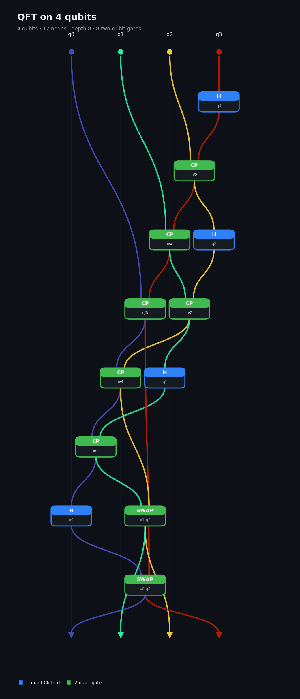

# Circuits as ONNX graphs: export for Netron

Branch `exp/netron` (merged via `exp/integrate`), 5 Oct 2026, Xeon Gold 6548Y+ VM.
Code: `src/io/onnx.rs` (`io::onnx::to_onnx`), the `qsim export` subcommand in `src/main.rs`,
tests in `tests/core/onnx_export.rs`, renderer `tools/onnx_gallery.py`. Data: `research/data/netron-export/`.

## Headline

Any `Circuit` (built in Rust, read from OpenQASM 2, or read from `.stim` with its detectors and
observables) exports to an ONNX model that opens in [Netron](https://netron.app) and other graph
viewers. Gates are nodes in the custom domain `qsim`; every qubit is a chain of single-assignment
wire tensors (`complex64[2]`); measurement records are `bool` tensors, so classical control and
detectors show up as edges. All eight gallery models pass `onnx.checker.check_model` (onnx 1.19), and
NetVis reads them.

## Mapping

| circuit | ONNX |
|---|---|
| qubit `i` | graph input `q{i}`, `complex64[2]` |
| gate | node (`H`, `CX`, `RZ`, `CCX`, ...; Stim-style names), inputs = current wires of its qubits in argument order, outputs = `q{i}_{k}` |
| `Measure` | node with extra output `m{j}` (`bool` scalar), `j` = measurement-record index |
| classically controlled gate | `IF_<GATE>` with `m{j}` as an extra input, attributes `record`, `value` |
| noise | `X_ERROR`, `Y_ERROR`, `Z_ERROR`, `DEPOLARIZE1`, `DEPOLARIZE2` with attribute `p` |
| detectors / observables | `DETECTOR` / `OBSERVABLE_INCLUDE` reading the `m{j}` they combine; outputs `D{i}` / `L{k}` |
| parameters | attributes `qubits` (INTS), `theta`, `phi`, `lambda`, `p` (FLOAT, i.e. f32); the node doc string carries the exact f64 and a π fraction |
| statistics | model metadata: qubits, ops, depth, 1q/2q/3q gates, T-count, measurements, detectors, truncation |

IR version 8, opset imports `ai.onnx` 18 and `qsim` 1. The protobuf writer is built in (no new
dependency).

## Method and checks

* `tests/core/onnx_export.rs` decodes the bytes with an independent protobuf reader and checks: one node
  per op; single assignment (every tensor produced once, every input defined before use); quantum
  linearity (every qubit wire consumed at most once, no dangling wires); types on every value;
  classical edges (each `IF_*` reads an `m{j}` produced by an earlier `Measure`); detectors and
  observables; truncation (`max_ops`) and the detectors it drops; validation errors (qubit out of
  range, repeated qubit, reading a future measurement). It then rebuilds the gate list from the graph
  (angles from the exact doc-string values) and requires it to equal the original program exactly
  (noise probabilities at f32 precision). Circuits: GHZ, every gate kind, semiclassical Shor (N = 15),
  a `.stim` program with detectors, and a 1,000+-op ripple-carry Shor circuit.
* External: `onnx.checker.check_model` on GHZ-5, QFT-4, BV-5, brickwork 6×4, Stim's d = 3 rotated
  surface code (2 rounds, 139 nodes), a noisy d = 5 repetition code, and the full gate-level Shor
  circuits for N = 15 (9,820 and 7,772 nodes).

## Gallery

`tools/onnx_gallery.py model.onnx -o picture.png` renders a model from the file: depth (longest path
from the inputs) top to bottom, qubit lanes left to right, per-qubit wire colours, Netron-style cards
coloured by operation kind, dashed edges for classical tensors; `--wrap R` draws large graphs left to
right in R rows. Example (`research/data/netron-export/qft4.png`):



## Caveats

* FLOAT attributes are 32-bit: viewers show rounded angles; the exact value is in the description.
* Viewers do not execute the graph (the `qsim` operators have no ONNX schema); this is a visualisation
  and interchange format, not a way to run circuits in ONNX runtimes.
* Netron lays out graphs above a few thousand nodes slowly; `qsim export --max-ops N` exports a prefix
  and records the truncation in the metadata.

## Reproduction

```sh
cargo run --release -- export --example qft --qubits 4 -o qft4.onnx
cargo run --release -- export --stim research/data/netron-export/surface_d3_r2.stim -o surface.onnx
python3 tools/onnx_gallery.py qft4.onnx -o qft4.png          # needs onnx, numpy, matplotlib
cargo test --release --test onnx_export
```
