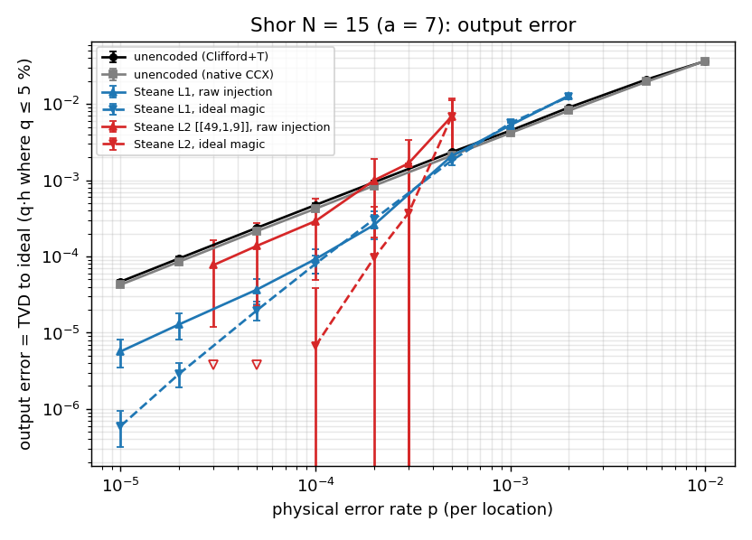
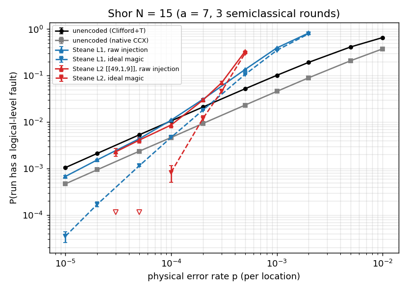
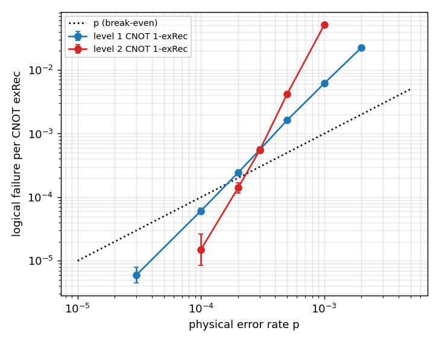
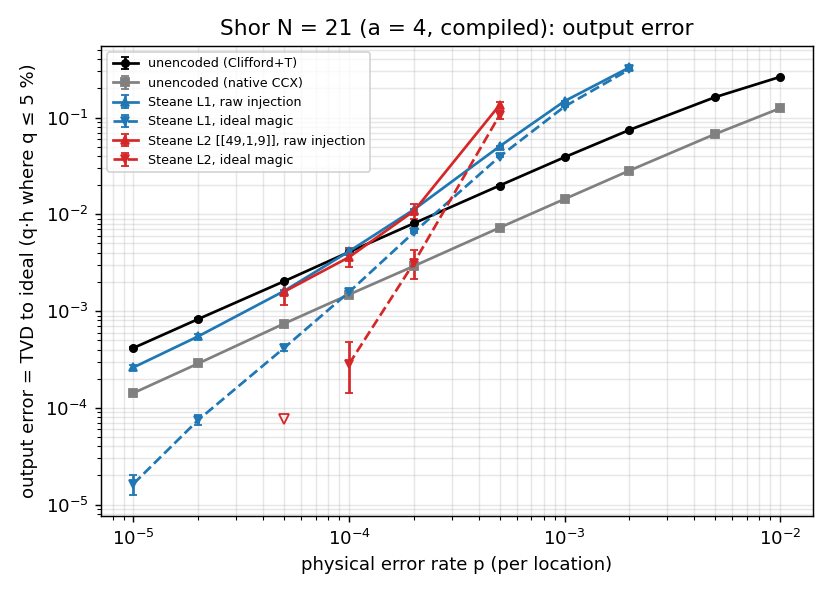

# Shor's algorithm on error-corrected qubits, simulated end to end at the gate level (topic `ft-shor`, branch `exp/ft-shor`)

**Headline.** Run end to end on concatenated-Steane logical qubits — every physical location
noisy, Steane error correction with verified ancillas, transversal Cliffords, T gates by
magic-state injection and teleportation with decoded feed-forward, hierarchical decoding —
semiclassical Shor for N = 15 (35 T) and a compiled N = 21 (42 T) beats the same circuit on
bare qubits only below **p\* ≈ 2.3–2.8·10⁻⁴ with ideal (distilled) magic states, for d = 3
([[7,1,3]]) and for the level-2 [[49,1,9]] code alike** (level 2 overtakes level 1 below
≈ 3·10⁻⁴), and only below **≈ 1·10⁻⁴ with raw injection**, which never beats a bare
native-Toffoli circuit; below p\* the probability that a run suffers any logical fault
drops from 106 p (bare) to 4.5·10⁵ p² (L1) and 8·10¹² p⁴ (L2) — at p = 10⁻⁴ from 1.1 % to
0.47 % and 0.08 %, and the N = 21 output error (TVD from the exact distribution) from
4.1·10⁻³ to 1.6·10⁻³ and 2.8·10⁻⁴ — at 11× / 81× the qubits and 260× / 4.4·10⁴× the
operations of the bare run. Raw injection dominates the logical-fault budget at low p (61 %
at 10⁻⁴; it sets a floor ≈ 63–85 p that no code distance removes) and Steane EC (94 % of
all locations) dominates above ≈ 1.5·10⁻⁴ and in output damage; for N = 15, whose output
only resolves two bits, encoded logical faults are 2.5–5× less harmful than bare ones and
the level-1 output crossover moves up to ≈ 7·10⁻⁴.

Everything is exact for stochastic Pauli noise except the distilled-magic model and the
noise model's omissions (no idle noise, all-to-all connectivity): the physical level is an
exact Pauli frame, the logical level an exact state vector, and the split is validated
against a full physical state-vector simulation with real measurements (§3). Monte-Carlo
error bars are ±1σ throughout.


## 1. What is simulated

* **Algorithm.** Semiclassical order finding with one recycled control qubit, t = 3
  rounds (three output bits as in Vandersypen et al. 2001, one recycled control as in Monz et
  al. 2016):
  * **N = 15, a = 7** (r = 4), the primary instance. Every multiplier a^(2^j) mod 15 is
    ±2^k, i.e. a cyclic rotation of the 4-bit register followed by a bitwise NOT for the
    minus sign — a genuine modular multiplication on all inputs 1…14 (not specialised to
    the input |1⟩). Controlled: rotations by 2 and by 3 = 5 Fredkin gates
    (CNOT·Toffoli·CNOT), the NOT = 4 CNOTs. Toffoli = the standard 7-T Clifford+T circuit
    (6 CNOT, 2 H, 7 T/T†): **35 T gates**, 5 logical qubits + 1 magic slot.
    Semiclassical phase corrections S† (and T†, only after an error) on the control.
  * **N = 21, a = 4** (r = 3), a *compiled* instance (secondary): the work register holds the
    orbit {1, 4, 16} in a 2-qubit code, ×4 / ×16 are controlled 3-cycles, cheapest found by
    exhaustive search = 1 CNOT + 2 Toffolis: **6 Toffolis = 42 T** (+ conditional T†), 3
    logical qubits. Compiled in the sense of Smolin–Smith–Vargo (uses the orbit of 1), like
    the published N = 21 demonstrations; used only as a second workload whose output is
    more noise-sensitive than N = 15's.
* **Noise**: circuit-level depolarizing noise of strength p on *every* physical location
  (details in §2), identical for the encoded and the unencoded runs.
* **Encodings**: unencoded (the same Clifford+T circuit on bare qubits, T gates
  physical; and, as a more favourable baseline, a native-Toffoli circuit with three
  single-qubit depolarizing channels per CCX as in `shor-noise`); concatenated Steane
  level 1 ([[7,1,3]], distance 3) and level 2 ([[49,1,9]]); magic states either by **raw
  injection** (simulated at the circuit level, post-selected on a trivial first syndrome)
  or **ideal** (a perfectly encoded |T⟩_L: the limit of perfect distillation; the 15-to-1
  model output 35ε³ is below 10⁻⁸ for every p here, so "distilled" = "ideal" at our
  resolution — factory Clifford noise not modelled, see §7).

## 2. The fault-tolerant stack

**Code and gadgets** (`src/ft/machine.rs`). Concatenated Steane code. A level-k logical
qubit is a block of 7^k physical qubits, and every level-k operation is built from level-(k−1)
operations, exactly as in Aliferis–Gottesman–Preskill (AGP) concatenation:

| level-k operation | implementation from level k−1 |
|---|---|
| H, CNOT | transversal, then Steane EC on every output block |
| S (S†) | transversal S† (S): S_L = (S†)^⊗7 for the Steane code, then EC |
| prepare \|0⟩_L / \|+⟩_L | non-FT encoder (3 pivots in \|+⟩, 9 CNOTs), **verified** against a second encoded checker block: transversal CNOT, transversal measurement, accept only if the outcome is an ideal codeword (repeat until accepted); data preparations are followed by EC |
| Steane EC | couple a verified \|+⟩_L (CNOT data→ancilla, measure Z: X syndrome) then a verified \|0⟩_L (CNOT ancilla→data, measure X: Z syndrome); Hamming-lookup decode each 7-bit outcome; correction = Pauli-frame update |
| measurement | transversal; hierarchical hard-decision decoding (level-(k−1) decoded bits → Hamming lookup) |
| \|T⟩_L (raw injection) | level-(k−1) \|T⟩ on sub-block 2, copied to 4, 5 (a weight-3 X_L representative avoiding the pivots), the pivot encoder, one EC; optionally post-selected on a trivial syndrome (on in all runs) |
| T / T† gadget | inject \|T⟩_L, transversal CNOT data→magic, transversal Z measurement of the magic block, feed-forward S (T) or S† (T†) on the decoded outcome; the S slot is a noisy identity when not applied |

Level 1 is the [[7,1,3]] Steane code, level 2 the [[49,1,9]] concatenated code. Why not a
d = 5 code: a single-level d = 5 code with Steane EC (e.g. the [[17,1,5]] colour code)
needs ancilla verification that tolerates two faults, and lattice-surgery surface-code
patches need a full space-time decoder plus non-transversal S and patch rotations; the
concatenated code reuses the verified, exhaustively tested level-1 gadgets, and a level-2
1-exRec only fails when two level-1 exRecs inside it fail (≥ 4 faults; 300 random
three-fault patterns in a level-2 CNOT+S exRec all pass), i.e. it is the "next distance"
of this family (failure ∝ p⁴, versus p³ for a d = 5 code). With
Steane EC the decoder is the (optimal for this EC) syndrome lookup: one EC round per
gadget extracts a complete syndrome from a verified ancilla, so no space-time matching or
BP+OSD is needed (those are what the round-based surface-code/colour-code tools in
`src/qec` are for).

**Noise model** (`src/ft/core.rs`), every physical location, rate p: preparation and
measurement flips (X after |0⟩, Z after |+⟩), single-qubit depolarizing after every 1q gate
(including the injected physical |T⟩ and the identity slot), two-qubit depolarizing (15
Paulis, p/15 each) after every CNOT. No idle noise (as in `shor-noise`), no leakage,
no coherent errors. Pauli-frame corrections are noiseless (they are classical).

**Fault tolerance is tested, not assumed** (`ft::machine::tests`, `tests/ft_shor.rs`): every
single fault (each location × each Pauli) in the level-1 exRecs for preparation, EC,
H/S/CNOT sequences, measurement, and the T gadget (with an ideal magic state) leaves no
logical error; 300 random three-fault patterns in a level-2 CNOT+S exRec leave none. The
first version used Goto's one-qubit verification of |0⟩_L; the exhaustive test caught that
a single fault there can leave a correlated X_a Z_b pair (X from the fault, Z by
back-propagation through the next verification CNOT, which then mis-steers the Z
correction), which a transversal S turns into a weight-2 Z error. Goto's verification is
fault-tolerant for preparation itself but not inside Steane EC followed by S; the
checker-block (Steane) verification rejects *every* detected error and passes the test.

## 3. Simulation method: Pauli frame × logical state vector (exact)

Every physical operation in this stack is a Clifford gate, a Pauli measurement, a
preparation of |0⟩, |+⟩ or |T⟩, or a classically controlled Clifford (the S correction).
For stochastic Pauli noise the physical state is therefore always F·Enc(|ψ⟩) with F a
Pauli frame on the physical qubits and |ψ⟩ the *ideal* logical state, and

* F is tracked bit-wise (two bits per physical qubit) and propagated through the physical
  Cliffords;
* |ψ⟩ lives in a dense vector over the logical qubits (6 for N = 15: control, 4 work
  qubits, one magic slot; 4 for N = 21);
* a logical measurement samples the ideal outcome from |ψ⟩ (Born rule) and XORs the
  decoded frame flip; every feed-forward (the T-gadget S correction, the semiclassical
  phase corrections) uses the *recorded* outcome.

So a decoder failure or a bad magic state acts on |ψ⟩ exactly as it would physically —
including the non-Pauli logical errors it causes (an X_L error before a T gadget flips the
gadget's measurement and applies the wrong S: S·X·T instead of T·X, which the vector
reproduces). Nothing is twirled or approximated at the logical level; there is no
logical-error-model step. The only magic in the simulation is the logical vector (2^6
amplitudes), so the stabilizer-rank or rotation-frame engines are not needed here: the
frame/vector split is exponentially cheaper because the non-Clifford content never
touches the physical level.

**Validation against a full physical state vector** (`DenseBackend`, the same machine code
on a dense physical state with real Born-rule measurements, real random codewords and
real decoding):

* Clifford circuits with EC (prep, H, S, S, H, measure; 21 physical qubits; p = 3 %): frame
  and dense engines record the same decoded outcome on **every shot** for identical fault
  realisations (40/40 shots, 22 of which are logical failures).
* T-gadget circuits (H·T·H, H·T·H·T†·H, H·T†·T†·H on |0⟩/|1⟩; injection + transversal CNOT +
  transversal measurement + feed-forward, 16 physical qubits, p = 2 %, EC between gadgets
  off): outcome frequencies agree (20 000 frame vs 1 500 dense shots per circuit,
  z = −0.49, 1.08, −1.74; e.g. P(1) = 0.287 vs 0.293 against the ideal 0.146).
* Noiseless encoded runs reproduce the exact Shor distributions (N = 15: uniform on
  {0, 2, 4, 6}).

## 4. Metrics and estimators

Per run we record the output y and whether the run suffered any **logical-level fault**:
encoded — a non-zero decoded flip of any top-level measurement, or a live data block whose
residual frame decodes to a logical Pauli after any top-level operation (Z_L on a freshly
prepared |0⟩_L is absorbed: it stabilises the state); unencoded — any physical fault at all.
This q = P(logical fault per run) is the standard, conservative fault-tolerance figure (it
counts harmless logical errors too). The algorithmic figure is the **total-variation
distance** TVD of the output distribution from the exact one (and 1 − P_peak, the
`shor-noise` success criterion: y/2^t within 1/(2r²) of some s/r).

*Clean-run estimator.* The location structure of a run does not depend on measurement
outcomes (the T-gadget S correction and the semiclassical S† correction are fixed slots;
T† corrections occur only after an error for r = 4), so the fault flag is independent of
the ideal outcomes and clean runs follow the ideal distribution exactly
(`clean_runs_follow_ideal_distribution`; L1, 3·10⁵ runs: χ² = 2.7 at p = 10⁻³, 1.0 at
3·10⁻⁴, 2.2 at 2·10⁻³ on 3 dof; the unit test's fixed 3·10⁴ seeds give 16.3, p ≈ 10⁻³, a
fluctuation of that seed range that is gone at 10× the runs over the same seeds). Hence P(y) = (1 − q)·ideal(y) + q·P(y | faulty) and TVD = q·h with
h = TVD(P(·|faulty), ideal), estimated from the faulty runs only (parametric bootstrap
errors, bias-corrected). There is one residual dependence: an applied S and the
identity slot conjugate the frame differently (X → Y), an O(p²) effect below detection.
For N = 21 (r = 3, T† corrections in error-free runs) plain multinomial estimates are used.

## 5. Results, N = 15




| series | p | runs | faulty runs | q = P(logical fault) | TVD to ideal | 1 − P_peak | 0.5 − P_order |
|---|---|---|---|---|---|---|---|
| unenc | 1e-05 | 2000000 | 2100 | 1.05e-03 [1.03e-03, 1.07e-03] | 5.47e-05 [4.44e-05, 6.45e-05] | 3.40e-05 | 4.50e-05 |
| unenc | 2e-05 | 2000000 | 4236 | 2.12e-03 [2.09e-03, 2.15e-03] | 9.49e-05 [7.96e-05, 1.09e-04] | 6.15e-05 | 6.90e-05 |
| unenc | 5e-05 | 2000000 | 10660 | 5.33e-03 [5.28e-03, 5.38e-03] | 2.38e-04 [2.15e-04, 2.62e-04] | 1.63e-04 | 1.55e-04 |
| unenc | 1e-04 | 2000000 | 21231 | 1.06e-02 [1.05e-02, 1.07e-02] | 4.82e-04 [4.48e-04, 5.15e-04] | 3.42e-04 | 3.16e-04 |
| unenc | 2e-04 | 2000000 | 42186 | 2.11e-02 [2.10e-02, 2.12e-02] | 9.20e-04 [8.72e-04, 9.69e-04] | 6.61e-04 | 5.58e-04 |
| unenc | 5e-04 | 2000000 | 104056 | 5.20e-02 [5.19e-02, 5.22e-02] | 2.34e-03 [2.26e-03, 2.40e-03] | 1.66e-03 | 1.46e-03 |
| unenc | 1e-03 | 2000000 | 203102 | 1.02e-01 [1.01e-01, 1.02e-01] | 4.48e-03 [4.38e-03, 4.58e-03] | 3.28e-03 | 2.85e-03 |
| unenc | 2e-03 | 2000000 | 386046 | 1.93e-01 [1.93e-01, 1.93e-01] | 9.01e-03 [8.86e-03, 9.14e-03] | 6.61e-03 | 5.99e-03 |
| unenc | 5e-03 | 2000000 | 829796 | 4.15e-01 [4.15e-01, 4.15e-01] | 2.10e-02 [2.08e-02, 2.12e-02] | 1.65e-02 | 1.48e-02 |
| unenc | 1e-02 | 2000000 | 1317516 | 6.59e-01 [6.58e-01, 6.59e-01] | 3.66e-02 [3.63e-02, 3.68e-02] | 3.27e-02 | 2.68e-02 |
| unenc-ccx | 1e-05 | 2000000 | 939 | 4.69e-04 [4.54e-04, 4.85e-04] | 5.37e-05 [4.66e-05, 6.15e-05] | 3.40e-05 | 3.13e-05 |
| unenc-ccx | 2e-05 | 2000000 | 1886 | 9.43e-04 [9.22e-04, 9.64e-04] | 8.47e-05 [7.42e-05, 9.44e-05] | 6.15e-05 | 5.55e-05 |
| unenc-ccx | 5e-05 | 2000000 | 4729 | 2.36e-03 [2.33e-03, 2.40e-03] | 2.18e-04 [2.02e-04, 2.33e-04] | 1.64e-04 | 1.46e-04 |
| unenc-ccx | 1e-04 | 2000000 | 9327 | 4.66e-03 [4.62e-03, 4.71e-03] | 4.49e-04 [4.26e-04, 4.72e-04] | 3.42e-04 | 3.11e-04 |
| unenc-ccx | 2e-04 | 2000000 | 18696 | 9.35e-03 [9.29e-03, 9.41e-03] | 8.33e-04 [8.01e-04, 8.63e-04] | 6.61e-04 | 5.75e-04 |
| unenc-ccx | 5e-04 | 2000000 | 46358 | 2.32e-02 [2.31e-02, 2.33e-02] | 2.12e-03 [2.07e-03, 2.17e-03] | 1.66e-03 | 1.44e-03 |
| unenc-ccx | 1e-03 | 2000000 | 91714 | 4.59e-02 [4.57e-02, 4.60e-02] | 4.15e-03 [4.08e-03, 4.22e-03] | 3.28e-03 | 2.83e-03 |
| unenc-ccx | 2e-03 | 2000000 | 179639 | 8.98e-02 [8.96e-02, 9.00e-02] | 8.20e-03 [8.09e-03, 8.29e-03] | 6.61e-03 | 5.75e-03 |
| unenc-ccx | 5e-03 | 2000000 | 419456 | 2.10e-01 [2.09e-01, 2.10e-01] | 1.96e-02 [1.95e-02, 1.98e-02] | 1.65e-02 | 1.42e-02 |
| unenc-ccx | 1e-02 | 2000000 | 752817 | 3.76e-01 [3.76e-01, 3.77e-01] | 3.67e-02 [3.65e-02, 3.69e-02] | 3.27e-02 | 2.67e-02 |
| L1-raw | 1e-05 | 400000 | 271 | 6.78e-04 [6.36e-04, 7.19e-04] | 8.36e-06 [-4.53e-06, 2.30e-05] | 0 | -2.13e-05 |
| L1-raw | 2e-05 | 400000 | 615 | 1.54e-03 [1.47e-03, 1.59e-03] | 1.65e-05 [-5.77e-06, 3.93e-05] | 2.50e-06 | 8.75e-06 |
| L1-raw | 5e-05 | 400000 | 1754 | 4.39e-03 [4.27e-03, 4.50e-03] | 3.34e-05 [-3.30e-06, 6.80e-05] | 1.75e-05 | -4.50e-05 |
| L1-raw | 1e-04 | 400000 | 4406 | 1.10e-02 [1.09e-02, 1.12e-02] | 2.37e-05 [-3.01e-05, 7.62e-05] | 2.00e-05 | 2.50e-06 |
| L1-raw | 2e-04 | 400000 | 12384 | 3.10e-02 [3.07e-02, 3.13e-02] | 3.44e-04 [2.29e-04, 4.58e-04] | 9.75e-05 | -9.50e-05 |
| L1-raw | 5e-04 | 400000 | 54111 | 1.35e-01 [1.35e-01, 1.36e-01] | 2.13e-03 [1.89e-03, 2.39e-03] | 6.07e-04 | 9.71e-04 |
| L1-raw | 1e-03 | 400000 | 158121 | 3.95e-01 [3.95e-01, 3.96e-01] | 5.22e-03 [4.78e-03, 5.69e-03] | 2.22e-03 | 2.14e-03 |
| L1-raw | 2e-03 | 400000 | 330437 | 8.26e-01 [8.25e-01, 8.27e-01] | 1.29e-02 [1.23e-02, 1.35e-02] | 8.22e-03 | 7.86e-03 |
| L1-ideal | 1e-05 | 400000 | 14 | 3.50e-05 [2.57e-05, 4.32e-05] | 6.26e-06 [2.53e-06, 1.00e-05] | 0 | 0 |
| L1-ideal | 2e-05 | 400000 | 68 | 1.70e-04 [1.49e-04, 1.91e-04] | 1.19e-05 [2.62e-06, 2.07e-05] | 2.50e-06 | 1.00e-05 |
| L1-ideal | 5e-05 | 400000 | 461 | 1.15e-03 [1.10e-03, 1.21e-03] | 5.31e-05 [3.12e-05, 7.49e-05] | 1.75e-05 | 3.87e-05 |
| L1-ideal | 1e-04 | 400000 | 1879 | 4.70e-03 [4.59e-03, 4.81e-03] | 1.11e-04 [7.07e-05, 1.54e-04] | 2.00e-05 | 8.75e-06 |
| L1-ideal | 2e-04 | 400000 | 7260 | 1.81e-02 [1.79e-02, 1.84e-02] | 1.73e-04 [9.47e-05, 2.51e-04] | 9.75e-05 | 2.00e-04 |
| L1-ideal | 5e-04 | 400000 | 42383 | 1.06e-01 [1.05e-01, 1.06e-01] | 1.82e-03 [1.63e-03, 2.03e-03] | 6.07e-04 | 5.89e-04 |
| L1-ideal | 1e-03 | 400000 | 140331 | 3.51e-01 [3.50e-01, 3.52e-01] | 5.62e-03 [5.17e-03, 6.05e-03] | 2.22e-03 | 2.43e-03 |
| L1-ideal | 2e-03 | 400000 | 318620 | 7.97e-01 [7.96e-01, 7.97e-01] | 1.25e-02 [1.19e-02, 1.31e-02] | 8.22e-03 | 8.29e-03 |
| L2-raw | 3e-05 | 10000 | 23 | 2.30e-03 [1.83e-03, 2.73e-03] | 2.33e-04 [4.11e-05, 4.16e-04] | 0 | -3.50e-04 |
| L2-raw | 5e-05 | 10000 | 41 | 4.10e-03 [3.50e-03, 4.70e-03] | 4.56e-04 [2.08e-04, 7.12e-04] | 0 | -5.50e-04 |
| L2-raw | 1e-04 | 6000 | 52 | 8.67e-03 [7.49e-03, 9.83e-03] | 7.07e-04 [3.31e-04, 1.08e-03] | 0 | -6.67e-04 |
| L2-raw | 2e-04 | 4000 | 119 | 2.97e-02 [2.69e-02, 3.24e-02] | 1.50e-03 [5.08e-04, 2.38e-03] | 0 | 1.87e-03 |
| L2-raw | 3e-04 | 3000 | 210 | 7.00e-02 [6.56e-02, 7.46e-02] | 1.78e-03 [-9.92e-05, 3.58e-03] | 0 | -3.33e-04 |
| L2-raw | 5e-04 | 2000 | 662 | 3.31e-01 [3.20e-01, 3.42e-01] | 6.93e-03 [1.97e-03, 1.19e-02] | 1.50e-03 | -8.50e-03 |
| L2-ideal | 3e-05 | 10000 | 0 | 0 [0, 1.14e-04] | 0 [0, 1.14e-04] | 0 | 0 |
| L2-ideal | 5e-05 | 10000 | 0 | 0 [0, 1.14e-04] | 0 [0, 1.14e-04] | 0 | 0 |
| L2-ideal | 1e-04 | 6000 | 5 | 8.33e-04 [5.04e-04, 1.17e-03] | 0 [-1.13e-04, 1.37e-04] | 0 | 8.33e-05 |
| L2-ideal | 2e-04 | 4000 | 48 | 1.20e-02 [1.03e-02, 1.38e-02] | 1.58e-03 [9.14e-04, 2.29e-03] | 0 | -1.75e-03 |
| L2-ideal | 3e-04 | 3000 | 138 | 4.60e-02 [4.18e-02, 4.98e-02] | 0 [-1.34e-03, 1.33e-03] | 0 | 3.33e-04 |
| L2-ideal | 5e-04 | 2000 | 603 | 3.01e-01 [2.92e-01, 3.11e-01] | 6.82e-03 [2.15e-03, 1.16e-02] | 1.50e-03 | 9.25e-03 |

(q with Wilson 68 % intervals; TVD and the other output metrics with bootstrap 16–84 %
bands; 0 faulty runs → one-sided 68 % upper bound 1.14/runs. The per-point TVDs at L2 rest
on 20–200 faulty runs and are noisy and upper-biased; the plot and crossovers use
q·h with h pooled over the single-fault regime instead (`tvd_vs_p.png` shows the raw
per-point TVDs).)

**Scaling of the logical-fault probability per run** (fits over the measured points):

| series | q per run | regime |
|---|---|---|
| unencoded, Clifford+T (107 locations) | 1 − (1 − p)^107 ≈ 106 p | all p |
| unencoded, native CCX (47 locations) | ≈ 47 p | all p |
| Steane L1, ideal magic | ≈ 4.5·10⁵ p² | p ≤ 2·10⁻⁴ |
| Steane L1, raw injection | ≈ 63 p + 4.5·10⁵ p² | p ≤ 2·10⁻⁴ |
| Steane L2, ideal magic | ≈ 8·10¹² p⁴ (local slope 3.9 between 1 and 2·10⁻⁴) | p ≤ 2·10⁻⁴ |
| Steane L2, raw injection | ≈ 75–85 p | p ≤ 10⁻⁴ (injection floor) |

**Harm per faulty run** (pooled over the single-fault regime q ≤ 5 %, where P(y | faulty)
does not depend on p):

| series | p range pooled | faulty runs | h = TVD(faulty runs, ideal) | h_peak = P(off-peak \| faulty) |
|---|---|---|---|---|
| L1-ideal | 1e-05–2e-04 | 9682 | 0.017 [0.013, 0.021] | 0.006 |
| L1-raw | 1e-05–2e-04 | 19430 | 0.008 [0.005, 0.011] | 0.003 |
| L2-ideal | 1e-04–3e-04 | 191 | 0.008 [0.000, 0.033] | 0.000 |
| L2-raw | 3e-05–2e-04 | 235 | 0.034 [0.007, 0.058] | 0.000 |
| unenc | 1e-05–2e-04 | 80413 | 0.045 [0.043, 0.046] | 0.031 |
| unenc-ccx | 1e-05–1e-03 | 173649 | 0.091 [0.090, 0.092] | 0.071 |

**Crossovers p\*** (log-log interpolation between measured points; encoded better below):

| encoded series vs baseline | N = 15, q (logical fault per run) | N = 15, output error | N = 21, q | N = 21, output error |
|---|---|---|---|---|
| L1 raw injection vs unencoded Clifford+T | 0.9·10⁻⁴ | 6.7·10⁻⁴ | 0.7·10⁻⁴ | 1.0·10⁻⁴ |
| L1 raw injection vs unencoded native CCX | never (63 p vs 47 p) | 5.1·10⁻⁴ | never | never |
| L1 ideal magic vs unencoded Clifford+T | 2.3·10⁻⁴ | 7.2·10⁻⁴ | 2.3·10⁻⁴ | 2.5·10⁻⁴ |
| L1 ideal magic vs unencoded native CCX | 1.0·10⁻⁴ | 6.3·10⁻⁴ | 0.8·10⁻⁴ | 0.9·10⁻⁴ |
| L2 raw injection vs unencoded Clifford+T | 1.3·10⁻⁴ | 1.9·10⁻⁴ | 1.0·10⁻⁴ | 1.2·10⁻⁴ |
| L2 raw injection vs unencoded native CCX | never | 1.6·10⁻⁴ | never | never |
| L2 ideal magic vs unencoded Clifford+T | 2.5·10⁻⁴ | 3.7·10⁻⁴ | 2.7·10⁻⁴ | 2.8·10⁻⁴ |
| L2 ideal magic vs unencoded native CCX | 1.8·10⁻⁴ | 3.6·10⁻⁴ | 1.8·10⁻⁴ | 1.9·10⁻⁴ |
| L2 vs L1, ideal magic | 2.6·10⁻⁴ | 3.1·10⁻⁴ | 3.0·10⁻⁴ | 2.9·10⁻⁴ |
| L2 vs L1, raw injection | 2.1·10⁻⁴ | (L2 never better: h_L2 > h_L1, see text) | 2.1·10⁻⁴ | 2.1·10⁻⁴ |

Output error = TVD from the exact output distribution, estimated as q·h in the single-fault
regime and directly above it (`table_outerr.md`, `crossovers_out.txt`; the q·h columns at L2
rest on 40–230 faulty runs for h and carry ±30–80 % on h). Crossovers are interpolated
between grid points spaced by ×2–2.5, so read them as ±30 %.

Output error at selected p (N = 15 | N = 21):

| series | p = 1e-05 | p = 1e-04 | p = 2e-04 | p = 5e-04 | p = 1e-03 |
|---|---|---|---|---|---|
| unenc | 4.68e-05 \| 4.16e-04 | 4.74e-04 \| 4.08e-03 | 9.41e-04 \| 8.08e-03 | 2.34e-03 \| 1.99e-02 | 4.48e-03 \| 3.90e-02 |
| unenc-ccx | 4.27e-05 \| 1.42e-04 | 4.24e-04 \| 1.48e-03 | 8.50e-04 \| 2.92e-03 | 2.11e-03 \| 7.29e-03 | 4.17e-03 \| 1.44e-02 |
| L1-raw | 5.68e-06 \| 2.62e-04 | 9.24e-05 \| 4.15e-03 | 2.60e-04 \| 1.12e-02 | 2.09e-03 \| 5.05e-02 | 5.27e-03 \| 1.48e-01 |
| L1-ideal | 5.97e-07 \| 1.64e-05 | 8.01e-05 \| 1.57e-03 | 3.09e-04 \| 6.53e-03 | 1.82e-03 \| 3.96e-02 | 5.62e-03 \| 1.30e-01 |
| L2-raw | – \| – | 2.91e-04 \| 3.61e-03 | 1.00e-03 \| 1.08e-02 | 6.88e-03 \| 1.35e-01 | – \| – |
| L2-ideal | – \| – | 6.69e-06 \| 2.84e-04 | 9.64e-05 \| 3.16e-03 | 6.87e-03 \| 1.07e-01 | – \| – |


### Where the logical failures come from (L1, raw injection; noise switched on in one component at a time)

| p | component | q (only this component noisy) | TVD |
|---|---|---|---|
| 1e-04 | prep | 0 [0, 5.70e-06] | 0 |
| 5e-04 | prep | 5.00e-06 [-2.88e-07, 9.71e-06] | 3.53e-06 |
| 1e-04 | meas | 1.50e-05 [4.11e-06, 2.41e-05] | 5.87e-06 |
| 5e-04 | meas | 2.50e-04 [2.16e-04, 2.81e-04] | 1.32e-05 |
| 1e-04 | gate | 3.00e-05 [2.02e-05, 4.02e-05] | 7.73e-06 |
| 5e-04 | gate | 4.25e-04 [3.80e-04, 4.70e-04] | 3.27e-05 |
| 1e-04 | ec | 4.03e-03 [3.88e-03, 4.18e-03] | 6.81e-05 |
| 5e-04 | ec | 9.02e-02 [8.96e-02, 9.09e-02] | 1.51e-03 |
| 1e-04 | inject | 6.37e-03 [6.19e-03, 6.55e-03] | 7.91e-05 |
| 5e-04 | inject | 3.08e-02 [3.04e-02, 3.11e-02] | 5.29e-05 |

Components: *prep* = verified |0⟩_L preparation of data blocks; *gate* = transversal
parts of the logical gates (incl. the T-gadget CNOT and S/I slot); *ec* = every Steane EC
(ancilla preparation + verification + coupling + ancilla measurement) after gates and
preparations; *inject* = encoding the noisy |T⟩ and its post-selected first EC; *meas* =
transversal logical measurements. Sum of the single-component q's: 1.04·10⁻² at 10⁻⁴ (full
run 1.10·10⁻²), 0.122 at 5·10⁻⁴ (full 0.135) — the components add up at low p.

* **Logical-fault budget**: at p = 10⁻⁴ raw injection is the largest term (61 %), Steane
  EC the second (39 %); by 5·10⁻⁴ EC dominates (74 %), because it is quadratic and holds
  94 % of all locations with ideal magic (26 200 of 27 700 per run; 80 % with raw injection). Data preparation, transversal gates and
  logical measurements together are < 1 %: with Steane EC, a logical gate is cheap; its
  error-correction cycle is what fails.
* **Output budget**: injection faults are almost never harmful for N = 15 (h = 0.008 for
  L1-raw vs 0.017 for L1-ideal): an injected |T⟩ error is mostly a logical Z on a work qubit
  in a computational basis state, or an error after the work register's last use. At 10⁻⁴ the
  two do comparable output damage (TVD 6.8·10⁻⁵ from EC vs 7.9·10⁻⁵ from injection, each
  ±~30 %); by 5·10⁻⁴ EC failures dominate (1.5·10⁻³ vs 5·10⁻⁵).

### Injected magic states

| level | p | post-select | pX | pY | pZ | ε (twirled) | ε/p | accept | 35ε³ |
|---|---|---|---|---|---|---|---|---|---|
| 1 | 1e-05 | false | 1.60e-05 | 1.20e-05 | 3.30e-05 | 4.70e-05 | 4.70 | 1.0000 | 3.63e-12 |
| 1 | 2e-05 | false | 3.50e-05 | 3.00e-05 | 7.20e-05 | 1.05e-04 | 5.22 | 1.0000 | 3.99e-11 |
| 1 | 5e-05 | false | 9.10e-05 | 5.40e-05 | 1.74e-04 | 2.46e-04 | 4.93 | 1.0000 | 5.24e-10 |
| 1 | 1e-04 | false | 1.76e-04 | 1.27e-04 | 3.49e-04 | 5.00e-04 | 5.00 | 1.0000 | 4.39e-09 |
| 1 | 2e-04 | false | 3.77e-04 | 2.42e-04 | 6.69e-04 | 9.78e-04 | 4.89 | 1.0000 | 3.28e-08 |
| 1 | 5e-04 | false | 9.04e-04 | 6.07e-04 | 1.78e-03 | 2.54e-03 | 5.08 | 1.0000 | 5.73e-07 |
| 1 | 1e-03 | false | 2.15e-03 | 1.19e-03 | 3.69e-03 | 5.36e-03 | 5.36 | 1.0000 | 5.39e-06 |
| 1 | 2e-03 | false | 4.71e-03 | 2.63e-03 | 7.87e-03 | 1.15e-02 | 5.77 | 1.0000 | 5.38e-05 |
| 1 | 1e-05 | true | 3.00e-06 | 6.00e-06 | 6.00e-06 | 1.05e-05 | 1.05 | 0.9994 | 4.05e-14 |
| 1 | 2e-05 | true | 7.00e-06 | 1.20e-05 | 1.40e-05 | 2.35e-05 | 1.17 | 0.9988 | 4.54e-13 |
| 1 | 5e-05 | true | 2.90e-05 | 3.20e-05 | 3.30e-05 | 6.35e-05 | 1.27 | 0.9969 | 8.96e-12 |
| 1 | 1e-04 | true | 4.80e-05 | 4.30e-05 | 8.50e-05 | 1.31e-04 | 1.30 | 0.9938 | 7.78e-11 |
| 1 | 2e-04 | true | 1.02e-04 | 8.60e-05 | 1.60e-04 | 2.54e-04 | 1.27 | 0.9874 | 5.74e-10 |
| 1 | 5e-04 | true | 2.31e-04 | 2.18e-04 | 4.49e-04 | 6.74e-04 | 1.35 | 0.9687 | 1.07e-08 |
| 1 | 1e-03 | true | 4.80e-04 | 4.29e-04 | 8.79e-04 | 1.33e-03 | 1.33 | 0.9383 | 8.30e-08 |
| 1 | 2e-03 | true | 9.20e-04 | 8.95e-04 | 1.72e-03 | 2.63e-03 | 1.31 | 0.8800 | 6.34e-07 |
| 2 | 5e-05 | true | 5.00e-05 | 5.00e-05 | 1.00e-04 | 1.50e-04 | 3.00 | 0.9998 | 1.18e-10 |
| 2 | 1e-04 | true | 0 | 1.00e-04 | 1.50e-04 | 2.00e-04 | 2.00 | 0.9978 | 2.80e-10 |
| 2 | 2e-04 | true | 1.00e-04 | 1.50e-04 | 6.50e-04 | 7.75e-04 | 3.87 | 0.9906 | 1.63e-08 |
| 2 | 3e-04 | true | 5.00e-05 | 1.00e-04 | 7.00e-04 | 7.75e-04 | 2.58 | 0.9794 | 1.63e-08 |
| 2 | 5e-04 | true | 1.00e-04 | 1.50e-04 | 1.40e-03 | 1.53e-03 | 3.05 | 0.9443 | 1.24e-07 |

Post-selecting the injected state on a trivial first syndrome cuts its error ε (twirled
infidelity: P_Z + (P_X + P_Y)/2) from ≈ 5 p to ≈ 1.3 p at an acceptance of 1 − 60 p. At
level 2 the injected state is *worse* (ε ≈ 2–4 p): the level-1 |T⟩ is post-selected only
by the level-2 EC and the level-2 encoder adds level-1 gadgets around it. Raw injection
therefore sets a floor q ≈ 35 · O(p) that no code distance removes (levels 1 and 2 have
the same slope, 63–85 p), and the gain over the unencoded circuit's 106 p is capped at
≈ 1.5× in q; the native-CCX unencoded circuit (47 p) is never beaten in q by raw
injection. With a distilled supply (15-to-1: 35 ε³ < 10⁻⁷ for every p here) the floor
disappears and q falls as p² (L1) and p⁴ (L2).

### Threshold: the CNOT 1-exRec



| level | p | gadget | trials | failures | rate (1-exRec) | rate / p |
|---|---|---|---|---|---|---|
| 1 | 3e-05 | cnot | 2000000 | 12 | 6.00e-06 [4.50e-06, 8.00e-06] | 0.200 |
| 1 | 1e-04 | cnot | 2000000 | 122 | 6.10e-05 [5.57e-05, 6.68e-05] | 0.610 |
| 1 | 2e-04 | cnot | 2000000 | 486 | 2.43e-04 [2.32e-04, 2.54e-04] | 1.215 |
| 1 | 3e-04 | cnot | 2000000 | 1113 | 5.57e-04 [5.40e-04, 5.73e-04] | 1.855 |
| 1 | 5e-04 | cnot | 2000000 | 3250 | 1.62e-03 [1.60e-03, 1.65e-03] | 3.250 |
| 1 | 1e-03 | cnot | 2000000 | 12324 | 6.16e-03 [6.11e-03, 6.22e-03] | 6.162 |
| 1 | 2e-03 | cnot | 2000000 | 45018 | 2.25e-02 [2.24e-02, 2.26e-02] | 11.255 |
| 2 | 1e-04 | cnot | 200000 | 3 | 1.50e-05 [8.49e-06, 2.65e-05] | 0.150 |
| 2 | 2e-04 | cnot | 200000 | 28 | 1.40e-04 [1.16e-04, 1.69e-04] | 0.700 |
| 2 | 3e-04 | cnot | 200000 | 110 | 5.50e-04 [5.00e-04, 6.05e-04] | 1.833 |
| 2 | 5e-04 | cnot | 200000 | 838 | 4.19e-03 [4.05e-03, 4.34e-03] | 8.380 |
| 2 | 1e-03 | cnot | 200000 | 10236 | 5.12e-02 [5.07e-02, 5.17e-02] | 51.180 |

(perfect inputs → noisy leading EC on both blocks → transversal CNOT → trailing ECs →
ideal decoding; 487–511 locations at L1, 85 000–91 000 at L2.) Level-1 pseudo-threshold
(p_L = p) ≈ 1.7·10⁻⁴; level 2 beats level 1 below ≈ 3·10⁻⁴ (the concatenation threshold
of this stack under this noise model; with idle noise it would be lower). These are in the
range reported for Steane-code concatenation with circuit-level depolarizing noise (AGP's
rigorous lower bound 2.7·10⁻⁵; numerical estimates of the order of 10⁻⁴, e.g. Cross,
DiVincenzo & Terhal 2009). The whole-algorithm crossover between L1 and L2 (q: 2.6·10⁻⁴ ideal
magic, 2.1·10⁻⁴ raw) matches the gadget-level one.

## 6. Results, compiled N = 21 (a = 4)



| series | p | runs | faulty runs | q = P(logical fault) | TVD to ideal | 1 − P_peak | 0.5 − P_order |
|---|---|---|---|---|---|---|---|
| N21:unenc | 1e-05 | 2000000 | 2223 | 1.11e-03 [1.08e-03, 1.14e-03] | 3.25e-04 [9.20e-05, 5.78e-04] | 3.63e-04 | 0 |
| N21:unenc | 2e-05 | 2000000 | 4425 | 2.21e-03 [2.18e-03, 2.24e-03] | 6.53e-04 [3.84e-04, 9.32e-04] | 7.83e-04 | 0 |
| N21:unenc | 5e-05 | 2000000 | 10868 | 5.43e-03 [5.39e-03, 5.48e-03] | 1.93e-03 [1.67e-03, 2.18e-03] | 1.99e-03 | 0 |
| N21:unenc | 1e-04 | 2000000 | 21797 | 1.09e-02 [1.08e-02, 1.10e-02] | 4.09e-03 [3.83e-03, 4.36e-03] | 4.08e-03 | 0 |
| N21:unenc | 2e-04 | 2000000 | 43165 | 2.16e-02 [2.15e-02, 2.17e-02] | 8.11e-03 [7.85e-03, 8.38e-03] | 8.11e-03 | 0 |
| N21:unenc | 5e-04 | 2000000 | 106435 | 5.32e-02 [5.30e-02, 5.34e-02] | 1.99e-02 [1.96e-02, 2.02e-02] | 1.99e-02 | 0 |
| N21:unenc | 1e-03 | 2000000 | 207651 | 1.04e-01 [1.04e-01, 1.04e-01] | 3.90e-02 [3.87e-02, 3.93e-02] | 3.90e-02 | 0 |
| N21:unenc | 2e-03 | 2000000 | 394038 | 1.97e-01 [1.97e-01, 1.97e-01] | 7.46e-02 [7.43e-02, 7.49e-02] | 7.46e-02 | 0 |
| N21:unenc | 5e-03 | 2000000 | 845894 | 4.23e-01 [4.23e-01, 4.23e-01] | 1.63e-01 [1.63e-01, 1.63e-01] | 1.63e-01 | 0 |
| N21:unenc | 1e-02 | 2000000 | 1335336 | 6.68e-01 [6.67e-01, 6.68e-01] | 2.64e-01 [2.63e-01, 2.64e-01] | 2.64e-01 | 0 |
| N21:unenc-ccx | 1e-05 | 2000000 | 729 | 3.65e-04 [3.50e-04, 3.80e-04] | 2.16e-04 [-4.00e-05, 4.66e-04] | 1.06e-04 | 0 |
| N21:unenc-ccx | 2e-05 | 2000000 | 1474 | 7.37e-04 [7.17e-04, 7.57e-04] | 2.29e-04 [-2.37e-05, 4.65e-04] | 2.53e-04 | 0 |
| N21:unenc-ccx | 5e-05 | 2000000 | 3801 | 1.90e-03 [1.87e-03, 1.93e-03] | 6.26e-04 [3.84e-04, 8.80e-04] | 7.12e-04 | 0 |
| N21:unenc-ccx | 1e-04 | 2000000 | 7589 | 3.79e-03 [3.75e-03, 3.83e-03] | 1.34e-03 [1.07e-03, 1.61e-03] | 1.46e-03 | 0 |
| N21:unenc-ccx | 2e-04 | 2000000 | 14961 | 7.48e-03 [7.42e-03, 7.54e-03] | 2.85e-03 [2.59e-03, 3.09e-03] | 2.86e-03 | 0 |
| N21:unenc-ccx | 5e-04 | 2000000 | 37312 | 1.87e-02 [1.86e-02, 1.88e-02] | 7.23e-03 [6.97e-03, 7.49e-03] | 7.24e-03 | 0 |
| N21:unenc-ccx | 1e-03 | 2000000 | 73717 | 3.69e-02 [3.67e-02, 3.70e-02] | 1.43e-02 [1.41e-02, 1.46e-02] | 1.43e-02 | 0 |
| N21:unenc-ccx | 2e-03 | 2000000 | 144983 | 7.25e-02 [7.23e-02, 7.27e-02] | 2.84e-02 [2.81e-02, 2.87e-02] | 2.84e-02 | 0 |
| N21:unenc-ccx | 5e-03 | 2000000 | 343391 | 1.72e-01 [1.71e-01, 1.72e-01] | 6.78e-02 [6.75e-02, 6.81e-02] | 6.77e-02 | 0 |
| N21:unenc-ccx | 1e-02 | 2000000 | 629028 | 3.15e-01 [3.14e-01, 3.15e-01] | 1.25e-01 [1.25e-01, 1.25e-01] | 1.25e-01 | 0 |
| N21:L1-raw | 1e-05 | 400000 | 320 | 8.00e-04 [7.54e-04, 8.47e-04] | 3.91e-04 [-1.76e-04, 9.77e-04] | 5.41e-04 | 0 |
| N21:L1-raw | 2e-05 | 400000 | 671 | 1.68e-03 [1.61e-03, 1.75e-03] | 6.39e-04 [9.26e-05, 1.19e-03] | 8.38e-04 | 0 |
| N21:L1-raw | 5e-05 | 400000 | 1971 | 4.93e-03 [4.81e-03, 5.04e-03] | 1.32e-03 [8.34e-04, 1.85e-03] | 1.85e-03 | 0 |
| N21:L1-raw | 1e-04 | 400000 | 5063 | 1.27e-02 [1.25e-02, 1.28e-02] | 4.29e-03 [3.76e-03, 4.78e-03] | 4.37e-03 | 0 |
| N21:L1-raw | 2e-04 | 400000 | 13679 | 3.42e-02 [3.39e-02, 3.45e-02] | 1.19e-02 [1.12e-02, 1.25e-02] | 1.19e-02 | 0 |
| N21:L1-raw | 5e-04 | 400000 | 57876 | 1.45e-01 [1.44e-01, 1.45e-01] | 5.05e-02 [4.99e-02, 5.12e-02] | 5.06e-02 | 0 |
| N21:L1-raw | 1e-03 | 400000 | 164032 | 4.10e-01 [4.09e-01, 4.11e-01] | 1.48e-01 [1.47e-01, 1.49e-01] | 1.48e-01 | 0 |
| N21:L1-raw | 2e-03 | 400000 | 335482 | 8.39e-01 [8.38e-01, 8.39e-01] | 3.30e-01 [3.29e-01, 3.31e-01] | 3.30e-01 | 0 |
| N21:L1-ideal | 1e-05 | 400000 | 19 | 4.75e-05 [3.70e-05, 5.70e-05] | 2.59e-04 [-3.11e-04, 8.76e-04] | 3.61e-04 | 0 |
| N21:L1-ideal | 2e-05 | 400000 | 87 | 2.18e-04 [1.95e-04, 2.40e-04] | 2.80e-04 [-3.00e-04, 8.21e-04] | 4.03e-04 | 0 |
| N21:L1-ideal | 5e-05 | 400000 | 482 | 1.20e-03 [1.15e-03, 1.26e-03] | 5.19e-04 [-5.47e-05, 1.06e-03] | 7.43e-04 | 0 |
| N21:L1-ideal | 1e-04 | 400000 | 1820 | 4.55e-03 [4.44e-03, 4.65e-03] | 1.17e-03 [6.83e-04, 1.69e-03] | 1.80e-03 | 0 |
| N21:L1-ideal | 2e-04 | 400000 | 7555 | 1.89e-02 [1.87e-02, 1.91e-02] | 6.86e-03 [6.27e-03, 7.36e-03] | 6.89e-03 | 0 |
| N21:L1-ideal | 5e-04 | 400000 | 43579 | 1.09e-01 [1.08e-01, 1.09e-01] | 3.96e-02 [3.89e-02, 4.03e-02] | 3.96e-02 | 0 |
| N21:L1-ideal | 1e-03 | 400000 | 142503 | 3.56e-01 [3.55e-01, 3.57e-01] | 1.30e-01 [1.30e-01, 1.31e-01] | 1.30e-01 | 0 |
| N21:L1-ideal | 2e-03 | 400000 | 322105 | 8.05e-01 [8.05e-01, 8.06e-01] | 3.15e-01 [3.14e-01, 3.16e-01] | 3.15e-01 | 0 |
| N21:L2-raw | 5e-05 | 6000 | 29 | 4.83e-03 [3.87e-03, 5.70e-03] | 0 [-3.97e-03, 3.89e-03] | -2.79e-04 | 0 |
| N21:L2-raw | 1e-04 | 6000 | 66 | 1.10e-02 [9.63e-03, 1.23e-02] | 0 [-4.11e-03, 4.06e-03] | 2.05e-03 | 0 |
| N21:L2-raw | 2e-04 | 4000 | 132 | 3.30e-02 [3.03e-02, 3.58e-02] | 4.95e-03 [-3.06e-04, 1.04e-02] | 1.12e-02 | 0 |
| N21:L2-raw | 5e-04 | 2000 | 727 | 3.63e-01 [3.52e-01, 3.75e-01] | 1.35e-01 [1.26e-01, 1.44e-01] | 1.36e-01 | 0 |
| N21:L2-ideal | 5e-05 | 6000 | 0 | 0 [0, 1.90e-04] | 0 [-4.00e-03, 3.78e-03] | -1.78e-03 | 0 |
| N21:L2-ideal | 1e-04 | 6000 | 5 | 8.33e-04 [5.09e-04, 1.18e-03] | 0 [-4.03e-03, 4.06e-03] | -1.78e-03 | 0 |
| N21:L2-ideal | 2e-04 | 4000 | 37 | 9.25e-03 [7.70e-03, 1.07e-02] | 0 [-5.22e-03, 5.01e-03] | 3.97e-03 | 0 |
| N21:L2-ideal | 5e-04 | 2000 | 549 | 2.75e-01 [2.64e-01, 2.85e-01] | 1.07e-01 [9.75e-02, 1.16e-01] | 1.08e-01 | 0 |

(plain multinomial estimates: here the T† phase correction occurs in error-free runs, so
the clean-run estimator is not exact; the plain TVD at low p is dominated by its sampling
floor ≈ 10⁻³ (L1) / 5·10⁻³ (L2), which is why the plot and the crossovers use q·h there.
The "1 − P_peak" column is the excess off-peak mass over the ideal 0.186.)

Harm per faulty run:

| series | p range pooled | faulty runs | h = TVD(faulty runs, ideal) | h_peak = P(off-peak \| faulty) |
|---|---|---|---|---|
| N21:L1-ideal | 1e-05–2e-04 | 9963 | 0.346 [0.341, 0.351] | 0.531 |
| N21:L1-raw | 1e-05–2e-04 | 21704 | 0.328 [0.324, 0.331] | 0.513 |
| N21:L2-ideal | 1e-04–2e-04 | 42 | 0.341 [0.282, 0.403] | 0.500 |
| N21:L2-raw | 5e-05–2e-04 | 227 | 0.328 [0.296, 0.362] | 0.515 |
| N21:unenc | 1e-05–2e-04 | 82478 | 0.375 [0.373, 0.376] | 0.560 |
| N21:unenc-ccx | 1e-05–1e-03 | 139583 | 0.391 [0.389, 0.392] | 0.576 |

The picture is the same as for N = 15 in q (same scaling, same crossovers within ±30 %:
per-run fault probabilities 111 p unencoded, 37 p native-CCX, ≈ 80 p L1 raw,
≈ 4.6·10⁵ p² L1 ideal, ≈ 8·10¹² p⁴ L2 ideal), but here **a faulty run is harmful about a
third of the time for every series** (h = 0.33–0.39): the 3-state orbit code has no spare
work-register states and the compiled circuit has no redundant rounds, so encoded and
unencoded faults hurt equally and the output-level crossover coincides with the
fault-count crossover. For N = 15 the encoded faults were 2.5–5× less harmful than the
unencoded ones, pushing the L1 output crossover up to ≈ 7·10⁻⁴; for N = 21 it stays at
≈ 1·10⁻⁴ (raw) / 2.5·10⁻⁴ (ideal magic). How harmful a logical fault is depends on the
instance, not only on the code.

## 6.5 Overhead of the encoded run (N = 15)

| series | physical qubits | locations / run | prep | 1q gates | CNOTs | measurements |
|---|---|---|---|---|---|---|
| unenc | 5 | 107 | 0 | 0 | 0 | 0 |
| unenc-ccx | 5 | 47 | 0 | 0 | 0 | 0 |
| L1-raw | 56 | 3.25e+04 | 7.43e+03 | 371 | 1.73e+04 | 7.4e+03 |
| L1-ideal | 56 | 2.77e+04 | 7.43e+03 | 371 | 1.73e+04 | 7.4e+03 |
| L2-raw | 406 | 5.61e+06 | 1.29e+06 | 2.6e+03 | 3.02e+06 | 1.29e+06 |
| L2-ideal | 406 | 4.75e+06 | 1.29e+06 | 2.6e+03 | 3.02e+06 | 1.29e+06 |
| N21:unenc | 5 | 110 | 0 | 0 | 0 | 0 |
| N21:unenc-ccx | 5 | 37.5 | 0 | 0 | 0 | 0 |
| N21:L1-raw | 42 | 3.51e+04 | 8.01e+03 | 438 | 1.86e+04 | 8e+03 |
| N21:L1-ideal | 42 | 2.92e+04 | 8.01e+03 | 438 | 1.86e+04 | 8e+03 |
| N21:L2-raw | 308 | 6.05e+06 | 1.39e+06 | 3.06e+03 | 3.26e+06 | 1.39e+06 |
| N21:L2-ideal | 308 | 5.01e+06 | 1.39e+06 | 3.06e+03 | 3.26e+06 | 1.39e+06 |

(per run, at the lowest p. Unencoded: one noise location per operation — 4 preparations
+ 3 × (prep, 2 H, measure) + 5 Fredkins × 17 Clifford+T gates + 4 CNOTs + 2 S†-correction
slots = 107; with native Toffolis (3 locations each) 47. The unencoded rows' per-kind
columns are not tallied.)

* **Qubits**: 5 logical qubits + 1 magic slot → 56 physical at L1 (5 data blocks, the magic
  block, one EC ancilla block and its checker block live at a time: 8 × 7) — 11× the
  unencoded circuit; 406 at L2 — 81×. With one EC ancilla per data block for parallel EC
  the counts would be 3× the data blocks instead.
* **Operations**: 2.8·10⁴ physical locations per run at L1 (260× the 107 of the unencoded
  run; 3.3·10⁴ with raw injection), 4.8·10⁶ at L2 (4.4·10⁴×; 5.6·10⁶ with raw injection).
  94 % of them are error correction (ancilla preparation and verification, coupling,
  measurement): a logical CNOT is 7 physical CNOTs, its two ECs ≈ 480 locations.
  Ancilla verification rejects 0.14–1.4 times per run at L1 (p = 10⁻⁵–10⁻⁴;
  ≈ 1.4·10⁴ p) and 70–250 times per run at L2 (p = 3·10⁻⁵–
  10⁻⁴; 1 500 at 5·10⁻⁴).
* **Magic**: 35 T gadgets per run (+1 T† correction after an error); raw injection costs
  ≈ 140 locations per attempt at L1 with acceptance 1 − 60 p, ≈ 25 000 at L2.

## 7. What is exact and what is not

**Exact (no approximation beyond Monte-Carlo sampling):** the circuit-level stochastic
Pauli noise on every physical location of the full fault-tolerant circuit (preparations,
encoders, verification, every EC round, transversal gates, injection, measurements); the
propagation of every fault; real hierarchical decoding and post-selection; the logical
state including all non-Clifford effects of logical errors (frame × logical vector, §3,
validated against a full physical state vector); the output distribution of the
algorithm.

**Modelled / approximate:**
* *Distilled magic states* are perfectly encoded |T⟩_L with a Z_L error of probability
  35 ε_in³ (twirled 15-to-1 model; ≤ 10⁻⁷ here, i.e. effectively ideal). The factory itself
  (≈ 15 injections + O(10²) logical Cliffords per output state) is not simulated; with L1
  logical CNOT failure ~6·10⁻⁵ at p = 10⁻⁴ its Clifford noise would add O(10⁻³) per
  distilled state unless the factory is itself run at a higher level — so "ideal magic"
  is a lower bound on what distillation achieves at L1.
* *Noise model*: no idle errors (as in `shor-noise`), so the long serial EC/verification
  sequences cost nothing while qubits wait; no leakage, crosstalk, coherent errors;
  measurement-and-reset assumed fast. Thresholds here are therefore optimistic relative to
  models with idle noise; the encoded and unencoded runs share the same model.
* *Scheduling/geometry*: all-to-all connectivity (transversal CNOTs between any blocks),
  no time steps, no decoder latency; the S/I correction and the S† phase-correction are
  fixed noisy slots (a small pessimism: a noisy identity where nothing would be done).
* *Decoding*: hard-decision hierarchical lookup (the standard concatenated decoder; soft
  / message-passing decoding of concatenated codes (Poulin, PRA 74, 052333, 2006) would do
  better at L2).
* *Instances*: N = 15 with t = 3 has only two meaningful output bits and is very forgiving
  (h = 4 % of faulty unencoded runs change the output distribution at all); N = 21 is
  compiled (orbit-specialised). Neither is a stand-in for large-N Shor, where `shor-noise`
  finds d ≈ 0.72 of faults fatal.

## 8. Known vs new

* **Fault-tolerant execution of algorithms, experiments.** Quantinuum ran QAOA and HHL
  end-to-end on [[7,1,3]] Steane-encoded qubits with fault-tolerant T gates
  (Perlin et al., arXiv:2603.04584, 2026; logical T infidelity 2.6·10⁻³, near break-even
  vs unencoded); earlier, QPE with error detection (Yamamoto et al., arXiv:2306.16608). Shor's algorithm
  itself has been run only unencoded on hardware (N = 15, 21, …).
* **Physical-level simulation of a fault-tolerant Shor circuit.** The closest prior work
  is Kurman et al., "Controller-decoder system requirements derived by implementing Shor's
  algorithm with surface code" (arXiv:2412.00289, Quantum 2026): a compiled N = 21 circuit
  (5 logical qubits, 14 magic states) in rotated surface code d = 3–9 with lattice surgery,
  simulated in Stim with **T replaced by S** and **feed-forward omitted**, checking 3 of 5
  logical stabilizers as a proxy for success; they find the improvement saturates with d
  because of non-FT magic-state injection and that p ≈ 10⁻³ with ~10³ qubits suffices for
  their circuit. Our §5–6 reproduce the saturation mechanism quantitatively (the injection
  floor 63–85 p at both levels) in a different code family.
* **New here, as far as I found:** (i) a gate-level simulation of a complete Shor run on
  error-corrected qubits **with the actual non-Clifford gates and all feed-forward** (T
  gadgets with decoded measurement and conditional S, semiclassical phase corrections,
  recycled control), giving the **output distribution of the algorithm** rather than a
  Clifford proxy; (ii) an exact method for doing so cheaply — Pauli frame on the physical
  level × dense vector over the logical qubits — validated against a full physical
  state-vector simulation, with exact transfer of logical errors through non-Clifford
  gadgets; (iii) the encoded-vs-unencoded crossover at the level of the algorithm's output,
  for d = 3 and the [[49,1,9]] code, with a component breakdown; (iv) the observation that
  for this instance logical errors are much less harmful than the raw fault count suggests,
  and differently so for different components (injection faults h ≈ 1 %, EC faults ≈ 2 %,
  unencoded faults ≈ 4 %), which moves the output-level crossover 3–7× above the
  fault-count crossover; (v) a single-fault-exhaustive test that exposes a known-in-
  principle but easily missed failure: Goto-style one-qubit verification inside Steane EC
  followed by a transversal S is not fault-tolerant.
* **Context for the thresholds:** Aliferis, Gottesman & Preskill (quant-ph/0504218)
  rigorous bound 2.73·10⁻⁵ for concatenated distance-3 codes; Cross, DiVincenzo & Terhal
  (arXiv:0711.1556) compare codes under circuit noise; Goto (Sci. Rep. 6, 19578, 2016) — one-qubit
  verification for Steane |0⟩_L; Steane (PRL 78, 2252, 1997; quant-ph/9611027) EC with
  verified ancillas; Bravyi &
  Kitaev (quant-ph/0403025, 15-to-1 distillation); Gidney–Ekerå (arXiv:1905.09749) and Gidney
  (arXiv:2505.15917) budget logical errors per location, i.e. count every logical fault as
  fatal — our q is that count; h shows by how much it over-counts for a small instance.

## 9. Files and commands

* `src/ft/` — `core.rs` (RNG, noise source with per-component masks and scripted faults,
  Steane tables), `machine.rs` (concatenated Steane machine, generic over the backend;
  single-fault and three-fault FT tests), `backends.rs` (Pauli frame; dense state vector with
  real measurements), `logical.rs` (logical vector, `Encoded`, `Unencoded`, `Checked`,
  injection-error sampler), `shor.rs` (N = 15 and compiled N = 21 circuits, exact
  distributions).
* `tests/ft_shor.rs` — frame vs dense (per shot, Clifford + EC; statistics, T gadgets),
  T-gadget exRec single faults, noiseless encoded Shor, clean-run estimator.
* `examples/ft_shor.rs` (runs), `examples/ft_exrec.rs` (gadget exRecs),
  `examples/ft_flagdebug.rs` (first logical fault per run), `examples/ft_cleancheck.rs`.
* `research/data/ft-shor/`: `res1.txt` (N = 15 campaign), `res2.txt` (N = 21), job lists
  `jobs1.txt`, `jobs2.txt`, `campaign.sh` (2 Mac workers, pausing on the bench lock),
  `analyze.py` → `table_*.md`, `crossovers*.txt`, PNGs.

```
cargo test --release --lib ft:: && cargo test --release --test ft_shor
B=target/release/examples/ft_shor
$B shor unenc 0 raw 1e-4 2000000 11            # unencoded, Clifford+T
$B shor enc 1 raw 1e-4 400000 21               # Steane L1, raw injection
$B shor enc 2 ideal 2e-4 4000 31               # [[49,1,9]], ideal magic
$B shor enc 1 raw 1e-4 200000 51 7 4           # only EC noisy (mask 4)
$B shor enc 1 ideal 1e-4 400000 121 21c        # compiled N = 21
$B inject 1 1e-4 1000000 41 1                  # injected |T> error
target/release/examples/ft_exrec 2 2e-4 200000 61 cnot
python3 research/data/ft-shor/analyze.py
```
Machines: all runs on the Mac (M1 Pro, 2 background workers, load 10–44 from other
jobs; Monte-Carlo statistics only, no timing claims). Per-run cost: unencoded ~5 µs, L1
~0.2 ms (28–33 k locations), L2 ~30–60 ms (4.8–5.8 M locations).
