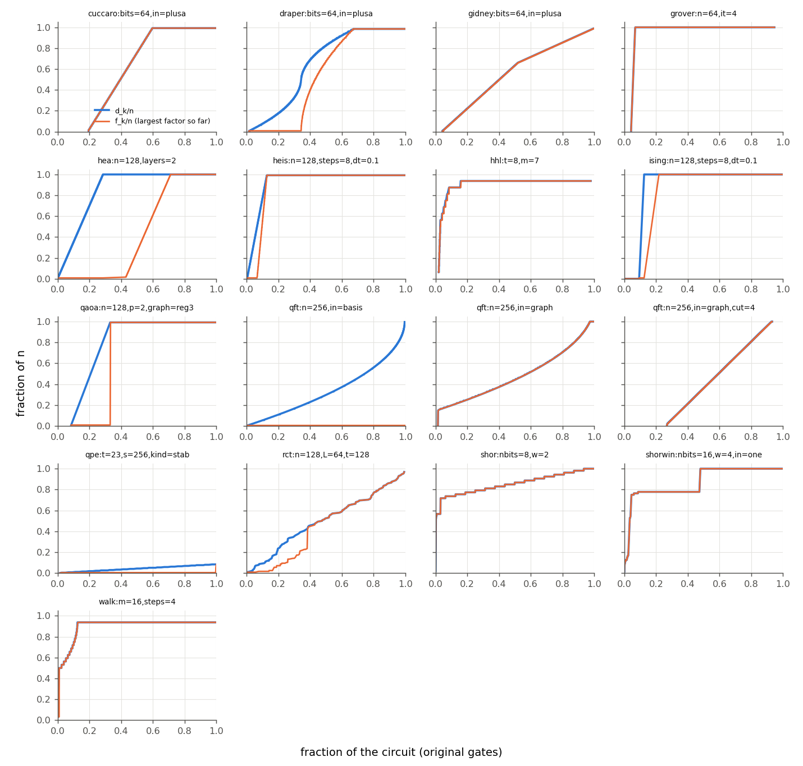
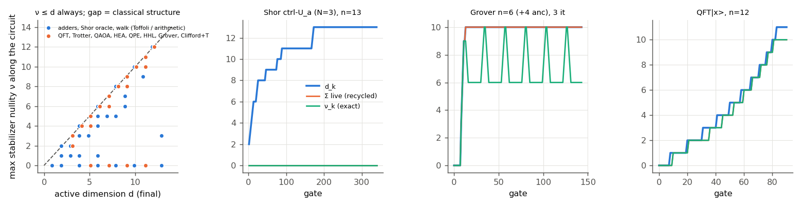
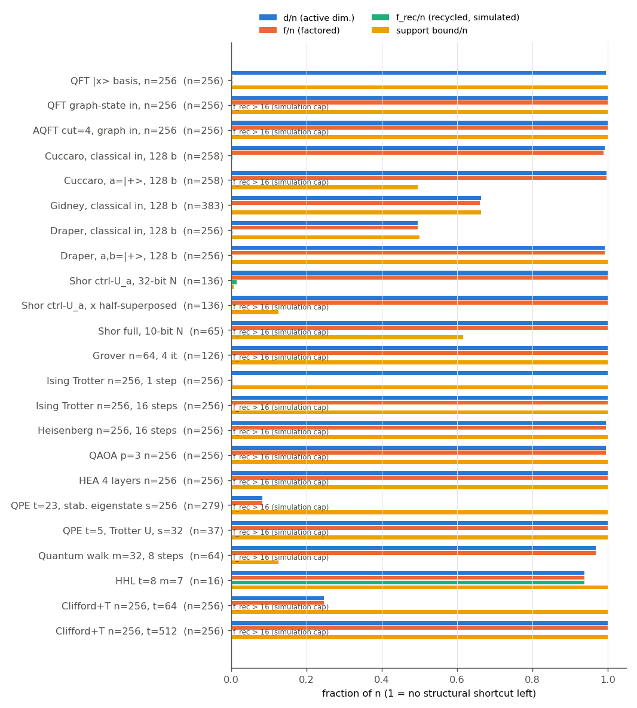
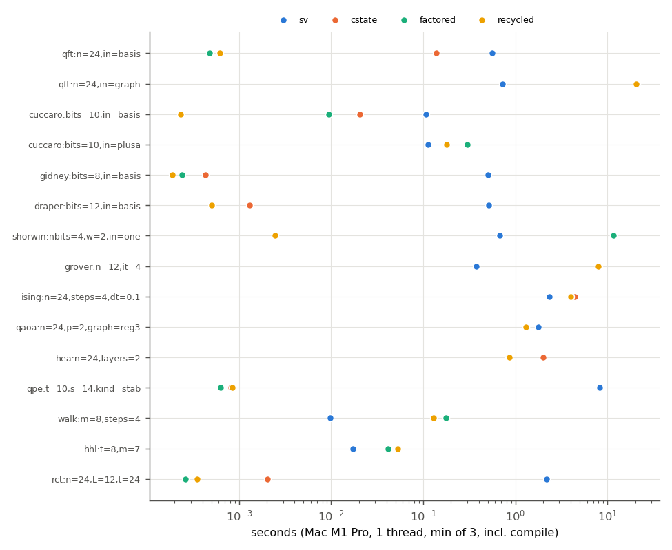
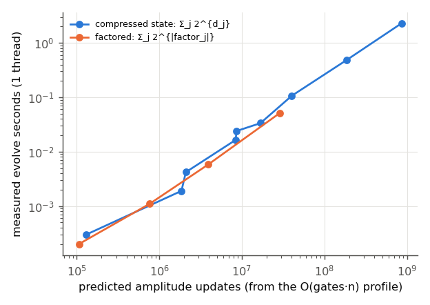

# A magic atlas of real quantum algorithms

Branch `exp/magic-atlas`. Author: qsim-magic-atlas agent (round 4, 4 Oct 2026). Based on main 73fb9fb.
Code: `src/magic_atlas/{mod.rs,families.rs}`, `examples/magic_atlas.rs`, `tests/magic_atlas.rs`
(11 tests), two small changes in `src/pauli_frame.rs` (support-only `map`, `post_conjugate`) and
`src/adaptive.rs` (frame internals made `pub(crate)`).
Data: `research/data/magic-atlas/` (`atlas.csv` 367 instances, `recycle.csv`, `magic.csv` + `magic/`
80 ground-truth timelines, `profiles/` 17 "when" profiles, `mac/*.jsonl` timings, `tables.md` all
per-family tables, PNGs, `driver.py`, `plots.py`, `run_mac.sh`).

## Headline

**Almost every real algorithm saturates the rotation frame's active dimension (d = n, so the
compressed-state shortcut is gone) within its first few percent of gates — QFT on generic input, all
adders on superposed input, Shor, Grover, Trotter after one step, QAOA, VQE ansätze — and for these
"generic" circuits d equals the stabilizer nullity of the state (max over the circuit, 33/33
instances at n ≤ 12; gate by gate for HEA, QAOA, Trotter and QPE), so d is a tight, O(gates·n) magic
measure there.** The big exception is arithmetic: Toffoli networks on
classical or two-branch data have d = n and T-counts up to 2·10⁵ yet zero magic at every Toffoli
boundary, and a new "magic-recycling" variant of the compressed state that absorbs stabilizer factors
back into the Clifford frame turns that into exact simulations with a 1–2-qubit register — e.g. the
windowed Shor oracle for a 62-bit modulus (256 qubits, 85,718 gates, T-count 190,050) in 1.3 s on a
laptop.

## 1. What is measured

A unitary circuit on |0ⁿ⟩ is lowered to Clifford + Z rotations (Toffoli → 7 T, `CPhase`/`Rx`/`Ry`/`U`
→ Clifford + `Rz`) and written in the rotation frame `U_k = C_k R_{m_k}⋯R_1` (research/pauli.md).
`magic_atlas::profile` computes, in one pass, O(gates·n/64) plus O(n²·w) for the GF(2) basis
(0.01–2.5 s per circuit at n ≤ 1024):

| symbol | definition | what it bounds |
|---|---|---|
| T-count / rot. | rotations by odd multiples of π/4 / all non-Clifford rotations (after merging π/2 multiples) | — |
| `d_k` | `dim span{x(Q_1..Q_m)}`, the active dimension (adaptive.rs) | register of the compressed state; **stabilizer nullity ν ≤ d** (the n−d frame qubits are stabilized) |
| `W_d` | `Σ_j 2^{d_j}` | exact amplitude-update count of `CompressedState` |
| `f_k` (**new**) | largest connected component of the coupling graph of the mapped axes in the CNOT frame V (x part + z part on already-active coordinates; union-find) | the active register is *exactly* a tensor product over components; `FactoredState` stores it that way; `W_f = Σ_j 2^{|comp_j|}` |
| `E_stab` | entanglement (bits) of the Clifford skeleton `C_k|0⟩` across the middle cut, from a column-major tableau | true Schmidt rank: `log2 χ(U_k|0⟩) ≤ E_stab + d` (since `U_k|0⟩ = Σ_y φ(y) P_y C_k|0⟩`, Pauli `P_y`) |
| support | affine GF(2) support bound (simulability.rs) | sparse-engine cost |
| `f_rec`, Σlive (**new**, needs simulation) | largest factor / total live qubits of `FactoredState::with_recycling` | Σlive ≥ ν at every gate boundary (asserted in every ground-truth run) |
| ν, M2 | stabilizer nullity (Beverland et al. 2020), stabilizer 2-Rényi entropy (Leone–Oliviero–Hamma 2022) from all 4ⁿ Pauli expectations (one FWHT per x, O(4ⁿ·n), n ≤ 12) | ground truth |

**Magic recycling (new engine mode).** After every original gate, each factor of the active register
touched by it (≤ 16 qubits) is tested for being an exact stabilizer state (affine support, flat
modulus, phase `i^{λ·c}(−1)^{q(c)}`, Dehaene–De Moor), a Clifford `K` with `K|0^k⟩ = φ` is
synthesised (H, S, CZ, CNOT network, X) and replayed against φ to 1e-9, then absorbed:
`ψ = C V† K_tot (… ⊗ φ ⊗ …) → K_tot ← K_tot K`, and the factor's coordinates return to |0⟩. Future
axes are conjugated by `K_tot` (a Heisenberg tableau with right-multiplication, `post_conjugate`).
**Free-coordinate compaction:** recycled coordinates hold |0⟩, so any CNOT network among them is a
symmetry; when a mapped axis has x-bits on several free coordinates, `CNOT(c*, t)` gates folding them
into one are absorbed into `K_tot`, so a rotation activates at most one new coordinate. Without
compaction the Shor oracle needed 11 qubits at n = 22 (growing ∝ n); with it, 2. The register size is
no longer monotone: it tracks state magic, not circuit magic.

## 2. The atlas (one representative row per family; all rows in `data/magic-atlas/tables.md`)

`d/n = 1` means no structural shortcut is left. "pred/meas" = predicted compressed-state seconds
`2.3 ns · W_d` vs measured (Mac, 1 thread), where an n ≤ 24 instance of the same family was timed (§5).

| family (instance) | n | gates | T / non-Cl. rot. | max d | d/n | f | f_rec | support | where d saturates | pred / meas (n≈24) |
|---|---|---|---|---|---|---|---|---|---|---|
| QFT on a basis state (n=1024) | 1024 | 525,799 | 3,069 / 117,468 | 1023 | 1.00 | **1** | 1 | 1024 | linearly over the whole circuit | 0.21 / 0.14 s (factored: 0.5 ms) |
| QFT on |+ⁿ⟩ (output |0⟩) | 1024 | 526,336 | 3,069 / 117,468 | 1023 | 1.00 | 1023 | **1** | 1024 | linearly | — |
| QFT on a graph state | 1024 | 527,359 | 3,069 / 117,468 | 1024 | 1.00 | 1024 | >16 | 1024 | linearly | 29 / 21 s (SV 0.72 s) |
| AQFT cut=4, graph in | 256 | 1,909 | 765 / 3,042 | 256 | 1.00 | 256 | >16 | 256 | linearly | — |
| Cuccaro, classical in (256 b) | 514 | 1,783 | 3,584 / 3,584 | 512 | 1.00 | 511 | **1** | **0** | first carry ripple (0.6 of gates) | 0.034 / 0.021 s (recycled 0.2 ms) |
| Cuccaro, a=|+⟩ | 514 | 1,917 | 3,584 | 513 | 1.00 | 513 | >16 | 256 | 0.6 | 0.36 / 0.30 s |
| Gidney, classical in (256 b) | 767 | 8,403 | 2,040 | 510 | 0.66 | 509 | **1** | 510 | — | 0.3 / 0.4 ms |
| Draper, classical in (256 b) | 512 | 98,934 | 2,295 / 82,836 | 255 | **0.50** | 255 | **1** | 256 | 0.65 | 1.9 / 1.3 ms |
| Draper, a,b = |+⟩ (256 b) | 512 | 99,200 | 2,295 / 82,836 | 510 | 1.00 | 510 | **1** | 512 | 0.65 | — |
| Shor ctrl-U_a, ctrl |+⟩, x=1 (32-bit N) | 136 | 26,364 | 62,944 | 136 | 1.00 | 136 | **2** | **1** | first lookup (≈5 %) | 9.2 / 11.6 s (recycled 2.4 ms) |
| Shor ctrl-U_a, x half-superposed | 136 | 26,379 | 62,944 | 136 | 1.00 | 136 | >16 | 17 | ≈5 % | — |
| Shor order finding (10-bit N, 20 counting q.) | 65 | 79,035 | 175,057 | 65 | 1.00 | 65 | >16 | 40 | first controlled-U (≈3 %) | — |
| Grover, Toffoli-ladder oracle (n=128, 8 it.) | 254 | 9,392 | 28,224 | 254 | 1.00 | 254 | >16 | 254 | first oracle | 10.2 / 8.0 s (SV 0.38 s) |
| Ising Trotter, 1 step (n=256) | 256 | 1,021 | 0 / 511 | 256 | 1.00 | **1** | 1 | 256 | — | — |
| Ising Trotter, ≥ 2 steps (n=256, 16 st.) | 256 | 16,336 | 0 / 8,176 | 256 | 1.00 | 256 | >16 | 256 | end of step 1 | 5.5 / 4.4 s (SV 2.3 s) |
| Ising at the Clifford point J·dt = h·dt = π/4 | 64 | 1,012 | 0 / 0 | 0 | 0 | 0 | 0 | 64 | never | — |
| Heisenberg XXX from Néel (16 st.) | 256 | 85,808 | 0 / 12,240 | 255 | 1.00 | 255 | >16 | 256 | end of step 1 | — |
| QAOA MaxCut p=3, 3-regular | 256 | 4,480 | 0 / 1,920 | 255 | 1.00 | 255 | >16 | 256 | first mixer layer | 1.9 / 1.3 s (SV 1.8 s) |
| VQE HEA, 4 layers | 256 | 3,324 | 0 / 2,304 | 256 | 1.00 | 256 | >16 | 256 | first rotation layer | 2.9 / 2.0 s |
| QPE, stabilizer eigenstate (t=23, s=256) | 279 | 59,354 | 66 / 12,535 | **23** | **0.08** | 23 | 23 | 279 | never (d = t) | 4.5e-4 / 8e-4 s at t=10 |
| QPE of a Trotter step on |0⟩ (t=5, s=32) | 37 | 11,740 | 12 / 3,936 | 37 | 1.00 | 37 | >16 | 37 | first controlled step | — |
| Coined walk, 2³² sites, 8 steps | 64 | 15,416 | 107,632 | 62 | 0.97 | 62 | >16 (2 after 1 step) | 8 | first step | 0.09 / 0.18 s (SV 0.01 s) |
| Toy HHL (t=8, m=7) | 16 | 750 | 86 / 604 | 15 | 0.94 | 15 | 15 | 16 | phase estimation | 0.036 / 0.041 s |
| random Clifford+T, t = n/4 (n=256) | 256 | 49,083 | 64 | **63** | 0.25 | 63 | >16 | 256 | grows ≈ 1 per T until t ≈ n | — |
| random Clifford+T, t = 2n | 256 | 49,991 | 512 | 256 | 1.00 | 256 | >16 | 256 | t ≈ 1.1 n | 2.1e-3 / 2.0e-3 s (t=24, n=24) |

How d grows with n and depth: in every saturating family d/n → 1 as n grows at fixed depth (the
tables show 0.98 → 1.00 from n = 64 to 256), and depth only adds rotations (`W_d` grows by
log2(#rotations at full d)), never dimensions. The families that keep `d ≪ n` at scale are exactly:
phase estimation with a stabilizer eigenstate (`d = t`, independent of the system size), Clifford+T
with t < n (`d ≈ t`), Draper/Gidney on classical inputs (`d ≈ n/2`, `2n/3`), and exact Clifford points
of Trotter evolution (`d = 0`). With factorisation, QFT/AQFT on any product or basis input (`f = 1` at
every n) and the first Trotter step (`f = 1`). With recycling, all arithmetic on classical or
two-branch data (`f_rec ≤ 2`) and the Draper adder on uniform superpositions (`f_rec = 1`).

`E_stab` (middle cut) is 0–3 for almost everything except adders with a superposed register
(`E_stab = bits`, the a↔b correlation crosses the cut) and random Clifford+T (25–29 at n = 256). The
entanglement bound `min(n/2, E_stab + d)` therefore only says something where d is already small
(QPE: ≤ 25 at n = 279; Clifford+T t = 16, n = 64: ≤ 22).

## 3. When is the quantumness used? (`when_profiles.png`)



`d_k/n` (blue) and the largest factor so far (orange) against the fraction of the circuit:

- **Grover, QAOA, HEA, Ising/Heisenberg, Shor:** saturation in the first 3–30 % of the gates (first
  oracle / first mixer / first Trotter step / first controlled-U). Everything after that is "free"
  from the frame's point of view: depth costs rotations, not dimensions.
- **QFT and AQFT:** d grows linearly with the processed qubits (d after qubit j ≈ j). On a basis
  input the register never couples (orange stays at 1/n).
- **Draper (a = |+⟩):** d is half used by the first QFT, the phase additions add nothing structural,
  the factored register merges during the inverse QFT.
- **QPE with a stabilizer eigenstate:** d climbs by one per counting qubit and stops at t.
- **Random Clifford+T:** d ≈ number of T gates seen so far; f lags d (components merge later).
- **Windowed Shor oracle:** d jumps to 0.78·n in the first table lookup and to n at the first modular
  addition; but the *recycled* register (§4) stays at ≤ 2 for the whole run.

## 4. Ground truth: is d the "quantumness"? (`nullity_vs_d.png`, `magic.csv`)



80 instances at n ≤ 12, nullity ν and SRE M2 after (up to 150 checkpoints of) every original gate,
compared with d_k, f_k and the recycled Σlive_k:

1. **Generic circuits: d = ν.** QFT on graph states, HEA, QAOA, Ising, Heisenberg, QPE (both
   kinds), HHL and Grover: `max_k ν_k = d` in **33/33** instances; for HEA, QAOA, Ising, Heisenberg
   and QPE-stab `ν_k = d_k` at *every* checkpoint (20/20 instances). Random Clifford+T: 3/4 (n = 6:
   d = 3, ν = 2). The rotation-frame dimension is not just an upper bound there; it is the stabilizer
   nullity, computed in O(gates·n) instead of O(4ⁿ). Overall `max ν = d` in 44/80 instances; the 36
   misses are all arithmetic, the walk, QFT on basis/|+⟩ inputs and one Clifford+T. (M2 is much smaller than ν, e.g. QFT graph n = 12: ν = 12,
   M2 = 6.8 — the usual gap between nullity and Rényi measures.)
2. **Arithmetic: the gap is total.** Cuccaro on classical inputs: d = 10, ν = 0 throughout (n = 12).
   The Shor oracle (ctrl |+⟩, x = 1, n = 13, T-count 686): d = 13, **ν = 0 and M2 = 0 at every one of
   its 340 gate boundaries** — the state is always `(|0,u⟩ + |1,v⟩)/√2`, a stabilizer state; the
   magic is borrowed and returned inside each Toffoli. Draper on `|+⟩|+⟩`: d = 8, ν = 0 at the end
   (`Σ_{a,b}|a⟩|a+b⟩` is an affine map of a stabilizer state).
3. **Recycling recovers most of ν.** Σlive (an upper bound, asserted ≥ ν in every run) equals ν at
   4,225 of 5,271 checkpoints (80 %) and is within 1 at 86 %; at every checkpoint of 54/80 instances
   (within 1 for 67/80). It misses where a stabilizer part is entangled with a non-stabilizer part
   inside one factor (the factor is then not a stabilizer state, so nothing is absorbed): Shor oracle
   with x half-superposed (Σlive 13, ν 3), the quantum walk (8 vs 5), superposed-input adders
   (ν + 1 or + 2).
4. **QFT|x⟩: nullity is not cost.** ν = n − 2 = d − 1 (output qubits are non-stabilizer
   single-qubit states except the last two) yet f = 1: high magic, product state, trivially simulable. Magic monotones alone do not
   predict simulation cost; the factor structure does.
5. **Grover:** ν oscillates between n_search (after each iteration) and n_search + n_anc (inside the
   oracle's Toffoli ladder); d sits at n_search + n_anc throughout. Grover states have stabilizer rank
   2 (`α|w⟩ + β|s⟩`, both stabilizer states), which neither d, ν nor f captures; a rank-2 engine
   would simulate Grover at any n (known; not implemented here).

## 5. Exactness and the cost law (Mac M1 Pro)

**Exactness.** `tests/magic_atlas.rs` (11 tests): for 19 small instances covering every family, the
profile's d-profile equals `adaptive::active_dimension_profile` exactly; `CompressedState` matches the
state vector (infidelity ≤ 1e-10); `FactoredState` (plain and recycling) matches 60 random Pauli
expectations per instance to 1e-10 and its largest factor equals the profile's f; recycling never
enlarges the register. Plus: QFT on 300 qubits against the product formula; the 38-qubit Shor oracle
against its analytic output; the adders against integer addition; HHL against `2^{-m} Σ 1/λ²`; QPE
against the Fejér-kernel distribution; the stabilizer recogniser on 200 random Cliffords (accepts all)
and their T-doped versions (rejects all with ν > 0); `E_stab` exact on 20 random Clifford circuits
and a valid bound (Rényi-2 ≤ E_stab + d) on all 19 instances. `verify` (example) ran on 15 families
at n ≤ 22: max Pauli error 5e-14, infidelity ≤ 8e-14. Existing suites (adaptive, pauli_frame,
simulability, lib: 123 tests) pass with the two `pauli_frame` changes.

**Cost law** (`cost_law.png`, `mac/magic-law.jsonl`; QPE t = 12…20 and Clifford+T t = 16…24 at
n = 64–84; 1 thread, min of 3; Mac 1-min load 9–10 during this chunk, owner's apps running): measured
compressed-state evolve time vs `W_d` from the profile: log–log slope **1.10**, RMSE 0.10 decades,
2.0–2.8 ns per amplitude update; factored engine slope 1.06. The profile predicts the run time of
the compressed engine to about ±30 % on this set (0.5–1.6× across the 15 families of the next table)
before anything is simulated.

**Engines head-to-head at n = 16–24** (`engines.png`, `mac/magic-eng.jsonl`, 1 thread, min of 3,
load 2.9–9):

| instance | n | d | f | f_rec | log2 W_d | pred. cstate | SV | cstate | factored | recycled | SV / best |
|---|---|---|---|---|---|---|---|---|---|---|---|
| QFT basis | 24 | 23 | 1 | 1 | 26.5 | 0.21 s | 0.56 s | 0.14 s | 0.5 ms | 0.6 ms | 1,200× |
| QFT graph | 24 | 24 | 24 | 24 | 33.6 | 29 s | **0.72 s** | 20.8 s | 20.7 s | 20.7 s | 1 |
| Cuccaro classical | 22 | 20 | 19 | 1 | 23.8 | 0.034 s | 0.11 s | 0.021 s | 9.4 ms | 0.2 ms | 460× |
| Cuccaro a=|+⟩ | 22 | 21 | 21 | 20 | 27.2 | 0.36 s | **0.11 s** | 0.30 s | 0.30 s | 0.18 s | 1 |
| Gidney classical | 23 | 14 | 13 | 1 | 17.0 | 0.3 ms | 0.51 s | 0.4 ms | 0.2 ms | 0.2 ms | 2,700× |
| Draper classical | 24 | 11 | 11 | 1 | 19.7 | 1.9 ms | 0.52 s | 1.3 ms | 0.5 ms | 0.5 ms | 1,000× |
| Shor ctrl-U_a (N=15) | 22 | 22 | 22 | 2 | 31.9 | 9.2 s | 0.68 s | 11.6 s | 11.6 s | 2.4 ms | 280× |
| Grover 12+10 anc, 4 it | 22 | 22 | 22 | 22 | 32.0 | 10 s | **0.38 s** | 8.0 s | 7.9 s | 8.0 s | 1 |
| Ising 4 steps | 24 | 24 | 24 | 24 | 31.2 | 5.5 s | **2.3 s** | 4.4 s | 4.0 s | 4.0 s | 1 |
| QAOA p=2 | 24 | 23 | 23 | 23 | 29.6 | 1.9 s | 1.8 s | 1.3 s | 1.3 s | 1.3 s | 1.4× |
| HEA 2 layers | 24 | 24 | 24 | 24 | 30.2 | 2.9 s | **0.84 s** | 2.0 s | 0.85 s | 0.86 s | 1 |
| QPE stab. (t=10) | 24 | 10 | 10 | 10 | 17.6 | 0.4 ms | 8.2 s | 0.8 ms | 0.6 ms | 0.8 ms | 13,000× |
| walk m=8, 4 steps | 16 | 14 | 14 | 14 | 25.2 | 0.09 s | **0.01 s** | 0.18 s | 0.18 s | 0.13 s | 1 |
| HHL t=8 m=7 | 16 | 15 | 15 | 15 | 23.9 | 0.04 s | **0.017 s** | 0.04 s | 0.04 s | 0.05 s | 1 |
| Clifford+T t=24 | 24 | 18 | 13 | 13 | 19.8 | 2.1 ms | 2.2 s | 2.0 ms | 0.3 ms | 0.3 ms | 8,400× |

Where d (or f, f_rec) is well below n the frame engines beat the state vector by 10²–10⁴ at n = 24,
and the predicted time tracks the measured one (predicted/measured 0.5–1.6× across all 15 families). Where d = n they lose by 1–30× (the
boundary law of research/simulability.md §5b: Clifford absorption buys only log2(G/m) qubits). The
recycled engine costs nothing extra when it cannot recycle (≤ 1.3× of plain factored).

## 6. Surprises

1. **The most T-expensive subroutine of Shor has zero magic.** One controlled modular multiplication
   (windowed, Gidney 2019) has the largest T-counts in the atlas and d = n at every size, yet with the
   control in |+⟩ and x a basis state it is a stabilizer state at every Toffoli boundary. Magic
   recycling simulates it exactly with a **2-qubit** register: 32-bit N (136 qubits, T-count 62,944)
   in 0.33 s, 62-bit N (256 qubits, T-count 190,050) in 1.3 s. All the magic of order finding comes
   from the *counting-register superposition*: the full circuit with 2n counting qubits has d = n and
   recycling fails (>16) at every size; with x half-superposed the register stays > 16 as well.
2. **QFT of a basis state: d = n − 1, ν = n − 2, f = 1.** Maximal by both circuit and state magic
   measures, yet a product state; the factored frame simulates n = 1024 (525,826 gates) exactly in
   0.5 s. The AQFT cutoff does not change d or f at all (d = 255, f = 1 for every cut at n = 256): the
   cutoff only removes rotations (W_f: 2^14 → 2^10), it never removes a dimension.
3. **Approximating the Draper adder makes it *harder* to simulate exactly.** Exact Draper on classical
   inputs: f_rec = 1 at every size (the output is a basis state, and the frame recycles every
   dimension). With the AQFT angle cutoff (cut = 2…8, i.e. dropping rotations below π/4…π/256) the
   output is no longer a basis state: f_rec > 16 at 64 bits (12 at 16 bits, 26 at 32 bits with cut=4,
   18 with cut=12). The approximate circuit is cheaper on hardware and costlier classically — the
   residual approximation error *is* the magic.
4. **Trotter step size is invisible to d except at exactly Clifford angles.** For the TFIM at n = 64,
   4 steps, d = 64 at every dt in a 16-point sweep except dt = π/4 and π/2 (J dt, h dt multiples of
   π/4 → Clifford, d = 0); "dual-unitary" lines with one Clifford coupling (J dt = π/4, generic h) keep
   d = n. The structural measure is discontinuous where the state magic (M2) is continuous; near-Clifford
   Trotter needs a different (perturbative / stabilizer-rank) handle.
5. **One Trotter step from |0⟩ is free, two are not.** After the first step f = 1 (ZZ rotations on
   |0⟩ are phases; the Rx layer is a product), after the second f = n.
6. **The Draper adder on |+⟩|+⟩ is a stabilizer computation.** d = 126 at 64 bits but f_rec = 1:
   `Σ_{a,b}|a⟩|a+b⟩` is an affine image of |+⟩^{2n}; the 82,836 non-Clifford rotations of the QFT
   sandwich cancel to a Clifford, and recycling finds it gate by gate.

## 7. Beyond-SV exact simulations (Mac M1 Pro, 8 threads unless stated; `mac/magic-demo.jsonl`)

| demo | n | gates | T / rot. | d | register | time | check |
|---|---|---|---|---|---|---|---|
| windowed Shor oracle, N = 4611686014132420609 (62-bit semiprime), a = 7, ctrl |+⟩, x = 1, w = 4 | **256** | 85,718 (27,150 Toffoli) | 190,050 T | 256 | **2 qubits** (recycled) | 1.29–1.35 s (3 runs) | all 256 ⟨Z_q⟩ and the coherence ⟨X_c X_diff⟩ = 1, ⟨Y_c X_diff⟩ = 0 against the analytic output; max error 0 |
| QPE, GHZ eigenstate of `exp(−iθX^{⊗256}) Π exp(−iφ_i Z_iZ_{i+1})`, t = 23 | **279** | 59,354 | 66 / 12,535 | 23 | 2²³ amplitudes | 13.3 s | ⟨Z_k⟩ of all 23 counting qubits against the Fejér-kernel distribution and ⟨X^{⊗256}⟩ = 1; max error 6.9e-12 |
| QFT of a random basis state | **1024** | 525,826 | 117,468 rot. | 1023 | 1023 factors of 1 qubit | 0.51–0.55 s | ⟨X_q⟩, ⟨Y_q⟩ of 65 output qubits against the product formula; max error 1.1e-11 |

Commands (after `cargo build --release --example magic_atlas`):
```
target/release/examples/magic_atlas demo-shor 62 4     # 256-qubit Shor oracle, recycled frame
target/release/examples/magic_atlas demo-qpe 23 256    # 279-qubit QPE, compressed state d=23
target/release/examples/magic_atlas demo-qft 1024      # 1024-qubit QFT|x>, factored frame
```
Honest caveats on these demos: each is classically easy *for a reason the atlas identifies* (two
branches; a stabilizer eigenstate; a product state). The sparse engine would also do the Shor oracle
(support 2) and any analytic formula does the other two; the point is that a single exact frame
engine finds the structure automatically from the gate list, and that its cost is predicted
beforehand (d, f) or tracks a magic monotone (recycling).

## 8. Known vs new (literature)

**Known.**
- Gottesman–Knill; Clifford+T compresses to t qubits (Jozsa–Van den Nest; Yoganathan–Jozsa–Strelchuk
  2019); circuit-specific active dimension with a dynamic register: Clifft (arXiv:2604.27058), which
  *contracts the register at measurements* — not in unitary circuits.
- Magic monotones: stabilizer nullity (Beverland, Campbell, Howard, Kliuchnikov 2020), stabilizer
  Rényi entropy (Leone, Oliviero, Hamma 2022, arXiv:2106.12587), stabilizer rank and extent (Bravyi
  et al. 2016/2019; arXiv:2106.07740). The FWHT trick for all Pauli expectations (O(4ⁿ n)) is the same
  as arXiv:2512.24685.
- Magic along algorithms: Krüger & Mauerer track stabilizer entropies across algorithms and VQAs
  ("Geometric and resource-theoretic characterisation of non-stabiliserness in quantum algorithms",
  PRA 2025, arXiv:2507.16543; "Quantum dark magic", QCE 2025) at state-vector sizes; magic of Shor's
  order-finding state analytically ("The true cost of factoring", arXiv:2605.05347, which finds Shor
  maximally uses magic — consistent with our full-circuit d = n and f_rec > 16); QFT has small
  entanglement (Chen, Stoudenmire, White, PRX Quantum 2023); Ingleton-type entropic tests on Grover/QFT/
  QPE (arXiv:2411.03439).
- Disentangling doped Clifford states by Clifford optimisation (Fux, Béri, Fazio, Tirrito, PRL 2025,
  arXiv:2410.09001) and Clifford-augmented MPS (CAMPS, arXiv:2412.17209) — related to our f < d and
  to recycling, but heuristic/variational and on MPS.
- Toffoli networks on classical data are classically trivial (reversible simulation; sparse simulators,
  e.g. research/shor.md); Grover states have stabilizer rank 2.

**New here, as far as I found.**
1. An atlas of exact, O(gates·n) structural magic invariants (d, f, E_stab bound, support) for ~20
   algorithm families at n = 16–1024, with *where* in the circuit the shortcut disappears.
2. Ground truth that **d equals the stabilizer nullity on every generic family tested** (33/33 at
   n ≤ 12, gate by gate on 20/20) — i.e. d is a polynomial-time nullity oracle there — and the systematic failure on
   arithmetic.
3. The factored active dimension f (exact tensor-product structure of the compressed register from
   union-find over frame axes) and its engine.
4. **Magic recycling** in a unitary frame simulator: exact stabilizer-factor recognition + Clifford
   synthesis + absorption + free-coordinate compaction, giving a non-monotone register that upper-bounds
   ν gate by gate (Σlive = ν at 80 % of 5,271 ground-truth checkpoints, all of them in 54/80 runs). With it, a 256-qubit, 190k-T Shor oracle runs
   exactly with a 2-qubit register.
5. Specific findings: zero magic at Toffoli boundaries of the controlled modular multiplier;
   approximate (AQFT) Draper adders leave unrecyclable magic where the exact one leaves none; the AQFT
   cutoff never changes d or f.

## 9. Caveats

- d, f and support are properties of the circuit *and* the product input; they ignore angles (any
  non-Clifford angle counts, so small-angle and near-Clifford circuits look maximal). Rotations with
  |angle| < ~1e-12 are treated as identity by the crate (`is_multiple_of_half_pi`); for QFT at
  n ≥ 45 this silently drops rotations of size < 2^-40 — an error < 1e-12 per gate, below the 1e-10
  exactness target but not zero.
- "T-count" counts π/4 rotations only; QFT-type circuits also have arbitrary-angle rotations ("non-Cl.
  rot."), which a fault-tolerant compiler would synthesise into many more T gates.
- Recycling only tests factors ≤ 16 qubits after original gates; `f_rec > 16` means "not found with
  this cap", not "no structure". It does not find stabilizer *rank*-2 structure (Grover).
- The Gidney adder is unitary (AND uncomputed by its adjoint, 4 T); the paper's measurement-based
  uncompute would halve its T-count; d is unaffected.
- Shor moduli are semiprimes `p·q` with `p` the largest prime below 2^{n/2}; the gate structure depends
  on N only through the lookup tables.
- Timings: Mac M1 Pro under the swarm lock, chunks ≤ 3.5 min, 1-min load 2.9–10 (owner's apps and a
  peer's build were running in some chunks); min of 3. The QPE instances in the engine and cost-law
  chunks were built with the earlier float-angle QPE builder (same gate structure, d and W_d
  identical); the demo used the final exact-binary-fraction builder.

## 10. Reproduce
```
cargo build --release --example magic_atlas
B=target/release/examples/magic_atlas
$B profile 'shorwin:nbits=32,w=4,in=one' 1          # one JSON line of invariants
$B verify 'cuccaro:bits=5,in=plusa' 1               # cstate + factored + recycled vs SV
$B time recycled 'shorwin:nbits=16,w=4,in=one' 1 8  # one engine run
$B magic 'grover:n=6,it=3' 1 out.csv 150            # ground-truth nullity/SRE timeline (n <= 14)
cd research/data/magic-atlas
WORKERS=2 python3 driver.py atlas  $B .   # atlas.csv + profiles/
WORKERS=2 python3 driver.py magic  $B .   # magic.csv + magic/
WORKERS=2 python3 driver.py recycle $B .  # recycle.csv
./run_mac.sh law1|law2|eng1|eng2|eng3|demo1|demo2 OUT.jsonl   # Mac, takes the bench lock
python3 plots.py . mac                    # tables.md + PNGs
```
Families (spec strings): `qft:n,cut,in={basis,plus,graph,zero,neel}`, `cuccaro|gidney|draper:bits,in={basis,plusa,plusab},cut`,
`shorwin:nbits,w,in={one,half}`, `shor:nbits,w,cnt`, `grover:n,it`, `ising:n,steps,dt,J,h,in`,
`heis:n,steps,dt,in`, `qaoa:n,p,graph={ring,reg3}`, `hea:n,layers`, `qpe:t,s,kind={stab,trotter}`,
`walk:m,steps`, `hhl:t,m`, `rct:n,L,t`.




