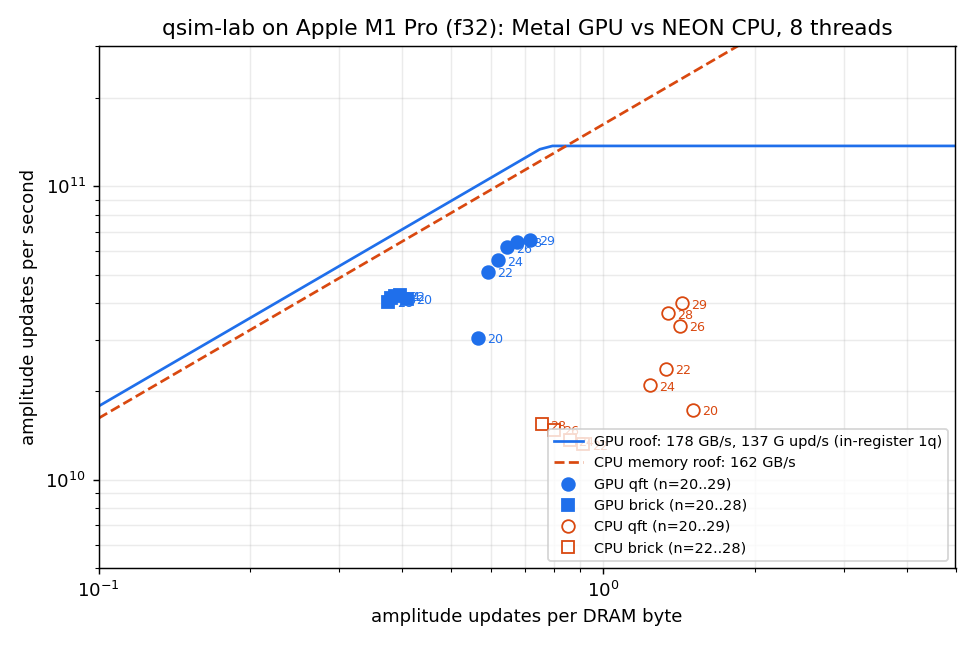

# Metal (Apple GPU) backend for the dense state vector, f32 (round 4, 4 Oct 2026)

Branch `exp/metal`. The code sits behind the `metal` cargo feature and only compiles on macOS: `src/metal_sv.rs` (host), `src/metal_sv.metal` (kernels), `tests/metal.rs`, `examples/metal_bench.rs`. Raw data and scripts are in `research/data/metal/`.

## Verdict

**Positive result. The kill criterion is not met.** On the M1 Pro (14-core GPU, 16 GB unified memory), the fused Metal backend beats our best CPU path (NEON FMA + 1 MiB cache-blocked executor, 8 threads):

- **QFT: 1.64-1.85x at 26-29 qubits.**
- **Random brickwork, depth 20: 2.6-2.8x at 26-28 qubits.**
- 2-3x at 22-24 qubits.

Against the quieter CPU numbers in `research/mac-m1.md`, the speedups are QFT-26 1.85x, brickwork-26 about 2.6x and brickwork-28 about 2.4x.

**Single precision only.** Apple GPUs have no f64 arithmetic. The CPU baseline in every comparison is also f32.

| workload | n | CPU 8t (s) | **GPU (s)** | **GPU speedup** | CPU quiet ref. (mac-m1.md) | GPU passes / CPU passes | GPU % of 178 GB/s roof | CPU % of 162 GB/s roof | setup (s) |
|---|---|---|---|---|---|---|---|---|---|
| QFT | 20 | 0.0044 | **0.0025** | 1.76x | | 8 / 3 | 30% | | 0.0014 |
| QFT | 22 | 0.0150 | **0.0070** | 2.14x | 0.0154 | 9 / 4 | 48% | | 0.0014 |
| QFT | 24 | 0.0792* | **0.0297** | 2.67x | 0.0620 (→ 2.09x) | 10 / 5 | 51% | | 0.0078 |
| QFT | 26 | 0.2278 | **0.1235** | **1.84x** | 0.2285 (→ 1.85x) | 11 / 5 | 54% | 15% | 0.020 |
| QFT | 28 | 0.9414 | **0.5378** | **1.75x** | 1.0182 (FMA, 256 KiB block) | 12 / 6 | 54% | 17% | 0.083 |
| QFT | 29 | 1.8484 | **1.1256** | **1.64x** | | 12 / 6 | 51% | 17% | 0.228 |
| brickwork d20 | 20 | (0.134*) | **0.0121** | (load-affected) | | 73 / 29 | 57% | | 0.0015 |
| brickwork d20 | 22 | 0.1674 | **0.0521** | 3.21x | 0.1687 (→ 3.24x) | 83 / 36 | 60% | | 0.0014 |
| brickwork d20 | 24 | 0.7102 | **0.2291** | 3.10x | 0.6699 (→ 2.92x) | 93 / 42 | 61% | 10% | 0.010 |
| brickwork d20 | 26 | 2.8383 | **1.0141** | **2.80x** | ≈2.67 (→ ≈2.6x) | 103 / 49 | 61% | 11% | 0.033 |
| brickwork d20 | 28 | 11.7506 | **4.4914** | **2.62x** | ≈10.7 (→ ≈2.4x) | 113 / 56 | 61% | 13% | 0.100 |

How the table was measured:
- **Timing.** Min of 5 (n ≤ 26 QFT, n ≤ 22 brickwork) or 3 runs, interleaved: every repetition runs CPU and GPU once, and the order rotates each repetition. Both work on the same shared `MTLBuffer`, reset to |0> on the GPU before each run.
- **What a time covers.** GPU time is plan (lowering, fusion, stage planning, diagonal tables; 0.3-1 ms, included) plus command-buffer submit to completion. CPU time is `BlockedChunkExecutor::from_kops` (its planning) plus `apply_to_chunk` on the same memory, as in `apply_circuit_blocked`.
- **Setup.** `setup` is the `MTLBuffer` allocation plus |0> initialisation on the GPU, including the OS's first-touch page zeroing. It is done once per n and is not in the run times.
- **Sources.** Rows come from `clean.out`, except QFT-29 and brickwork-28, which come from `scale.out`.
- **The two roof columns.** "% of roof" is `passes × 16 B × 2^n / BW / time`, the fraction of the time the DRAM traffic alone would take at the measured streaming bandwidth. CPU passes come from `plan_stages` with the CPU's f32 parameters (2^17-amplitude block, 6 slots).
- **Quiet references.** These are the "FMA + 1 MiB" rows of `mac-m1.md` §5. For n = 26/28 brickwork they are the 256 KiB-block numbers divided by the measured 1 MiB gain (§3), hence ≈.
- `*` marks CPU cells visibly slowed by machine load (see Caveats).



The roofline above plots amplitude updates per second against amplitude updates per DRAM byte. The memory roofs are the measured streaming bandwidths: 178 GB/s for the GPU (in-place `scale4` kernel, n = 26-29) and 162 GB/s for the CPU (rayon in-place loop, n = 29). The GPU compute roof is the measured rate of register-local single-qubit gates, 137 G amplitude updates per second. The plot shows the main finding: **the CPU path is compute-bound** at 10-17% of its memory roof, while **the GPU runs at 51-61% of its memory roof** but makes 2.0-2.5x more passes. The two machines stream at similar speeds (178 vs 125-162 GB/s), so the GPU's advantage is arithmetic throughput, not bandwidth.

## Design

The front end reuses the CPU blocked executor (`crate::blocked`). The steps are:
1. `lower_gates` turns gates into `KOp`s.
2. `fuse_1q` multiplies runs of single-qubit gates together, in f64.
3. `plan_stages` cuts the op list into stages of `tg_bits` inner qubits: the low contiguous qubits plus up to `slots` gathered high qubits. Controls and diagonal terms may involve any qubit.
4. `schedule_diag` moves diagonal terms together.

Each stage is **one compute dispatch** with one threadgroup per assignment of the outer qubits, so DRAM is streamed once per stage. All of a plan's stages go into one command buffer, and serial compute dispatches are ordered. The state is one shared-storage `MTLBuffer`, and `MetalState::amplitudes()` is a zero-copy `&[Complex32]` view of it (unified memory, no transfers).

Two stage kernels:

- **Register kernel (default: `tg_bits = 9`, `slots = 4`, `threads = 64`).** Thread `t` keeps buffer elements `t + 64 i` (i < 8) in registers for the whole stage, so it loads and stores straight from and to DRAM. A gate on buffer bit `b` is applied in one of three ways:
  - `b ≥ 6`: register-local, with no barrier and no shared memory (templated on `b` so the register indices are compile-time constants);
  - `b < 5`: `simd_shuffle_xor` across the 32-lane SIMD group;
  - `b = 5`: exchange through threadgroup memory.

  With the default shape, physical qubits 0-4 sit on the lane bits, the first gathered qubit on bit 5 and the other three gathered qubits on register bits. `slots = tg_bits − log2(threads)` would put every gathered qubit on a register bit; the extra slot costs some shared-memory exchanges but saves passes, and it measured faster.
- **Shared-memory kernel (`regs = false`).** The threadgroup gathers `2^tg_bits ≤ 4096` amplitudes into threadgroup memory (32 KiB on the M1) and applies each op there, with a barrier after every op. Consecutive uncontrolled 1q gates on distinct qubits can be batched (`batch ≤ 4`) into one op whose `2^k` amplitudes per thread stay in registers. This kernel needs fewer passes (QFT-26: 7 vs 11), but every op costs a barrier and a shared-memory round trip, and in total it is about 2x slower than the register kernel (ablation below).

**Diagonal aggregation**, the GPU port of the CPU's QFT advantage, works as follows. A run of diagonal terms is applied in one sweep over the stage's amplitudes.
- **Pivot groups.** Each term (multiply by `f` where `(e & imask) == ipat` and the outer bits match) is assigned to a *pivot group*. A term with no outer condition goes to the group of pivot `imask \ {d}`, where it leaves a factor that depends on the single bit `d`. A QFT's controlled phases after `H(j)` all share the pivot `{j}`.
- **Tables.** Inside a group the single-bit factors multiply into two 64-entry complex tables over the low and high 6 bits of the buffer index. The tables are built in f64 on the host, so the GPU does no `exp` or `sincos`.
- **Outer factors.** A term conditioned on outer qubits (a controlled phase whose control is not in the stage) becomes a per-threadgroup scalar of its group. These scalars are evaluated by a SIMD-group product reduction, one term per lane, instead of per amplitude.
- **Cost.** Each amplitude does about two table loads and three complex multiplies per matching group, and a QFT run has about one group.

**Naive baseline (`apply_kops_naive`).** One dispatch over the whole state per unfused op.

**Kernel compilation.** The offline Metal compiler is *not* installed on this Mac: `xcrun metal` fails with "missing Metal Toolchain" and would need `xcodebuild -downloadComponent MetalToolchain`. The backend therefore compiles its MSL source at run time with `MTLDevice newLibraryWithSource:`, which is part of macOS, so nothing was installed. Each `(kernel, tg_bits, threads)` pipeline is compiled on first use, which takes tens of ms. That cost lands in the first repetition and is excluded by the min.

**Bindings.** The `metal` crate 0.32 is an optional dependency under `[target.'cfg(target_os = "macos")'.dependencies]`, enabled by `--features metal`. `src/lib.rs` declares `#[cfg(all(feature = "metal", target_os = "macos"))] pub mod metal_sv;`. `tests/metal.rs` is cfg-gated the same way, and `examples/metal_bench.rs` has `required-features = ["metal"]` plus a stub `main` off macOS. Builds without the feature, and all non-macOS builds, are unchanged. Without the feature, `cargo check --lib --tests` is clean on the Mac. On the VPS the Linux build wasn't run (out of RAM); the gating is the standard target-specific optional-dependency pattern.

Usage:
```rust
use qsim_lab::metal_sv::{MetalConfig, MetalSim};
let sim = MetalSim::new()?;                 // compiles kernels
let mut st = sim.alloc(28)?;                // |0..0>, f32, shared memory
sim.apply_circuit(&mut st, &circuit, &MetalConfig::default())?;
let amps: &[num_complex::Complex32] = st.amplitudes();   // zero-copy
```

## Correctness

`tests/metal.rs` has 6 tests, all green on the M1 Pro. They compare against the independent f64 `audit_common::RefSv` with tolerance **1e-5** (f32):
- **Random circuits, n = 1..16.** The circuits mix `random_circuit` (every `Gate` it draws, including Toffoli, SWAP, CPhase, CZ, Rx/Ry/Rz, edge angles and edge qubits) with Sx, Sxdg, U, I, ISwap and ISwapdg. The test's own reference for those extra gates uses textbook matrices and is itself checked against RefSv. Each circuit is checked under 22 configurations, plus the naive path:
  - the default register kernel;
  - 8 shared-memory shapes covering batch widths 1-4;
  - 11 register-kernel shapes covering every split of buffer bits into lane, threadgroup-memory and register bits, including 1 and 1024 threads;
  - 2 configurations with fusion and scheduling off.

  **Worst |dAmp| = 2.3e-7.**
- **QFT from random basis states** (QFT|0> is uniform and real, so it is a weak check), and QFT and brickwork from |0>, at n = 5..16.
- **Back-to-back plans** on a non-zero basis state.
- **Error paths**: bad qubits, measurements, invalid configs, and n > 30.

At benchmark size the bench cross-checks every mode against the CPU on 65,536 evenly spaced amplitudes plus the norm. Brickwork n = 20-28 agrees to ≤ 3e-9; amplitudes are ~1e-4, so that is a relative ~1e-5. QFT-28 from the basis state `0x5a5a5a5` agrees to 4.2e-11 on amplitudes of ~6e-5 (`clean.out`, `QSIM_BENCH_BASIS`).

Bug found during development: with `slots = 1`, a SWAP of two high qubits makes `plan_stages` emit a stage wider than `tg_bits`, which overflowed the threadgroup buffer. `compile` now requires `slots ≥ 2` and rejects any stage wider than `tg_bits`, and a test covers this.

## Ablations: what the fusion buys (n = 24-28, Mac loaded, `scale.out`)

| workload | naive (1 dispatch / op) | shared-memory kernel (tg 12, slots 6, 512 thr, batch 3) | **register kernel (default)** |
|---|---|---|---|
| QFT-26 | 0.876 s (364 dispatches) | 0.251 s (7 passes) | **0.130 s** (11 passes) |
| QFT-28 | | 1.102 s (8) | **0.542 s** (12) |
| brickwork-24 | 1.714 s (1670 dispatches) | 0.424 s (59) | **0.228 s** (93) |
| brickwork-26 | | 1.873 s (66) | **1.014 s** (103) |

- **Stage fusion vs one dispatch per gate: 7x.**
- **Register residency vs a shared-memory buffer: about 2x**, despite needing 1.6x more passes.

QFT-26 over the development steps, all measured with the Mac loaded, so the numbers are approximate (`dev*.out`, `prof*.out`):

| version | QFT-26 |
|---|---|
| shared-memory kernel, per-term diagonal loop | 0.43-0.50 s |
| summed log-tables + `sincos` | 0.34 s |
| complex product tables, compile-time thread count | 0.18 s |
| register kernel | 0.17 s |
| SIMD-reduced outer factors + shape sweep | **0.124 s** |

Shape sweep at n = 26 (`sweep26.out`, interleaved, min of 3):

| register kernel shape (tg / slots / threads) | QFT-26 | brickwork-26 |
|---|---|---|
| 9 / 4 / 64 (default) | **0.124** | 1.013 |
| 9 / 4 / 32 | 0.160 | **0.926** |
| 10 / 3 / 128 | 0.139 | 1.047 |
| 8 / 3 / 32 | 0.146 | 1.066 |
| 10 / 4 / 64 | 0.152 | 0.967 |
| 10 / 5 / 64 | 0.156 | 1.045 |
| 11 / 3 / 256 | 0.151 | 1.104 |

Shapes with 32 amplitudes per thread (12/5/128, 11/5/64, 10/5/32) are **2-3x slower** (`dev3.out`), presumably from register spilling and low occupancy. That caps the register-local bits at 3-4.

## Bottleneck analysis

Diagnostics: `MetalSim::profile(…, load_store_only)` runs each stage in its own command buffer, either with or without its ops. `QSIM_METAL_DEFINES` injects `#define DBG_NO_*` switches into the kernel source.

1. **DRAM traffic is not the limit per pass.** A stage with no ops gathers and scatters at 150-177 GB/s, which is the streaming roof. So does every SWAP-only QFT stage (`prof3/4.out`).
2. **Pass count is the GPU's structural handicap.** The GPU's on-chip working set per threadgroup is 2^9 amplitudes (8 per thread × 64 threads, in registers). The CPU's is a 2^17-amplitude, 1 MiB L2 block. Each stage can therefore gather only 4 high qubits on the GPU vs 6 on the CPU, with fewer low qubits per block, so the GPU makes 2.0-2.5x more passes: QFT-26 11 vs 5, brickwork-26 103 vs 49. Four of the 11 QFT-26 passes are SWAP-only stages for the final bit reversal.
3. **In-stage compute costs about as much as the traffic.** QFT-26 stages 0-4 (5 H + 5 diagonal runs each) take 26 ms against 6.4 ms of load/store. Synthetic attribution at n = 26 (`prof5/7.out`):
   - A register-local 1q gate costs 0.5 ms per 2^26 amplitudes, i.e. 137 G updates/s, about 1.9 TFLOP/s of complex 2x2 arithmetic.
   - In the `cp` stage (5 H + 5 diagonal runs, 9 groups), load/store alone is 6.9 ms, with 1q gates only 13.3 ms, with diagonals only 19.3 ms, and with both 33.5 ms. That total is more than load/store plus the two increments (25.7 ms). The two code paths together raise register pressure and cut occupancy, and stage time is roughly *load/store + compute* with little overlap.
4. Net effect: the GPU sits at 51-61% of its memory roof with 2.0-2.5x the passes of the CPU, which sits at 10-17% of its roof. The GPU wins by its arithmetic throughput. A GPU at 100% of its roof with the CPU's pass count would be 3.4-4x faster again. That is the headroom, not a measured number.

What would move it (not done here):
- **A hybrid kernel.** Keep 2^12 amplitudes per threadgroup, as the shared-memory kernel does, but do most gates in registers. That would give the shared-memory kernel's pass count (about 0.6x) at close to register speed.
- **A dedicated bit-permutation pass for QFT's final SWAPs.** It would remove 3 of 11 passes, about 25% of QFT time. It needs a second buffer, or in-place cycle-following.
- **Commutation-aware (light-cone) stage planning across brickwork layers.** This would help the CPU executor too.
- Not recommended: running the CPU and GPU together. They share the same DRAM: GPU stream 178 GB/s, CPU 125-162 GB/s.

## Caveats

- **Machine load.** The Mac was heavily shared during every run. The 1-min load was 15-25, sometimes 50, from other agents' campaigns run without the lock (`dem_distance`, `color_search`, `bin2`, superopt `python`/`qsim` at up to 650% CPU) and from Logic Pro at about 85% of one core. Every timing holds `/tmp/qsim-mac-bench.lock` and is interleaved, and each block header in the `.out` files logs the load, the top processes and a `rustc`/`cargo` contamination flag. A load gate (wait for load < 6) timed out after 15 minutes, so the "clean" pass ran at load 15-25.
  - The CPU baseline suffers from this more than the GPU. Most CPU cells nevertheless agree with mac-m1.md's quieter numbers to within 0-10%: QFT-26 0.2278 vs 0.2285, brickwork-22 0.1674 vs 0.1687, brickwork-24 0.7102 vs 0.6699.
  - CPU brickwork-20 (0.134 s) and QFT-24 (0.079 s vs 0.062 s) are clearly inflated. Speedups against the quiet references are given in the table and are the conservative figures.
- **30 qubits was not run.** An f32 state at n = 30 is 8 GiB. The device limit allows it (`maxBufferLength` 9.53 GB, recommended working set 12.7 GB), but free plus inactive RAM was 6.5-8.5 GB, with 2 GB of swap already in use, Logic Pro running and other agents' jobs resident. Running it would have pushed Dylan's laptop into heavy swapping. n = 29 (4 GiB) ran fine.
- **Indices are 32-bit in the kernels**, so `MAX_QUBITS = 30`.
- **f32 only.** Long circuits accumulate about 1e-7 per op of relative error, the same as the CPU f32 path. Use the CPU f64 path when precision matters.
- **The GPU and CPU are compared on f32 with each one's best configuration.** The CPU uses its defaults (NEON FMA, 1 MiB block, 6 slots, 8 threads); the GPU uses the default register kernel.
- **The QFT benchmark starts from |0>**, as in mac-m1.md. QFT|0> has trivial phases, but the timing doesn't depend on the input state, and correctness from non-trivial basis states is tested separately.
- **Recommendation: merge behind the `metal` feature.** It is opt-in and macOS-only, with zero effect on other builds. The `unsafe` is confined to two kinds of block in `src/metal_sv.rs`, each with a SAFETY comment: the zero-copy slice views of the `MTLBuffer` (8-byte `float2` = `Complex32`, page-aligned) and the plain-old-data byte views used to upload plans.

## Reproduce (on the Mac)

```sh
export CARGO_TARGET_DIR=~/qsim-metal-target
cargo test --release --features metal --test metal
RAYON_NUM_THREADS=8 target/release/examples/metal_bench qft 20,22,24,26,28 3 0 cpu gpu naive "gpu:regs=0,tg=12,slots=6,thr=512"
RAYON_NUM_THREADS=8 target/release/examples/metal_bench brick 22,24,26 3 20 cpu gpu
target/release/examples/metal_bench bw 28 6                     # streaming roofs
target/release/examples/metal_bench prof qft 26 0 gpu           # per-stage full vs load/store-only
target/release/examples/metal_bench work brick 26 20            # amp updates, CPU/GPU pass counts
python3 research/data/metal/roofline.py                         # replot from summary.csv
```
Timing runs go through `research/data/metal/lr.sh`, which takes the lock and logs the load and contamination.
