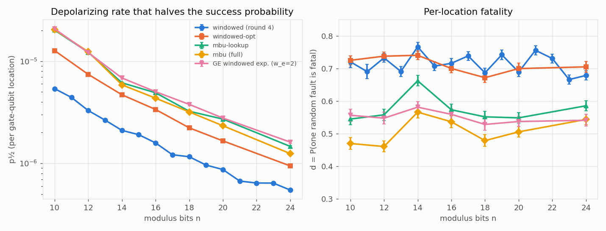
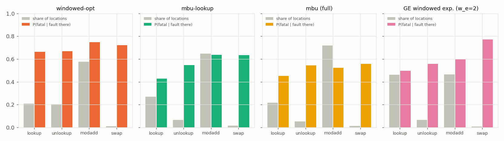

# Noise tolerance of the new Shor oracles (topic `noise-oracles`, branch `exp/noise-oracles`)

**Question.** The Shor oracle got much smaller today (round-4 windowed 1.70 M
gates → windowed-opt 1.04 M at 31 bits; Toffolis halved again by
measurement-based uncomputation (MBU); Gidney–Ekerå (GE) techniques → 45–61 k
Toffolis). research/shor-noise.md measured, on the round-4 oracle, that a
random depolarizing fault is fatal with probability d = 0.716 and that the
success probability halves at p½ = 5.49·10⁻⁷ per gate-qubit location at
n = 24. Did noise tolerance improve in proportion, or do the new
constructions concentrate the fatal locations?

**Answer.** Noise tolerance did **not** improve in proportion to the
Toffoli savings, and the new constructions do **not** concentrate fatal
locations — the measurement-based ones dilute them. Measured exactly at the
gate level (same 10–24-bit instances as shor-noise, depolarizing faults at
every gate-qubit location, every X-basis measurement and its fix-up
included), the rate that halves the success probability at **n = 24** is
(±1σ bootstrap; 95 % CI ≈ ±2σ; in brackets the systematic lower bound with
capped trajectories counted as failures):

| oracle (n = 24) | Toffolis | locations L | d = P(fault fatal) | **p½** | × round 4 |
|---|---|---|---|---|---|
| windowed, round 4 (shor-noise) | 277 632 | 1 867 900 | 0.678 ± 0.014 | (5.49 ± 0.09)·10⁻⁷ | 1 |
| windowed-opt (superopt) | 120 672 | 1 038 566 | 0.705 ± 0.017 | **(9.45 ± 0.19)·10⁻⁷** [9.33] | 1.72 |
| mbu-lookup | 96 639 | 856 349 | 0.589 ± 0.016 | **(1.46 ± 0.03)·10⁻⁶** [1.27] | 2.66 |
| mbu (full MBU, Gidney adders) | 54 065 | 1 063 701 | 0.546 ± 0.016 | **(1.24 ± 0.04)·10⁻⁶** [1.12] | 2.26 |
| GE windowed exponentiation (w_e = 2, w_m = 4, full MBU) | 40 337 | 807 326 | 0.543 ± 0.018 | **(1.61 ± 0.05)·10⁻⁶** [1.43] | 2.93 |

* **Toffolis fell 2.3–6.9×, p½ rose 1.7–2.9×.** p½ follows the number of
  locations (every CNOT, CZ fix-up, measurement and reset counts, not only
  Toffolis) times the per-location fatality d: P_succ ≈ S₀·exp(−d·p·L) still
  holds, p½·L ≈ ln 2 / d, and L-ratio × d-ratio reproduces every p½ ratio
  within 6 %. Full MBU halves the Toffolis of mbu-lookup but *adds* CNOT,
  CZ and measurement locations (L 0.86 M → 1.06 M), so its p½ is *lower* than
  mbu-lookup's despite its lower d.
* **Superoptimisation changed nothing per location** (d = 0.67–0.74 at every
  n, as round 4's 0.67–0.77; same fatality structure): its 1.72× is exactly its location
  reduction (1.80×).
* **MBU and GE lower d** from 0.70 to 0.54–0.59 at n = 24 (0.46–0.56 at
  n = 10–20). Mechanism: an X-basis measurement of an ancilla turns the
  persistent dirt left by an X/Y fault (which dephases every later round —
  theory-shor T3(d), fatal) into a one-round phase error. Faults that leave
  no dirty ancilla rise from 35 % (windowed-opt) to 59–74 %; dirty-ancilla
  faults survive 16–30 % instead of 1.6 %. T3(a, b) hold on all oracles; the
  hypothesis of T3(d) fails for MBU circuits. Window model: d → 0.79
  (windowed-opt), 0.70 (mbu-lookup), 0.63 (mbu, GE) at large n.
* **Fatality map** (§4): no block is a hot spot — every block's share of the
  fatal-fault budget G_eff is within ±0.1 of its share of locations; the
  modular adder (58–72 % of locations; GE: lookups 48 %) carries 60–74 % of
  G_eff. What stays fatal is arithmetic (X/Y on b, K, carries in the
  reduction, P(ok) 0.2–0.4).
* **Design** (§6): a Z-basis reset of every should-be-clean ancilla **after
  each window** (no added gates; the resets' own flip locations charged)
  raises p½ of windowed-opt by **1.56–1.79×** at n = 12–20 (per-round reset,
  shor-noise's design: 1.40–1.69×), of mbu-lookup by 1.19–1.29× and of mbu by
  ~1.14× (MBU already resets what it measures).
* **Engine**: `src/shor/noisy_gen.rs` simulates all these oracles exactly
  (X-basis measurements under faults via multiset branches and importance
  weights; GE exponent windows; mid-circuit resets), validated against an
  independent sparse-state reference on 1 246 fixed fault patterns to 1e-12
  and against independent samplers by χ² (18 cases, p ∈ [0.15, 0.97]).

All numbers are ±1σ (bootstrap over trajectories) unless stated. Machines: VPS
(4 vCPU, shared, load 6–13 from other agents; `nice -n 15`, 2 threads) for
development, validation and n ≤ 20; Mac (M1 Pro, shared, load 5–28; 2 threads,
no bench lock, workers SIGSTOPped while anyone held the lock or free+inactive
memory < 3 GB; every process ≤ 1.7 GB RSS) for n = 22, 24. No timing claims:
these are Monte-Carlo statistics (per-trajectory seconds are in the raw CSVs).

## 1. Engine: exact noisy trajectories for every oracle (`src/shor/noisy_gen.rs`)

The engine of research/shor-noise.md (`src/shor/noisy.rs`) handles X / CNOT /
CCX oracles. The new module generalises it, with the same fault model and
the same control algebra, to:

* **windowed-opt** (reversible, superopt): the block is emitted window by
  window with exact block tags (lookup / modular adder / unlookup / swap,
  and parts: unary-iteration AND chain, fan-out, adder, reduction,
  comparator), asserted gate-for-gate equal to `shor_superopt::controlled_ua`;
* **mbu-lookup** and **mbu** (`shor_mbu`, `MbuOpts::LOOKUPS` / `ALL`):
  X-basis measurements with classically controlled fix-ups (temporary-AND CZ,
  phase-lookup unlookup, phase-comparator flag). The op stream depends on
  the recorded outcomes, so it is resolved **per trajectory** by a tagged
  mirror of `shor_mbu::resolve` (tested equal to it, op for op);
* **GE windowed exponentiation** (`shor_ge`, `w_e` exponent qubits per window,
  exact arithmetic, all MBU constructions): the "control" is a `w_e`-qubit
  register; after the block the engine keeps, per rest-of-register key, the
  `2^{w_e}` exponent amplitudes and applies phase correction, H, readout of
  each exponent qubit (highest power first) with faults on each of them.

**Exact X-basis measurements under faults, without per-measurement sorting.**
On a list of basis branches, projecting qubit q onto X-outcome m maps
|…q…⟩ ↦ (−1)^{m·q}|…0…⟩/√2. Fault-free, q is a function of the other qubits on
every branch: no two branches collide and P(m) = ½. A fault can break this:
two branches that differ only in q then merge and interfere. The engine
keeps the branch list as a **multiset** (every later op is linear and acts
per branch) and sums duplicate keys once, at the end of the round, where it
merges the control halves anyway. Recorded outcomes are drawn uniformly (the
fault-free law), and the trajectory carries the **importance weight**
W = Π_rounds ‖state‖² = Π_j 2·P(m_j | history); E[W·ok] is exact. Collisions
are not rare with faults: 15–51 % of single-fault MBU trajectories have
W ≠ 1 (0.82–1.17), mean weight 1.000 ± 0.002 as it must be.

**Fault locations** (all at rate p, as shor-noise): a Pauli after every gate
on each of its qubits (the Z / CZ fix-ups are gates); control sites
Prep / H1 / Phase / H2 / Meas per round (per exponent qubit in GE); an X-basis
measurement has two: a readout flip (the recorded outcome, which selects the
fix-up, differs from the projection) and a reset flip (q left in |1⟩).
Keys are `u128` or a 192-bit `K192` (GE at n = 24 has 130 qubits).

### Validation

* `tests/noise_oracles.rs` (exact distributions of the recorded integer,
  whole measurement tree, vs an independent gate-by-gate sparse-state
  reference that applies every op as a real gate, every fault as a real Pauli
  and every X-basis measurement as H + projective measurement with its true
  probability, path weight ×2P): **423** fixed fault patterns on mbu /
  mbu-lookup / windowed-opt (N = 15, 21; all control sites × Paulis, readout
  and reset flips at random measurements, every Pauli on a measured qubit just
  before its measurement, random 1–4-fault patterns) agree to < 1e-12, for
  both key types; **120** random op streams with X-measurements of qubits that
  are not functions of the rest (75 with W ≠ 1) agree to < 1e-12; **144**
  patterns of the reset design variants (§5, 51 with a dirty reset) agree;
  **559** patterns of GE windowed exponentiation (w_e = 2, 4; N = 15, 21) agree,
  and its noiseless distribution equals the textbook order-finding
  distribution to 1e-12.
* `src/shor/noisy_gen.rs` unit tests: on the round-4 windowed and windowed-opt
  oracles the new engine reproduces the shor-noise engine exactly (fixed
  patterns, three channels, 1e-12; same location count L).
* Sampler vs independent samplers (`examples/noise_oracles_validate.rs`,
  `data/noise-oracles/validation.csv`; 20 000 engine vs 3 000 reference
  trajectories at pL = 1.5, depolarizing / bit-flip / phase-flip):
  windowed-opt vs the stock noisy `Circuit::run`; mbu-lookup and mbu vs a
  *lazy* interpreter of the oracle's logical ops on the sparse state (real
  measurements with true probabilities, fix-ups generated from the measured
  outcomes, own noise sampling — no importance weights, no location index).
  Two-sample χ² on the recorded integer: **all 18 p-values in
  [0.146, 0.968]**; success-rate z-tests |z| ≤ 1.27.

## 2. Method (as shor-noise, plus weights)

Same instances (research/data/shor-noise/instances.txt, one typical base per
N), same success criterion ("peak": |y/2^t − s/r| < 1/(2r²)), same fault-count
stratification P(p) = Σ_k Binom(k; L, p)·S_k with k = 0…3 (k > 3 bounded by
S_k ≤ S₃), same caps. S₀ is a property of the instance (every oracle is
exact; the noiseless distributions are identical), so it is pooled over all
oracles. For MBU oracles L depends on the recorded outcomes (fix-ups run on
half the shots); its spread is 0.2–0.7 % (σ_L/L), so P(p) uses the mean L̄
(error O((σ_L/L)²) ≈ 10⁻⁵).

**Caps (the main systematic).** A dirty trajectory's support grows, so runs
are capped and capped trajectories get a calibrated success ĉ, as in
shor-noise. Reversible oracles keep the shor-noise rule (real cap 4r = 8× the
noiseless peak support r/2). The MBU / GE oracles behave differently: a dirty
ancilla is cleaned by the next X-measurement of that qubit, and at n ≤ 16 the
support of a dirty trajectory stays ≤ 24× the peak (median 1×), so they ran
with cap 16r up to n = 20 (most dirty trajectories complete) and 4r at
n = 24 (memory: ≤ 1.7 GB per process). Calibration, from trajectories that
exceeded 8× the peak but completed, split by family and by where the faults
act (theory-shor T3: start window vs middle): reversible 0.010 ± 0.003
(middle) / 0.027 ± 0.015 (start), from uncapped runs at n = 10, 11;
measurement-based 0.083 ± 0.005 (middle) / 0.56 ± 0.03 (start), from n ≥ 14.
A capped trajectory whose faults all lie in the last ν₂(r) rounds is counted
with S₀ exactly (T3(a); none occurred). The v-capped success of the MBU
oracles varies by instance (1–3 % at n = 14, 16; 18–50 % at n = 18, 20, whose
instances have 8–10 spare low bits), so for them the calibration is the
dominant systematic: with ĉ = 0 instead, S₁ at n = 24 drops from 0.410 to
0.346 (mbu-lookup), 0.453 to 0.408 (mbu), 0.455 to 0.404 (GE), 0.294 to
0.287 (windowed-opt); the resulting p½ lower bounds are the bracketed values
in the TL;DR and the column `p½ (ĉ = 0)` below. Every conclusion holds at the
lower bound.

## 3. Results: p½, d, G_eff per oracle



{{TABLE_MAIN}}

Gate and location counts at n = 24 (N = 10 161 323, one resolved stream for
the MBU oracles; `data/noise-oracles/counts_24.txt`):

| oracle | qubits | ops (gates + measurements + fix-ups) | Toffolis | X-measurements | locations L |
|---|---|---|---|---|---|
| windowed (round 4) | 104 | 818 630 | 277 632 | 0 | 1 867 900 |
| windowed-opt | 104 | 463 867 | 120 672 | 0 | 1 038 566 |
| mbu-lookup | 104 | 383 846 | 96 639 | 22 767 | 856 349 ± 2 444 |
| mbu (full) | 127 | 516 111 | 54 065 | 64 145 | 1 063 701 ± 1 633 |
| GE windowed exp. (w_e = 2, w_m = 4) | 130 | 389 370 | 40 337 | 45 953 | 807 326 ± 3 044 |

* **Exponential model.** As for round 4, P_succ ≈ S₀·exp(−d·p·L) describes
  the strata to first order (windowed-opt: S₂ ≈ S₀(1 − d)², with the
  few-percent success floor at k = 3 that shor-noise found; MBU / GE: S₂ is
  5–30 % above S₀(1 − d)², faults compound less than independently), so
  p½·L ≈ ln 2/d: 0.94–1.03 for windowed-opt,
  1.05–1.33 (mbu-lookup), 1.25–1.54 (mbu), 1.16–1.36 (GE).
* **Scaling, n = 10–24.** G_eff = L·d grows as n^2.95 (windowed-opt), n^3.04
  (mbu-lookup), n^3.19 (mbu), n^2.87 (GE), the exponents of their L (n^3.02,
  n^3.02, n^3.06, n^2.92) within ±0.13: d does not drift systematically with
  n beyond the instance-to-instance scatter (0.67–0.74 windowed-opt,
  0.55–0.66 mbu-lookup, 0.46–0.57 mbu, 0.53–0.58 GE), which follows the T3
  windows (§5). The superoptimised oracle's L grows as n^3.0 (round 4: n^2.69,
  which carried more lower-order terms), so its advantage over round 4 shrinks
  with n: ×2.37 at n = 10, ×1.72 at n = 24.
* **Ranking at n = 24**: GE (w_e = 2) > mbu-lookup > mbu > windowed-opt >
  round 4 in p½, the same order as L·d. At n = 10–20 mbu-lookup, mbu and GE
  are within 10–20 % of each other; at n = 24 GE leads by 10 % (fewest
  locations) and mbu falls behind mbu-lookup by 15 % (most locations).

## 4. The fatality map



{{TABLE_FAT}}

**No concentration.** In every oracle the fatal locations are spread over
the blocks roughly in proportion to their location counts: the share of G_eff
of each block is within ±0.1 of its share of locations. The modular adder
holds 58–72 % of the locations of the windowed oracles and 60–74 % of G_eff;
the GE windowed exponentiation, whose lookups are addressed by w_e + w_m bits,
moves half of its locations into lookups (48 %) and they carry 44 % of G_eff.
The new constructions do not create a small set of critical locations that
could be protected selectively.

**Per-location damage fell, mostly in the lookups.** P(ok | fault in block)/S₀:

* windowed-opt: 0.25 (modular adder), 0.33–0.34 (lookups) — the same as the
  round-4 oracle (shor-noise: 0.28 overall, lookup register 0.11 X/Y + 0.61 Z);
  superoptimisation removed gates, not fatal-per-gate structure.
* mbu-lookup: lookups 0.57 (from 0.34), unlookup 0.45, modular adder 0.36.
* mbu: lookups 0.55, modular adder 0.47 (from 0.25: its flag and the Gidney
  temporary-AND carries are uncomputed by measurement).
* GE: lookups 0.48, modular adder 0.40, swap 0.20, exponent-qubit control
  sites 0.00 (0.2 % of L: a phase or H fault on an exponent qubit corrupts
  the measured bits of the window).

**Why.** By register and Pauli family (`fatality_blocks_pauli.csv`,
`fatality_roles.csv`): in windowed-opt an X/Y fault survives with 0.05–0.13
almost everywhere (it leaves a dirty ancilla that dephases every later round,
T3(d)); in the MBU oracles X/Y faults on the lookup output and the AND
ancillas survive with 0.5–0.55 — those qubits are X-measured right after use,
and the measurement converts the dirt d(x) into a phase (−1)^{m·d(x)}, i.e. a
Z-type fault confined to one round (the clean-fault behaviour of T3(b, c)).
The fraction of single faults that leave no dirty ancilla after their round
("clean") rises from 0.35 (windowed-opt) to 0.59 (mbu-lookup), 0.68 (mbu)
and 0.74 (GE). What remains fatal is arithmetic: X/Y faults on b, K and the
carries in the reduction part of the modular adder (P(ok) 0.20–0.40), which
corrupt the sum itself; changing how ancillas are uncomputed cannot make those benign.

## 5. Theory check (research/theory-shor.md, T3)

{{TABLE_WIN}}

Theory-shor T3 was proved for any fault model and stated for the round-4
oracle; on the new oracles:

* **T3(a) end window** (any fault in the last ν₂(r) rounds is harmless,
  P(ok) = S₀ exactly): confirmed for every oracle — measured 0.996–1.014 · S₀
  (table above; for GE a fault acts on all rounds of its window, and windows
  are classified by their first round). The analysis now uses the theorem
  for capped end-window trajectories (exactly S₀).
* **T3(b) start window, clean faults**: measured P(ok) 0.95–0.98 for clean
  single faults in rounds with Δ_i ≥ 1, above the mean bound L(Δ_i) =
  0.75–0.83 for every oracle (`analysis.txt`).
* **T3(d) dirty faults are fatal** holds for windowed-opt (measured 0.016 ±
  0.003 vs the dephasing bound 0.011) and **fails for the MBU oracles**:
  dirty single faults survive with 0.16 ± 0.01 (mbu-lookup), 0.30 ± 0.02 (mbu),
  0.24 ± 0.02 (GE) against the bound 0.009–0.015. The theorem is not violated:
  its hypothesis — the dirty ancilla dephases the control *in every later
  round* — is false when the next X-measurement of that ancilla removes the
  dirt. So the dichotomy "clean faults are benign at the edges, dirty faults
  are fatal" that underlies the window model becomes "dirty faults are
  transient" for MBU circuits.
* **T3 window model and its large-n limit**: with each oracle's pooled
  clean/dirty survival rates and clean fraction, the model reproduces the
  instances' d within 0.02–0.06 (`analysis.txt`) and predicts d∞ = 0.79
  (windowed-opt, the same as shor-noise's 0.79 for round 4), 0.70
  (mbu-lookup), 0.63 (mbu), 0.63 (GE). The improvement of the MBU oracles
  is therefore a large-n effect, not a small-instance artefact; it is
  smaller than at n = 10–12 (d = 0.46–0.56), where the start window is a
  larger share of the rounds.

## 6. Design: where to reset the should-be-clean ancillas

{{TABLE_DESIGN}}

**Proposal.** The fatality map says the remaining avoidable damage is
*persistent dirt*: an X/Y fault that leaves an ancilla in the wrong state
poisons every later window and round. MBU removes dirt only from the qubits
it measures (lookup output, AND ancillas, flag, Gidney carries); the constant
register K, the carry c0, the top accumulator bit b[n] and, in windowed-opt,
everything else are uncomputed coherently. The change: a **Z-basis
measure-and-reset of every qubit that should be clean at that point**, placed
**after every window's unlookup** (lookup register, AND ancillas, K, c0, flag,
b[n], Gidney carries: they are all |0⟩ between windows) plus, at the round
end, of every ancilla (`ResetMode::Window`; `ResetMode::Round` is only the
round-end reset, shor-noise's design). No gate is added (gate count equal);
each reset is an operation with its own location — a reset flip at rate p
that leaves the qubit in |1⟩ — so L grows by 0.8–3.7 %, and that is charged.
The engine evaluates such rounds in segments and measures the group exactly
(sorting and merging only when some branch is actually dirty); 144 fault
patterns agree with the sparse reference (§1).

**Result** (depolarizing; p½ includes the extra reset locations): per-window
placement raises p½ of **windowed-opt by 1.56–1.79×** at n = 12–16
({{DES20}}), against 1.40–1.69× for the per-round placement; for
mbu-lookup by 1.19–1.29× (per round 1.19–1.23×), for mbu by 1.13–1.14×
(per round 1.07–1.16×, the same within errors). With per-window resets the
*reversible* windowed-opt oracle (gate count unchanged, 2.2× the Toffolis of
mbu) is as fault-tolerant as mbu-lookup with the same resets and better than
mbu-lookup or mbu without them. For the MBU oracles most of the benefit is
already built in (their measurements are resets), so the extra resets buy
little; their remaining damage is arithmetic (§4).

Why per window beats per round on windowed-opt: a fault in the uncompute
half of a block (unlookup, the reduction's restore, the comparator) leaves
dirt but a correct sum; a reset right after the block removes it before the
next window uses the dirty ancilla as a control. Measured on windowed-opt
(k = 1, pooled n = 12–16): d drops from 0.71–0.74 to 0.46–0.47 (per window)
and 0.46–0.52 (per round). Constant dirt (an X fault on K after its last use)
is removed with no side effect; dirt that depends on x (a fault on an AND flag
during an unlookup) is removed by a Z measurement that partially collapses
the work register — the residual damage of the variant.

## 7. Caveats

* The fault model of research/shor-noise.md: uniform rate p at every
  gate-qubit location, each CCX gets three independent single-qubit channels,
  ideal state preparation of the work register and ancillas, no idle noise,
  Pauli (stochastic) noise only, noiseless classical phase corrections. The
  MBU X-measurements get a readout flip and a reset flip at the same rate p;
  the design variants' resets get one reset flip per qubit. A real device
  would weight these sites differently (measurements and resets are usually
  slower and noisier than gates); the location shares in §4 let the reader
  re-weight.
* "Locations" ≠ "gates": every comparison of fault tolerance is per
  gate-qubit location. Toffolis are not the right unit here: MBU halves the
  Toffolis but *adds* CNOT, CZ and measurement locations (mbu: L = 1.06 M at
  n = 24, more than windowed-opt's 1.04 M).
* One base per N (the shor-noise instances); d varies by instance by ±0.05
  through the T3 windows (ν₂(r), spare low bits). Every oracle runs the same
  instances, so the comparison between oracles is paired.
* Capped trajectories: windowed-opt with the calibrated ĉ = 1.1 % (n = 10, 11
  without a cap); MBU / GE at n = 24 with ĉ from n ≥ 14 (2 %). With ĉ = 0
  instead S₁ moves by ≤ 0.01 at n = 24 for every oracle (columns `S_lo` in
  `strata.csv`).
* MBU location counts depend on the recorded outcomes; P(p) uses the mean L̄
  (spread 0.2–0.7 %).
* The VPS MBU runs at n = 10–16 with cap 4r were superseded by re-runs with
  cap 16r (same seeds, `raw_superseded/`); the first VPS runs of every oracle
  had QSIM_NOISE_KMIN ignored (a job-script typo), so they also contain extra
  k = 0 / k = 1 strata, which are used (all seeds distinct per (job, k, j)).
* Design (§6) measured at n = 12–20, not at n = 24 (machine time).
* GE windowed exponentiation measured with w_e = 2 (t = 2n must be a multiple of
  w_e for every instance); research/ge-shor.md's 31-bit count used w_e = 3.
  Ekerå–Håstad and coset arithmetic are not measured (coset arithmetic is
  approximate even without noise; EH uses a different post-processing).

## 8. Literature

* **Measurement-based uncomputation** (temporary logical-AND: Gidney,
  arXiv:1709.06648; measured unlookup / phase fix-up: Berry et al.,
  arXiv:1902.02134, Gidney arXiv:1905.07682; flag measurement: Gidney
  arXiv:2505.15917) and **windowed exponentiation** (Gidney–Ekerå,
  arXiv:1905.09749) were introduced and are always costed as *gate-count*
  savings (Toffolis / T count); their resource estimates bound the failure
  probability by the summed logical error of all locations, i.e. treat every
  location as fatal (d = 1). We found no prior measurement of how MBU changes
  the *fraction* of fatal locations. The mechanism we measure — an X-basis
  measurement turns persistent ancilla dirt into a one-shot phase error — is
  the familiar point that measuring and resetting ancillas confines error
  propagation (e.g. ancilla verification and flag qubits in fault-tolerant
  gadgets, Chao & Reichardt arXiv:1705.02329), here quantified on whole
  Shor circuits.
* **Circuit-level fault statistics of Shor**: research/shor-noise.md (this
  repo; round-4 oracle, n ≤ 24) and the works cited there (Devitt, Fowler &
  Hollenberg quant-ph/0408081; Yang et al. arXiv:2509.00417, Beauregard
  circuit, 4–9-bit N). To our knowledge no circuit-level noise statistics of
  MBU or windowed-exponentiation Shor circuits have been reported; this note
  does it exactly for 10–24-bit N (up to 130 qubits).
* **Mid-circuit reset** of ancillas between rounds was measured for the round-4
  oracle in research/shor-noise.md (d 0.72 → 0.47); §6 extends it to the new
  oracles and compares placements.

## 9. Files and commands

* `src/shor/noisy_gen.rs` — the generic engine: `GenCircuit` (`new`,
  `with_resets`, `new_ge`, `resolve`), `Resolved` (locations, `sample_k`,
  `sample_p`, `op_qubit`), `GenState` (bit-sliced rounds with multiset
  branches and importance weights, per-branch control, segmented resets,
  windowed rounds), `run_trajectory`, `trajectory_distribution` (exact),
  block tags (`tag`), `ResetMode`, wide keys (`Key`, `K192`); unit tests
  (resolution = `shor_mbu::resolve`, tags, equality with `shor::noisy`).
  `src/shor_superopt.rs`: `emit_window`, `madd_mask` made `pub(crate)` (tagging).
* `tests/noise_oracles.rs` (4 tests: MBU fixed patterns, collision streams,
  reset variants, windowed exponentiation, all vs the sparse reference).
* `examples/noise_oracles.rs` (CSV per trajectory: y, ok, weight, support
  trace, every fault with round / site / gate / qubit / register / block tag /
  Pauli), `examples/noise_oracles_validate.rs` (χ² validation).
* `research/data/noise-oracles/`: `raw/*.csv.gz` (all trajectories),
  `raw_superseded/`, `scripts/gen_queue.py` (the exact job lines),
  `scripts/runq.sh` (queue runner; SIGSTOPs under the Mac bench lock / low
  memory), `analyze.py` → `analysis.txt`, `strata.csv`, `summary.csv`,
  `fatality_*.csv`, `windows.csv`; `mdtables.py` → `tables.md`; `plots.py` →
  PNGs; `validation.csv`; `counts_24.txt`.

```
cargo test --release --lib noisy_gen
cargo test --release --test noise_oracles
cargo run --release --example noise_oracles -- info mbu:4 10161323 321017
# n = 24, k = 1 stratum, 800 trajectories, cap 4r
QSIM_NOISE_KMIN=1 cargo run --release --example noise_oracles -- strat mbu:4 10161323 321017 depol 1 800 302402 6769920 > mbu24_k1.csv
QSIM_NOISE_KMIN=1 cargo run --release --example noise_oracles -- strat ge:2:4 10161323 321017 depol 1 800 502402 6769920
QSIM_NOISE_DESIGN=window cargo run --release --example noise_oracles -- strat opt:4 34387 25590 depol 3 300 101673 272000
cargo run --release --example noise_oracles_validate -- 20000 3000 3
cd research/data/noise-oracles && python3 analyze.py && python3 mdtables.py && python3 plots.py
```

