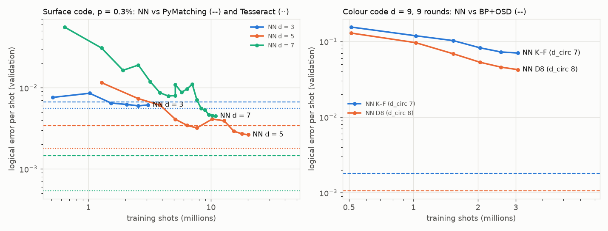

# A learned decoder trained on our FastSampler: surface code and colour code (d = 9 schedules)

Branch `exp/neural-decoder`. Code: `examples/nd_tool.rs` (data export, streaming, BP+OSD on files),
`research/data/neural-decoder/` (MLX model `nd_model.py`, `train.py`, `nn_eval.py`, `baselines.py`,
`summarize.py`, `plot_curves.py`). Raw results: `research/data/neural-decoder/results/` (`*.res.jsonl` = one
JSON line per decoder per test file; `models/*/log.jsonl` = training logs with validation, timing and memory;
`models/train_*.out` = trainer stdout). Weights and the 10⁶-shot test files stay on the Mac in
`~/qsim-nd-data` (not committed).

**Question.** Does a neural decoder trained on data streamed from our exact FastSampler beat our BP+OSD and
approach Tesseract, (1) on Stim's rotated surface-code memory and (2) on the triangular colour code under the
Kishony–Fowler (K–F) schedule and the certified d_circ = 8 schedule of `research/qec/colour-global.md` §4, where
BP+OSD sees a 0.26–0.58× logical-error gain and Tesseract sees none?

**Answer.** Partly at d = 5, no at d = 7 and for the d = 9 colour code, on a laptop budget.

- **Surface code, d = 5, p = 0.3%** (same 10⁶ held-out shots for every decoder): a 1.4 M-parameter sparse
  transformer over the fired detectors, trained on 20 M FastSampler shots (65 min of a shared M1 Pro GPU),
  has **0.78× [0.75, 0.80] the logical error of our BP+OSD** and 0.85× [0.82, 0.87] PyMatching's, but
  **1.66× [1.52, 1.82] Tesseract's**. It does not approach Tesseract.
- **d = 3**: after 2.6 M shots (5 min) it is at PyMatching (0.98×), 1.10× BP+OSD, 1.17× Tesseract.
- **d = 7**: after 10.9 M shots (64 min) it is **2.6× PyMatching, 1.9× BP+OSD, 7.3× Tesseract**, still
  improving. The shots needed to reach matching grow steeply with d (≈ 2 M at d = 3, ≈ 8 M at d = 5,
  > 11 M at d = 7), as the literature (AlphaQubit and successors train on 10⁸–10⁹ shots) leads one to expect.
- **Colour code, d = 9, 9 rounds, noisy-CNOT p = 0.3%**: after 3.07 M shots per schedule (34 min each) the
  network is **~40× worse than BP+OSD** on both schedules (7.9·10⁻³ vs 2.0·10⁻⁴ per round for K–F). It too
  fails less on the certified d_circ = 8 schedule, **0.613× [0.606, 0.620]** of K–F, the same factor as
  BP+OSD (0.59× re-measured here, 0.58× in `colour-global`) and unlike Tesseract (0.95×, no gain). A decoder
  this far from optimal cannot test whether a *good* learned decoder exploits the even-distance step: the
  result says the D8 circuit is easier for weak decoders, learned or not, which is what BP+OSD already showed.
  **The brief's colour-code question remains open.**
- Training cost is the whole story: data are free (the sampler idles at a few % of one core while the GPU
  trains at 1.5–9.6 k shots/s), but the GPU budget per accuracy grows fast with d and with the code's
  detector count. Total GPU time for this note: ≈ 4.5 h, under strict sharing limits on Dylan's laptop.


---

## 1. Setup

### 1.1 Circuits, noise and data

- **Surface code**: `stim.Circuit.generated("surface_code:rotated_memory_z", d, rounds = d)` with all four noise
  knobs at p = 0.3% ("uniform circuit noise", as `research/qec/qec-r4.md` direction B): `DEPOLARIZE2(p)` after CX,
  `DEPOLARIZE1(p)` on data before each round, measurement flips p, reset flips p. d = 3, 5, 7
  (24 / 120 / 336 detectors). `gen_surface.py` writes the flattened `.stim`, Stim's undecomposed DEM in
  `nd_tool`'s tab format, and per-detector coordinates. SI1000 was not run (Stim's generator has no idle-noise
  knob per moment; `gen_surface.py si1000` is only an approximation and is unused).
- **Colour code**: our native circuit (`ColorCode::memory_basis`, Z memory, d = 9, 9 rounds, noisy-CNOT
  model `DEPOLARIZE2(p)` after every CNOT, p = 0.3%), exported by `nd_tool color-export` with
  `.stim` (`to_stim`), our circuit DEM and per-detector (plaquette x, y, round, X/Z type, colour). Two schedules:
  K–F (`kf`, d_circ = 7) and `colour-global/schedules/d9_global_D8.sched` (d_circ = 8, certified).
  540 detectors (X- and Z-type; the network sees all of them).
- **Sampling**: `nd_tool stream <stim> <seed>` parses the `.stim`, compiles SymPhase, builds the
  **FastSampler** (Poisson-hit, wyrand) and streams ptb64 detection events + observable on stdout forever;
  `train.py` reads 1024-shot blocks from the pipe. FastSampler's distribution is the circuit's
  (`research/qec/fast-sampler.md`: 0 / 155,531 rejections against Stim). Sampling is never the bottleneck: the
  sampler process idles at a few % CPU while the GPU trains.
- **Held-out data**: 10⁶ test shots per circuit (seed 7) and 131,072 validation shots (seed 8), written once
  to ptb64 files; training streams use seeds ≥ 1000, so train/val/test are independent wyrand streams.
  **Every decoder decodes the same test file**, so ratios are paired (multinomial bootstrap over the
  4 joint fail/success cells, 4000 resamples, `nd_common.paired_ratio`).

### 1.2 Decoders compared

| decoder | input | settings |
|---|---|---|
| PyMatching 2.4 | Stim's decomposed DEM (surface code only) | default |
| BP+OSD-CS (ours, `src/qec/bposd.rs`) via `nd_tool bposd` | surface: Stim's DEM, all detectors; colour: our DEM, Z sector (as `color_ler`) | 50 min-sum iterations, scale 0.625, OSD order 10 (surface) / 100 (colour) |
| Tesseract (`tesseract-decoder` 0.1.1.dev, pip) | same DEM as BP+OSD (all detectors) | surface: K–F's setting, beam 15, 16 detector orders, beam climbing, pqlimit 2·10⁵ |
| **NN (this work)** | fired detectors of the shot | §2 |

### 1.3 Machine and sharing

Mac M1 Pro (16 GB, 8 CPU + 14 GPU cores), Dylan's laptop, shared with other agents (1-min load 12–19 from
peers during all runs). One training process at a time (Python driving the GPU + the sampler = 2 workers);
MLX capped with `mx.set_memory_limit(1.5 GB)` / `mx.set_cache_limit(256 MB)` (MLX treats the first as a soft
limit: logged peaks were 1.13 GB at d = 5, 1.59 GB at d = 7 and 1.66 GB for the colour code); training refuses to start below 4 GB
free+inactive, SIGSTOPs itself and the sampler below 3 GB, while `/tmp/qsim-mac-bench.lock` is held, and exits
if system wired memory passes 4 GB (it stayed at 3.0–3.3 GB); hard 44-min wall-clock cap per run, so long
trainings are chains of resumed runs. **An earlier, uncapped run (batch 4096, no cache limit) contributed to
the Mac going offline at ~14:13Z; everything after that ran under these limits.**

## 2. The network

`research/data/neural-decoder/nd_model.py` (MLX 0.32.3). A shot is the **set of fired detectors**
(d = 5 surface: 5 on average, ≤ 24; d = 7: 16, ≤ 45; colour d = 9: 29–30, ≤ 94), so the network works on
5–90 tokens instead of 120–540 dense inputs.

- **Tokens.** One per fired detector: a learned embedding of the detector index (it knows its boundary
  neighbourhood) plus an MLP of normalised (x, y, t, X/Z type, colour). A CLS token is prepended; batches
  are padded to the batch's largest count (multiple of 8) and padding is masked.
- **4 pre-LN transformer blocks**, width 128, 4 heads, MLP ×4.
- **Geometry-aware attention.** Each head of each layer adds a learned bias indexed by the pair's
  integer lattice offset (dx, dy, dt clipped to ±10) and both detector types (37,044 entries per layer,
  zero-initialised): a learned, translation-invariant "matching weight" between fired detectors. (A first
  version computed this bias with an MLP over the B·T²·features pair tensor; it was replaced because that
  tensor dominated memory.)
- **Readout.** CLS → MLP → logit of the observable flip, binary cross-entropy. (A soft-parity readout,
  P(flip) = (1 − Π(1 − 2q_i))/2 over per-token claims, is implemented as `--readout xor` but was not trained
  for lack of GPU time.)
- 1.44 M parameters (d = 5), 1.46 M (d = 7), ~1.6 M (colour d = 9); 0.6 M of them are the bias tables.

**Training.** AdamW (weight decay 10⁻⁴), linear warm-up over min(1000, steps/10) steps then cosine decay to
2% of the peak, gradient-norm clip 1.0, batch 256 (larger batches gave the same shots/s on the shared GPU and
more memory), peak lr 3·10⁻⁴ (2·10⁻⁴ for resumed runs), fresh FastSampler data every step (no epoch,
no reuse, so no overfitting), training at the test noise rate. Runs are capped at 44 min of wall time
including pauses for peers' bench lock; longer trainings are resumed runs with a fresh cosine schedule.
From the d = 7 run on, the best-validation checkpoint (32,768 shots) is kept and a batch whose loss exceeds
4× the running mean is skipped: the d = 7 run's final weights (3.9% test error) were much worse than its
it-10000 checkpoint (2.1% validation error), a late loss spike that the original "keep last" logic saved.


## 3. Results

All on the same Mac. "Train" = GPU-active training time (pauses for peers' bench lock excluded; wall time in
the logs). Shots per second during training: 9.6 k (d = 3), 5.2 k (d = 5), 2.8 k (d = 7), 1.5 k (colour d = 9),
GPU-bound (batch 256 and 1024 gave the same rate). Inference: ~50 k shots/s at d = 5 (21 s per 10⁶ shots,
batch 1024, weight-sorted batches), not optimised.

### 3.1 Rotated surface code, uniform circuit noise p = 0.3%, rounds = d, Z memory

Every row decodes the **same** 10⁶ held-out shots (Tesseract: the first 2·10⁵ of them). Ratio = NN failures /
baseline failures on the common shots, paired bootstrap 95% CI.

**d = 3** (24 detectors)

| decoder | fails / shots | p_L per round [95% CI] | NN / this decoder [95% CI] |
|---|---|---|---|
| PyMatching | 6640 / 10⁶ | 2.223e-03 [2.170e-03, 2.277e-03] | 0.978 [0.962, 0.995] |
| BP+OSD (order 10) | 5904 / 10⁶ | 1.976e-03 [1.926e-03, 2.027e-03] | 1.100 [1.081, 1.120] |
| Tesseract (beam 15, 16 orders) | 1112 / 2·10⁵ | 1.860e-03 [1.754e-03, 1.973e-03] | 1.174 [1.130, 1.221] |
| **NN**, 2.6 M shots (best-validation checkpoint of a 3.1 M-shot, 5.3-min run) | 6497 / 10⁶ | 2.175e-03 [2.123e-03, 2.229e-03] | — |

**d = 5** (120 detectors)

| decoder | fails / shots | p_L per round [95% CI] | NN (20 M) / this decoder [95% CI] |
|---|---|---|---|
| PyMatching | 3404 / 10⁶ | 6.827e-04 [6.601e-04, 7.060e-04] | **0.847 [0.820, 0.874]** |
| BP+OSD (order 10) | 3713 / 10⁶ | 7.448e-04 [7.212e-04, 7.692e-04] | **0.776 [0.749, 0.805]** |
| Tesseract (beam 15, 16 orders) | 357 / 2·10⁵ | 3.575e-04 [3.223e-04, 3.966e-04] | **1.66 [1.52, 1.82]** |
| NN, 7.7 M shots, 24 min | 3429 / 10⁶ | 6.877e-04 [6.650e-04, 7.111e-04] | (1.007 × PyMatching) |
| **NN, 20.1 M shots, 65 min** (7.7 M + 12.4 M resumed) | 2883 / 10⁶ | 5.779e-04 [5.572e-04, 5.994e-04] | — |

**d = 7** (336 detectors)

| decoder | fails / shots | p_L per round [95% CI] | NN (10.9 M) / this decoder [95% CI] |
|---|---|---|---|
| PyMatching | 1457 / 10⁶ | 2.084e-04 [1.980e-04, 2.194e-04] | **2.61 [2.49, 2.75]** |
| BP+OSD (order 10) | 1967 / 10⁶ | 2.815e-04 [2.693e-04, 2.942e-04] | **1.93 [1.85, 2.03]** |
| Tesseract (beam 15, 16 orders) | 54 / 10⁵ | 7.718e-05 [5.915e-05, 1.007e-04] | **7.3 [5.7, 9.8]** |
| NN, first run, 3.4 M shots (last weights after a loss spike) | 39118 / 10⁶ | 5.785e-03 | 10.3 |
| NN, rerun, 4.5 M shots (best-val checkpoint), 26 min | 7122 / 10⁶ | 1.024e-03 [1.000e-03, 1.048e-03] | 1.87 [1.82, 1.93] |
| **NN, + resumed run, 10.9 M shots, 64 min** | 3805 / 10⁶ | 5.454e-04 [5.283e-04, 5.630e-04] | — |

At d = 5 and d = 7 our BP+OSD (order 10) is *worse* than PyMatching on this noise (1.09× and 1.35×), while it
is better at d = 3 (0.89×); Tesseract is 0.51× (d = 5) and 0.37× (d = 7) of PyMatching, the
expected gain from using the Y correlations that uncorrelated matching discards.

### 3.2 Learning curves (validation failures on a fixed validation set)



Validation logical error per shot against training shots (log–log; `plot_curves.py`). Left: surface code,
dashed = PyMatching, dotted = Tesseract on the test set, same colour as the distance. Right: colour code
d = 9, dashed = BP+OSD. The d = 5 and d = 7 curves join two runs (the second resumes from the first's best
checkpoint, with a fresh warm-up that costs a temporary bump).

| shots seen | d = 3 (/ 32,768) | d = 5 (/ 131,072) | d = 7 (/ 32,768) | colour K–F (/ 32,768) | colour D8 (/ 32,768) |
|---|---|---|---|---|---|
| 0.5 M | 249 | — | — | 5074 | 4226 |
| 1.0–1.3 M | 280 | 1514 | 1011 (1.3 M) | 3894 | 3156 |
| 2.0 M | 204 | — | 537 (1.9 M) | 2694 | 1735 |
| 2.6 M | 196 | 961 | 623 | 2376 | 1498 |
| 3.1 M | 201 | — | 389 (3.2 M) | **2302** | **1387** |
| 5.1 M | — | 537 | 263 | — | — |
| 7.7 M | — | 419 | — | — | — |
| 20.1 M | — | **346** | — | — | — |
| 7.7 / 8.3 / 9.6 / 10.9 M (d = 7, resumed) | — | — | 231 / 182 / 152 / **147** | — | — |
| PyMatching (test rate × val size) | 218 | 446 | 48 | — | — |
| BP+OSD (test rate × val size) | 193 | 487 | 64 | 59 | 35 |

The gap to matching closes after ~2 M shots at d = 3 and ~8 M at d = 5; at d = 7 it is 5× after 5 M shots and
3× after 10.9 M (validation 147 against PyMatching's ≈ 48).
The colour code at d = 9 is ~40× above BP+OSD after 3 M shots; the colour curves were flattening as the
learning rate annealed, so more of the same schedule would not close a 40× gap quickly.

### 3.3 Colour code, d = 9, 9 rounds, noisy-CNOT p = 0.3%, Z memory: K–F vs the d_circ = 8 schedule

Both networks: identical architecture, hyper-parameters and budget (12,000 steps × 256 = 3.07 M shots,
34 / 33 min GPU-active). Test: 10⁶ shots per schedule (independent circuits, so the ratio is unpaired; CI from
the log-ratio normal approximation). BP+OSD: order 100, Z sector (as `color_ler` / `colour-global` §4.1), on the
first 300,032 test shots. Tesseract: from `colour-global` §4.1 (our samples and DEM, light setting
beam 5 / 1 order, 114,688 shots per schedule), not re-run.

| decoder | K–F p_L / round (fails / shots) | D8 p_L / round (fails / shots) | D8 / K–F [95% CI] |
|---|---|---|---|
| **NN**, 3.07 M shots each | 7.910e-03 (66851 / 10⁶) | 4.846e-03 (41965 / 10⁶) | **0.613 [0.606, 0.620]** |
| BP+OSD-CS order 100 (re-measured here) | 1.996e-04 (538 / 300,032) | 1.182e-04 (319 / 300,032) | **0.59 [0.52, 0.68]** |
| BP+OSD, `colour-global` §4.1 (other samples) | 2.000e-04 (2157 / 1.2 M) | 1.162e-04 (1254 / 1.2 M) | 0.581 [0.542, 0.623] |
| Tesseract (light), `colour-global` §4.1 | 3.97e-05 (41 / 114,688) | 3.78e-05 (39 / 114,688) | 0.95 [0.61, 1.48] |

- **The NN is far from useful here**: 40× (K–F) and 41× (D8) more logical errors per round than BP+OSD, and
  ~200× more than Tesseract, after 3 M shots. The per-shot error is 6.7% / 4.2%: the network still fails on
  low-weight fault configurations that every baseline corrects.
- **It nevertheless sees the D8 schedule as 0.61× K–F**, the same factor as BP+OSD (0.58–0.59×), and the gap
  was there throughout training (validation ratio 0.83 → 0.81 → 0.67 → 0.64 → 0.63 → 0.60 at 0.5–3.1 M shots).
  So the D8 circuit is **easier to learn**, not just easier for BP+OSD.
- That does **not** answer the brief's question ("can a learned decoder exploit the even-distance gain?").
  The question is about the regime where the decoder is near-optimal, so that failures are dominated by
  ⌊d_circ/2⌋+1 = 4-fault configurations; there Tesseract sees no gain (and `colour-global` §4.1 argues none is
  expected at leading order: C(8,4)/2 = C(7,4)). A decoder 200× worse than Tesseract is in the opposite
  regime. What the result does say: both weak decoders we have (BP+OSD and an under-trained network) fail
  less on D8, so D8 is a cheap robustness improvement for imperfect decoders; whether it helps a decoder
  that is good but not optimal (e.g. a fully trained network between BP+OSD and Tesseract) remains open.


## 4. Known vs new

**Known (literature).**
- Learned decoders beat matching on the surface code under circuit noise when trained at scale:
  AlphaQubit (Bausch et al., arXiv:2310.05900, recurrent transformer pretrained on up to ~10⁹ synthetic
  shots and fine-tuned on experimental data; beats correlated matching and a tensor-network decoder on
  Sycamore d = 3, 5 data and matching in simulation up to d = 11); Varbanov et al. (arXiv:2307.03280, recurrent network on near-term experiments);
  GNN decoders on the detector graph (Lange et al., arXiv:2307.01241; GraphQEC, arXiv:2502.19971, which
  includes colour codes and qLDPC codes; POLYMECHANON, arXiv:2610.01683, DEM-only input, up to 25% fewer
  failures than correlated MWPM on the rotated surface code). A colour-code neural decoder with circuit-level
  noise and flags goes back to Baireuther et al. (arXiv:1804.02926).
- The cost of reaching matching-level accuracy grows steeply with distance: every one of these works trains
  on 10⁷–10⁹ shots on datacentre GPUs/TPUs, and the data needed grows with d because failures become rarer.
- Tesseract (Beni et al., arXiv:2503.10988) is a near-optimal search decoder for these DEMs; we use it as the
  quality ceiling, as in `research/qec/qec-r4.md` and `research/qec/colour-global.md`.

**New here.**
- A complete pipeline from **our** exact sampler to a trained decoder on a laptop GPU: `nd_tool stream`
  feeds FastSampler shots to MLX with the sampler at a few % of one core, so training data is free and
  never reused.
- A **sparse fired-detector transformer** with a learned relative-offset attention bias. It reaches
  matching-level accuracy at d = 5 after 7.7 M shots (24 min) and beats PyMatching by 15% and our BP+OSD
  by 22% after 20 M shots (65 min of a shared M1 Pro GPU), on the same 10⁶ held-out shots. This is an
  existence result at small d, not a new state of the art: Tesseract is still 1.66× better.
- **Measured training-cost scaling on one laptop**: d = 5 reaches PyMatching in 25 min; d = 7 is still 2.6×
  PyMatching after 64 min, and the d = 9 colour code 40× BP+OSD after 34 min (§3).
- First learned-decoder measurement on the **certified d_circ = 8 colour-code schedule** (§3.3): an
  under-trained network sees the same 0.6× as BP+OSD, i.e. the schedule is easier for weak decoders of
  both kinds; no evidence either way for near-optimal ones.


## 5. Caveats

- **One noise point.** p = 0.3%, uniform circuit noise for the surface code, noisy-CNOT for the colour code.
  SI1000 and p = 0.1–0.2% were not run: at lower p the per-shot failure rate drops (d = 7, p = 0.1%: of order 10⁻⁵ per
  shot, extrapolated), so training sees even fewer informative shots and evaluation needs 10⁷+ shots; the brief's range
  is covered only at its top. Training was at the test p only (no higher-p curriculum, which the literature
  uses to get more informative shots).
- **Budget-limited, not architecture-limited.** Every NN number is "this network after N shots on a shared
  M1 Pro". No hyper-parameter search; the soft-parity readout was not trained. Bigger budgets would lower
  every NN row; how far is not measured. The d = 5 run shows the gap to PyMatching closing at ~8 M shots and
  the gain continuing to 20 M; nothing here bounds what 10⁸–10⁹ shots (literature scale) would give.
- **Spike guard bias.** From the d = 7 rerun on, batches whose loss exceeded 4× the running mean + 0.01 were
  skipped (0.85% of batches at d = 7, 2.3% in the continuation; 0 at d = 5, which ran before the guard).
  Those are exactly the batches with several confident mistakes, so the guard may slow learning of rare
  failures; a softer threshold would be better.
- **The first d = 7 run's checkpoint was lost** to a late loss spike (it saved the last weights; 3.9% test
  error against 2.1% validation error 3,400 steps earlier); d = 7 numbers are from the fresh guarded rerun.
- **Baselines.** BP+OSD order 10 on the surface code (order 100 would be slower and somewhat better);
  colour BP+OSD decodes the Z sector only (the published setting), whereas the NN sees X- and Z-type
  detectors. Surface Tesseract on the first 2·10⁵ test shots; colour Tesseract numbers are from
  `colour-global` §4.1 (other samples, light setting) and were not re-run here.
- **Colour ratio is unpaired** (different circuits), CI from independent binomials.
- **Memory.** MLX's `set_memory_limit(1.5 GB)` is soft: logged peaks were 0.58 (d = 3), 1.13 (d = 5),
  1.59 (d = 7) and 1.66 GB (colour); system wired memory stayed 2.8–3.4 GB under the 4 GB stop rule.
- Inference speed (~50 k shots/s at d = 5 on the M1 GPU, batched) is reported for completeness; the network is
  not a real-time decoder and was not optimised for latency.


## 6. Reproduce

```bash
# Mac (or any machine with MLX); nothing installed outside ~/qsim-*
/opt/homebrew/bin/python3 -m venv ~/qsim-nd-venv && ~/qsim-nd-venv/bin/pip install mlx numpy stim pymatching tesseract-decoder
CARGO_TARGET_DIR=~/qsim-nd/target cargo build --release -j 2 --example nd_tool
cd research/data/neural-decoder; D=~/qsim-nd-data; T=~/qsim-nd/target/release/examples/nd_tool; PY=~/qsim-nd-venv/bin/python
$PY gen_surface.py 5 0.003 $D/s5                                    # Stim circuit, DEM, detector coords
$T color-export 9 9 cnot 0.003 kf $D/c9kf                          # colour code, K-F
$T color-export 9 9 cnot 0.003 ../colour-global/schedules/d9_global_D8.sched $D/c9g8
$T stream $D/s5.stim 7 1000000 > $D/s5.test.ptb64; $T stream $D/s5.stim 8 131072 > $D/s5.val.ptb64
$PY baselines.py $D/s5 $D/s5.test.ptb64 5 $D/s5.res pm bposd:10 tess:200000:15:16
$PY train.py $D/s5 $D/m_s5 --steps 30000 --batch 256 --lr 3e-4 --val $D/s5.val.ptb64      # then --resume ...
$PY nn_eval.py $D/m_s5 $D/s5.test.ptb64 5 $D/s5.res nn
$PY summarize.py $D/s5.res 5 pymatching
python plot_curves.py                                   # needs matplotlib; reads results/models
```
