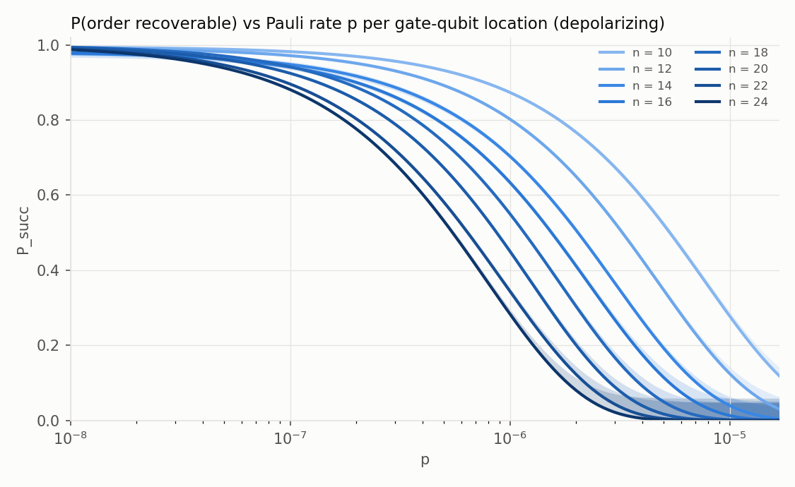
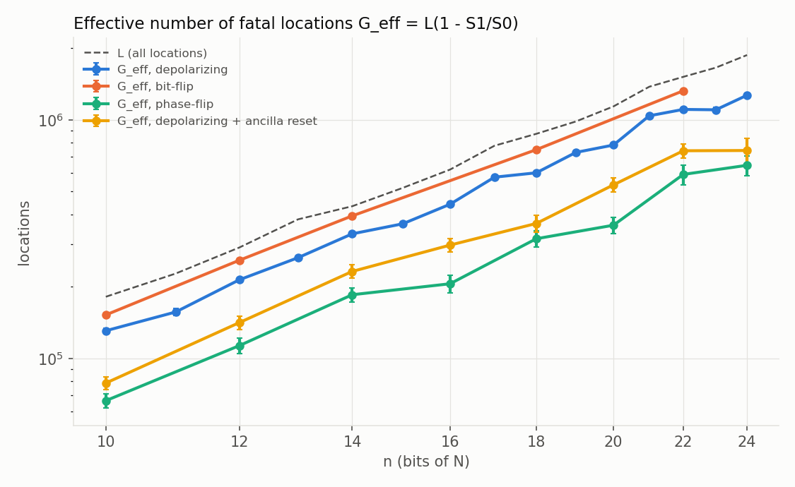
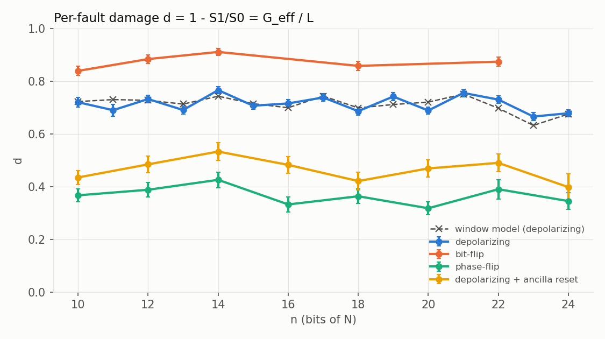
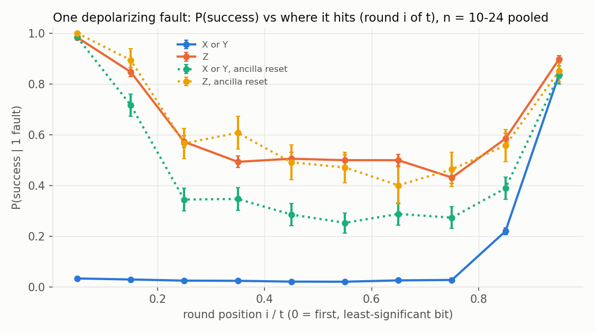

# Gate-level Shor under circuit noise, measured at scale (topic `shor-noise`, branch `exp/shor-noise`)

**Headline.** Run exactly at the gate level (windowed X/CNOT/CCX oracle,
10–24-bit N, up to 104 qubits and 0.82 M gates per run), semiclassical Shor
survives a single random depolarizing fault only 28 % of the time — each
fault is fatal with probability **d = 0.716 ± 0.004** (0.67–0.77 per
instance), so P_succ ≈ S₀·exp(−d·p·L), G_eff ≈ 0.72·L ∝ n^2.66, and the
success probability halves at **p½ = (5.49 ± 0.09)·10⁻⁷ per gate-qubit
location for n = 24** (≈ one expected fault per run: p½·L = 0.91–1.06 at
every size). The survivable faults are structure, not luck: X/Y faults are
fatal except in the last ν₂(r) rounds, Z faults are harmless in the
spare-low-bit rounds and half-harmless elsewhere (phase-flip noise is 2.4×
less damaging than bit-flip), a three-rate window model (rates fitted on the
pooled data) reproduces the instances' d with rms error 0.022 (max 0.040)
and predicts d → 0.79 at large n, and an ideal ancilla
reset between rounds cuts d to 0.47 ± 0.01.

All numbers below are ±1σ (binomial / bootstrap over trajectories) unless
stated. Machines: Mac (M1 Pro, 8 cores) for the bulk of the trajectories,
every run under `/tmp/qsim-mac-bench.lock` (≤ 178 s each); VPS (4 vCPU,
loaded, `nice -n 15`, ≤ 2 threads) for development, validation and the cheap
phase-flip runs. No timing claims are made here (the runs are Monte-Carlo
statistics, not benchmarks; per-trajectory seconds are in the raw CSVs).

## 1. What is simulated

* **Circuit**: exactly the round-4 record circuit (`research/shor.md`, round
  4): semiclassical order finding with one recycled control (qubit 0),
  t = 2n rounds, each `H`, controlled-`U^(2^(t−1−i))` as the Gidney windowed
  oracle (w = 4, 4n + 8 qubits, X/CNOT/CCX only), phase correction from the
  recorded bits, `H`, measure, recycle. Work register and ancillas start
  ideal (`|1>`, `|0…0>`), no idle noise.
* **Fault locations** (`src/shor/noisy.rs`, `NoisyCircuit`), all with the same
  rate p:
  * after every oracle gate, on **each** qubit it acts on (CCX: 3 locations,
    CNOT: 2, X: 1) — L ≈ 2.3 × gates, L = 181 228 at n = 10 … 1 867 900 at
    n = 24 (`data/shor-noise/gate_counts.txt`);
  * on the control, per round: `Prep` (control starts in `|1>`), after `H1`,
    after the phase correction, after `H2`, and a readout flip `Meas` (5t
    locations, < 0.02 % of L).
* **Channels** (`NoiseKind`): depolarizing (X, Y, Z with p/3 each at gate /
  H / phase locations, a flip at Prep / Meas), bit-flip (X with p everywhere),
  phase-flip (Z with p at gate / H / phase locations).
* **Instances** (`data/shor-noise/gen_instances.py`): N = the first balanced
  semiprime per bit size from `random.seed(1)` (same generator as round 4,
  extended down to 10 bits); one base per N drawn from `random.seed(1000+n)`
  among "good, typical" bases: r even, a^(r/2) ≢ −1, r ≥ λ(N)/8. (Small-order
  bases are excluded on purpose: they have many spare low bits — see §5 — and
  for r ≤ 256 `shor::postprocess` recovers r from any y by its multiples
  search.)
* **Success metrics** per trajectory (recorded integer y):
  * **peak** (main): |y/2^t − s/r| < 1/(2r²) for the nearest s — s/r in lowest
    terms is then a continued-fraction convergent of y/2^t and r follows by
    the standard small-multiple/lcm post-processing. Noiseless S₀ = 0.98–1.00.
  * **strict** ("y gives the correct order" from one run, textbook): r itself
    is a convergent denominator of y/2^t. Noiseless 0.19–0.49.
  * **factor**: the repo's `shor::postprocess` (convergents × multiples
    ≤ 256) returns a non-trivial factor. Noiseless 0.97–1.00.

  The per-fault damage is the same for peak and strict within errors
  (strict: d = 0.60–0.79, e.g. 0.684 at n = 20; `strata.csv`); the factor
  metric has smaller d at n ≤ 13 only because the multiples search rescues
  small r, and d_factor = 0.61–0.74 for n ≥ 14.

## 2. Why Pauli noise stays exact (and cheap) in the bit-sliced engine

The oracle block is a permutation of basis states, so the whole register is a
list of basis-state branches with amplitudes (round 4). A Pauli fault keeps it
so, and the engine (`NoisyState`) handles every case **exactly**:

* **X_q** flips bit q of every branch: one extra `w[q] ^= 1` slice step.
* **Z_q** multiplies each branch by (−1)^{b_q}: one extra slice word holds a
  per-branch sign bit, updated by `sign ^= w[q]` (a CNOT into the sign word),
  and folded into the amplitude when the outputs are read back.
* **Y_q = i·X_q·Z_q**: the Z step then the X step; the i is a global phase of
  the trajectory.
* `Prep` (X before H) is applied as Z after H (HX = ZH); faults after the phase
  gate and after H2 are applied in the control algebra (swap / negate the
  two control amplitudes); `Meas` flips the recorded (fed-forward) bit.

What changes relative to the noiseless engine is the bookkeeping: an X fault
can leave ancillas dirty or the control flipped, so branches are keyed by all
non-control qubits (a `u128`, n ≤ 30), the control-0 half of every round is
evaluated as a genuine map, and the two control halves are merged generally:
A_c(k) = signed amplitude of the output with control c and rest k (at most one
input maps there), P(1) = Σ_k |A₀(k) − e^{iφ}A₁(k)|²/4 before post-phase
faults. Cost per trajectory = one bit-sliced pass per branch, as noiseless.

**How Z faults reach the measurement statistics (exact statement).** A Z on
qubit q after gate g of round i multiplies the branch that entered as
|c⟩|x⟩|0⟩ by (−1)^{f(c,x)}, where f(c,x) is the value of qubit q at that point
of the gate-level computation. Z never changes a bit, so ancillas stay clean
and the support never grows; the faulty round is |c⟩|x⟩ ↦ (−1)^{f(c,x)}
|c⟩|U^c x⟩, i.e. controlled-U followed by a diagonal D_c on the work register.
Then P(1) = ‖D₀ψ − e^{iφ}D₁Uψ‖²/4, and:
1. f ≡ 0 on the support (q is |0⟩ in every branch at that moment — e.g. an
   AND-chain ancilla of an inactive address, any ancilla in the control-0
   half): **no effect at all**.
2. f(1,x) = f(0,x) ⊕ 1 (e.g. Z on the control): the measured bit of round i
   is flipped, with consistent feed-forward — y shifts by ±2^i.
3. f(c,x) = g(x) for both c: this round's P(1) is unchanged, but D is a
   diagonal error on the work register that is carried forward and mixes
   U's eigenvectors, so the **later, higher** bits estimate a different
   eigenphase s′/r than the lower bits already measured.

Cases 2–3 are harmless exactly when the corruption only shifts y by an amount
the success criterion ignores (§4). The engine does not use this analysis —
it simulates the sign exactly — but §4 confirms it quantitatively.

## 3. Method: fault-count stratification, capping, validation

**Stratified estimator.** With the same rate p at all L locations, given K = k
faults the faulted set is a uniform k-subset, so exactly

  P_succ(p) = Σ_k Binom(k; L, p) · S_k,  S_k = P(success | exactly k faults),

and one set of trajectories with k = 0…3 (`NoisyCircuit::sample_k`) gives
the whole curve. The k > 3 tail is bounded with S_k ≤ S₃ (monotone; S₃ ≤ 0.085
everywhere); at pL ≤ 2 it is < 0.006. Direct sampling at fixed p
(`sample_p`, geometric skipping) agrees with the stratified prediction:

| n | pL | direct (M = 300) | stratified |
|---|---|---|---|
| 16 | 1 | 0.499 [0.471, 0.529] | 0.485 |
| 16 | 2 | 0.255 [0.232, 0.283] | 0.243 |
| 20 | 1 | 0.457 [0.428, 0.486] | 0.497 |
| 20 | 2 | 0.242 [0.219, 0.269] | 0.245 |

**Support blow-up and the cap (stated, calibrated approximation).** A dirty
ancilla destroys the overlap of the two control halves, so the support
doubles every round after an X fault (measured: from ~r/2 to ≈ 2^t). Those
trajectories cannot be followed exactly at n ≥ 13. Rule used at every n:
a trajectory whose support exceeds **8 × the noiseless peak support** (= 4r)
is *v-capped* (from n = 15 on, the run is actually stopped there). Its outcome
is counted with the success rate ĉ of v-capped trajectories **measured** on
instances run with no binding cap (n = 10, 11, 12 exact; support up to 2^24):
ĉ = 2.6 %, 1.1 %, 2.6 % → pooled **ĉ = 0.021 (2856 trajectories)**. The
lower bound (ĉ = 0) changes S₁ by ≤ 0.013 absolute and d by ≤ 0.02 (column
`S_lo` in `strata.csv`). Real caps only hit trajectories that were already
dirty for ≥ 3 rounds.

**Validation.**
* *Exact, fixed fault patterns* (`tests/shor_noise.rs`): for every control
  site × every Pauli in an early, middle and late round, plus 30–40 random
  1–4-fault patterns, the exact distribution of the recorded integer (whole
  measurement tree) equals an independent gate-by-gate reference that applies
  the same Paulis as real gates (Y as the Y matrix, the Prep error as X before
  H) — dense state vector (ripple oracle, N = 15) and sparse state (windowed,
  N = 15, 21, w = 1, 2, 4; depolarizing, bit-flip and phase-flip patterns) —
  to < 1e-12; for N = 35, 143, 247 (6–8 bits, 32–40 qubits) the per-round
  P(1) along sampled paths agrees to < 1e-12. The noiseless trajectory
  distribution equals the round-4 sliced engine's to < 1e-12.
* *Sampler vs an independent sampler* (`examples/shor_noise_validate.rs`,
  `data/shor-noise/validation.csv`): the stock noisy `Circuit::run`
  (`Depolarize1q` / `XFlip` / `ZFlip` ops of `noise.rs`, own RNG use) on the
  dense state vector (ripple, N = 15, 16 qubits) and the sparse state
  (windowed, N = 15 and 21), 30 000 engine vs 3 000 reference trajectories at
  pL = 1.5, three channels each. Two-sample χ² homogeneity test on the
  recorded integer (bins with expected count < 5 pooled, Wilson–Hilferty
  p-value): **all 9 p-values in [0.085, 0.91]**; two-proportion z-test on the
  success rate: all |z| ≤ 1.3. The ancilla-reset variant has its own χ² test
  against `Circuit::run` with `Op::Reset` (p = 0.28).

## 4. Results

### P_succ vs p, and the effective number of fatal locations



Bands: bootstrap 16–84 % over trajectories, plus the k > 3 tail bound
(`psucc_vs_p.csv`). Main table (depolarizing; S_k with trajectory counts;
d = 1 − S₁/S₀, G_eff = L·d, p½ where P_succ = S₀/2, bootstrap errors):

| n | N | r | ν₂(r) | spare low bits t−2log₂r | gates | L | S₀ | S₁ | S₂ | S₃ | d | G_eff | p½ |
|---|---|---|---|---|---|---|---|---|---|---|---|---|---|
| 10 | 899 | 210 | 1 | 4.6 | 77 504 | 181 228 | 0.995 (600) | 0.278±0.018 (600) | 0.097±0.012 | 0.045±0.008 | 0.720±0.018 | 1.31e5 | 5.38e-6 |
| 11 | 1 711 | 406 | 1 | 4.7 | 97 684 | 226 696 | 1.000 (400) | 0.310±0.023 (400) | 0.092±0.014 | 0.025±0.008 | 0.690±0.022 | 1.56e5 | 4.42e-6 |
| 12 | 2 867 | 690 | 1 | 5.1 | 124 828 | 291 536 | 0.993 (400) | 0.266±0.014 (1000) | 0.090±0.010 | 0.037±0.009 | 0.732±0.014 | 2.13e5 | 3.29e-6 |
| 13 | 4 343 | 350 | 1 | 9.1 | 164 906 | 382 488 | 1.000 (400) | 0.309±0.015 (900) | 0.110±0.014 | 0.044±0.009 | 0.691±0.016 | 2.64e5 | 2.65e-6 |
| 14 | 8 453 | 4 134 | 1 | 4.0 | 186 378 | 434 216 | 0.980 (400) | 0.229±0.014 (900) | 0.067±0.011 | 0.032±0.008 | 0.766±0.014 | 3.33e5 | 2.10e-6 |
| 15 | 29 083 | 4 788 | 2 | 5.5 | 224 936 | 518 392 | 0.997 (300) | 0.292±0.014 (1000) | 0.095±0.015 | 0.052±0.011 | 0.707±0.014 | 3.66e5 | 1.91e-6 |
| 16 | 34 387 | 17 000 | 3 | 3.9 | 266 922 | 618 484 | 0.983 (300) | 0.280±0.014 (1000) | 0.097±0.015 | 0.044±0.010 | 0.716±0.015 | 4.43e5 | 1.59e-6 |
| 17 | 88 433 | 14 630 | 1 | 6.3 | 338 164 | 778 396 | 1.000 (300) | 0.262±0.014 (1000) | 0.078±0.013 | 0.037±0.009 | 0.738±0.014 | 5.75e5 | 1.22e-6 |
| 18 | 200 479 | 16 632 | 3 | 8.0 | 381 116 | 873 364 | 1.000 (300) | 0.314±0.015 (1000) | 0.105±0.015 | 0.040±0.010 | 0.686±0.015 | 5.99e5 | 1.16e-6 |
| 19 | 471 203 | 117 432 | 3 | 4.3 | 428 966 | 983 940 | 0.990 (300) | 0.256±0.014 (1000) | 0.090±0.014 | 0.030±0.009 | 0.742±0.015 | 7.30e5 | 9.63e-7 |
| 20 | 821 749 | 34 164 | 2 | 9.9 | 496 440 | 1 137 880 | 1.000 (300) | 0.311±0.015 (1000) | 0.066±0.012 | 0.040±0.010 | 0.689±0.014 | 7.84e5 | 8.71e-7 |
| 21 | 1 128 437 | 187 666 | 1 | 7.0 | 602 574 | 1 375 584 | 0.993 (300) | 0.243±0.014 (1000) | 0.068±0.013 | 0.035±0.009 | 0.755±0.014 | 1.04e6 | 6.72e-7 |
| 22 | 2 957 047 | 369 200 | 4 | 7.0 | 665 352 | 1 513 524 | 1.000 (300) | 0.270±0.014 (1000) | 0.114±0.016 | 0.042±0.010 | 0.730±0.014 | 1.11e6 | 6.43e-7 |
| 23 | 6 226 057 | 86 400 | 7 | 13.2 | 723 306 | 1 653 980 | 1.000 (300) | 0.334±0.015 (1000) | 0.132±0.017 | 0.082±0.014 | 0.666±0.015 | 1.10e6 | 6.42e-7 |
| 24 | 10 161 323 | 1 692 480 | 6 | 6.6 | 818 630 | 1 867 900 | 1.000 (300) | 0.322±0.015 (1000) | 0.105±0.015 | 0.049±0.011 | 0.678±0.014 | **1.27e6±0.03e6** | **5.49e-7±0.09e-7** |

(S₂ and S₃ from 400–760 trajectories each; S₀ errors ≤ 0.007; exact counts
and the lower estimate S_lo in `strata.csv`; errors on G_eff and p½ in
`summary.csv`, 1.5–3 %.)

* **Naive model check.** P_succ = S₀(1 − p)^{G_eff} with independent fatal
  faults predicts S_k = S₀(1 − d)^k. Fitting d to k = 1…3 jointly (`dfit`)
  gives the same d as k = 1 alone (within 1σ at 13 of 15 sizes, 1.6σ at
  worst), and the direct-p runs agree (table in §3), so the exponential form
  is a good description at pL ≲ 2. **Audit correction (§16 of audit.md):**
  it is *not* exact at k = 3. S₃ exceeds S₀(1 − d)³ at 13 of 15 sizes
  (e.g. n = 10: 0.045 vs 0.022; n = 23: 0.082 vs 0.037; mean z ≈ +1.9 per
  size, pooled ≈ 7σ): there is a success floor of a few percent (y still
  lands in a good window after the state is scrambled; cf. ĉ = 2.1 % for
  v-capped runs). The joint fit hides this because k = 1 dominates it. The
  effect on p½ is below 1 % (the k ≥ 3 weight at pL ≈ 1 is ~8 %), but at
  large pL P_succ decays to that floor, not to 0.
* **Scaling.** G_eff ∝ n^2.66 over n = 10–24, the same exponent as L (n^2.69;
  L/n³ falls from 181 to 135, the windowed oracle's lower-order terms), so
  **G_eff/L = d does not drift with n** in this range: weighted mean
  0.716 ± 0.004, but the scatter is real (χ²/dof = 4.3) and is explained by
  the instance's r (below). p½·L = 0.97 ± 0.04 at every n.
* **Versus fault counting.** Counting every location as fatal (G = L)
  overestimates the fatal count by 1/d = 1.40× (depolarizing), 1.14×
  (bit-flip), 2.75× (phase-flip). In gates rather than locations:
  G_eff ≈ 1.55 × the gate count (n = 24).



### Channels and ancilla reset



| channel | d (weighted mean over n) | n covered | per instance |
|---|---|---|---|
| depolarizing | 0.716 ± 0.004 | 10–24 (15 sizes) | 0.666–0.766 |
| bit-flip (X only) | 0.878 ± 0.007 | 10, 12, 14, 18, 22 | 0.84–0.91 |
| phase-flip (Z only) | 0.363 ± 0.010 | 10, 12, …, 24 | 0.32–0.43 |
| depolarizing + ideal ancilla reset after every round | 0.466 ± 0.012 | 10, 12, …, 24 | 0.40–0.53 |

The reset variant (`run_trajectory_opts`, `QSIM_NOISE_RESET=1`) measures
every ancilla after the control measurement and resets it (the device-level
analogue: mid-circuit reset of qubits that should be clean anyway; the reset
itself is ideal here). It turns most X/Y faults from "dirty ancilla poisons
every later round" into "one corrupted round", raising S₁ from 0.28 to 0.53 and p½ by 1.4–1.6× (n = 24: 8.95·10⁻⁷ vs 5.49·10⁻⁷). It costs nothing in
gates; in this simulator it also removes the support blow-up.

## 5. Where faults are fatal: two benign windows



The success criterion depends on y only through how well y/2^t approximates
some s/r. Two exact consequences:

* **End window (last ν₂(r) rounds).** Shifting y by any multiple of
  2^{t−ν₂(r)} shifts y/2^t by a multiple of 2^{−ν₂(r)}, a multiple of 1/r: it
  maps a good y to a good y (another s). So bits i ≥ t − ν₂(r) are irrelevant
  and *any* fault there is harmless — including X faults whose dirt makes the
  remaining bits random coin flips (the two control halves stop interfering,
  P(1) = 1/2).
* **Start window (first ⌊t − 2log₂r⌋ rounds).** The criterion tolerates an
  error in y up to ~2^t/(2r²), so the lowest ~t − 2log₂r bits are spare
  (t = 2n is more precision than the peak test needs). A fault that only
  corrupts the bit being measured, or that mixes eigenvectors of U while
  leaving the circuit's arithmetic intact (Z faults, §2 cases 2–3), shifts y
  by ≲ 2^i: harmless there.

Measured (depolarizing, k = 1, all n pooled; `analysis.txt`):

| fault family | start window | middle | end window |
|---|---|---|---|
| X or Y (2/3 of locations) | 0.032 (1705) | 0.055 (6873) | 0.997 (636) |
| Z (1/3) | 0.976 (756) | 0.517 (3526) | 0.997 (304) |
| X or Y, with ancilla reset | 0.941 (190) | 0.335 (854) | 0.988 (80) |
| Z, with ancilla reset | 0.966 (89) | 0.520 (435) | 0.981 (52) |

(P(success | one fault of that family in that window); trajectory counts in
brackets.)

* **X/Y faults** are fatal everywhere except the end window because almost
  every one leaves an ancilla dirty (lookup register, AND chain, constant
  register, accumulator): all 402 single-X/Y gate-fault trajectories at
  n = 10 had a non-zero ancilla after their round (none of the 197 Z ones). The dirty ancilla then corrupts every later
  round's arithmetic, so the start window does *not* protect them (3 %
  success) — unless the ancillas are reset, which restores it (94 %).
* **Z faults** never dirty anything. In the start window they are benign
  (98 %); in the middle about half are: by location class (k = 1, pooled),
  P(ok | Z) = 0.81 on AND-chain ancillas (|0⟩ for every inactive address, §2
  case 1), 0.68 on the constant register, 0.61 on the lookup register, 0.49
  on the accumulator b, 0.38 on the work register x, 0.24 on the control.
  This is the "faults whose effect is a phase the measurement ignores"
  channel; it makes phase-flip noise 2.4× less damaging than bit-flip.
* **The control qubit** is the most fragile per location (gate faults on it:
  P(ok) ≈ 0.1–0.24) but it carries < 3 % of L (its 5t non-gate locations are
  0.01 %), so it does not matter for the total.

**Window model.** With the three middle/edge rates above fixed (pooled
measurement), each instance's d is predicted from its own windows (t,
ν₂(r), ⌊t − 2log₂r⌋, X/Y : Z = 2 : 1):

  d_model = 1 − [⅔(w_s·0.032 + w_m·0.055 + w_e·0.997) + ⅓(w_s·0.976 + w_m·0.517 + w_e·0.997)]/S₀,

w_s, w_m, w_e = fraction of rounds in the start/middle/end window. It
reproduces the measured d of all 15 instances with rms error 0.022
(1.45σ; `window_model.csv`, dashed line in the damage plot) — e.g. n = 23,
whose base has ν₂(r) = 7 and 13 spare low bits, has the lowest d (0.666;
model 0.632). **Prediction for large n:** for typical bases the windows are
O(1) rounds out of t = 2n, so d → 1 − ⅔·0.055 − ⅓·0.517 = **0.79**
(depolarizing), i.e. P_succ ≈ exp(−0.79·pL) asymptotically: natural fault
tolerance of this circuit is worth ~20 % of the locations, not more.

**Same N, different order** (n = 20, N = 821 749, k ≤ 1, 600 trajectories
each): more spare low bits → lower d, as the model says (only the Z third
benefits from the start window):

| r | ν₂(r) | spare low bits | S₁ | d |
|---|---|---|---|---|
| 156 | 2 | 25.4 | 0.356 | 0.644 ± 0.018 |
| 1 752 | 3 | 18.5 | 0.322 | 0.678 ± 0.018 |
| 17 082 | 1 | 11.9 | 0.250 | 0.750 ± 0.017 |
| 68 328 | 3 | 7.9 | 0.271 | 0.729 ± 0.017 |

### Which locations dominate G_eff

Share of locations × P(ok | fault there) by register (depolarizing, k = 1,
n = 10–24 pooled, `breakdown_classes.csv`; contribution = share × (1 −
P(ok)/S₀)):

| register (qubits) | share of L | P(ok) X / Y / Z | share of G_eff |
|---|---|---|---|
| lookup register L (n) | 30.1 % | 0.11 / 0.12 / 0.61 | 30.3 % |
| AND-chain ancillas (w) | 25.0 % | 0.10 / 0.12 / 0.81 | 22.9 % |
| constant register K (n) | 15.7 % | 0.10 / 0.10 / 0.68 | 15.5 % |
| accumulator b (n+1) | 14.4 % | 0.13 / 0.11 / 0.49 | 15.2 % |
| work register x (n) | 10.7 % | 0.15 / 0.15 / 0.38 | 11.6 % |
| control (gate locations), carry, flag | 4.2 % | 0.04–0.17 / 0.04–0.17 / 0.24–0.84 | 4.4 % |
| control H / phase / prep / readout | 0.01 % | (too rare to sample) | ~0.01 % |

So the fatal locations are spread over the whole windowed oracle in
proportion to its gate count; the table-lookup machinery (lookup register +
AND chain, 55 % of locations) is 53 % of G_eff. There is no small set of
"critical" locations whose protection would buy much; what buys a factor is
removing persistent ancilla dirt (reset) or biasing noise towards Z.

## 6. Literature: what was known, what is new

* **Noise sensitivity of Shor, by simulation.** Miquel, Paz & Perazzo
  (PRA 54, 2605, 1996) and Obenland & Despain (1998) simulated small
  factoring circuits with decoherence/gate inaccuracies; Devitt, Fowler &
  Hollenberg (arXiv:quant-ph/0408081) used a discrete error model in state
  vector simulations of the period-finding circuit and found that the
  **error location strongly influences success and that naive precision
  estimates are too conservative** — the qualitative statement our §5
  quantifies. García-Mata, Frahm & Shepelyansky (arXiv:quant-ph/0701169,
  PRA 75, 052311) studied static imperfections up to 30 qubits (N ≤ 943):
  the tolerable coupling drops only polynomially in log N.
* **Closest prior work**: Yang, Liang, Yi & Wang (arXiv:2509.00417, 2025)
  applied circuit-level X/Y/Z noise to the Beauregard (2n+3) circuit and
  counted single "fault-tolerant positions" for 4–9-bit moduli: Z noise far
  more benign than X/Y, X/Y tolerance dependent on (N, a), extrapolated to
  2048 bits. **Our results agree** on the Z-vs-X/Y asymmetry (phase-flip d =
  0.36 vs bit-flip 0.88) and **extend** it: a different, cheaper oracle
  (windowed X/CNOT/CCX, the record circuit of this repo), 10–24-bit N on
  48–104 qubits measured directly (not extrapolated), the full semiclassical
  feedback loop including control, readout and preparation faults, multi-fault
  strata (the exponential model holds to k = 3), and a mechanism that explains
  *which* faults are benign (the two windows, set by ν₂(r) and t − 2log₂r) and
  predicts d per instance and its large-n limit.
* **Rigorous/analytic thresholds**: Cai (arXiv:2306.10072) and Cai & Young
  (arXiv:2412.17269, arXiv:2609.24316) prove Shor fails above a vanishing
  noise level on the QFT rotation angles; Liu (arXiv:2609.37636) argues that
  one layer of depolarizing noise on the control register breaks the
  "resonance". Those concern *coherent/rotation* noise or an idealized layer;
  here the QFT is semiclassical (one control, classically conditioned phases,
  which we keep ideal) and the noise is Pauli noise on the arithmetic, which
  is where > 99.9 % of locations are. Our G_eff ≈ 0.72·L ∝ n^{2.7} is the
  polynomial ("p must fall like 1/L") behaviour expected without error
  correction; nothing here contradicts the asymptotic results.
* **Large exact Shor simulations**: Willsch et al. (arXiv:2308.05047) simulated
  Shor for a 39-bit N (549 755 813 701) on a GPU supercomputer (noiseless; their companion
  review arXiv:2410.14397 studies errors for which Shor provably fails). To our
  knowledge, **circuit-level Pauli-noise statistics of a complete gate-level
  Shor circuit beyond ~10 bits have not been reported**; this note does it to
  24 bits (104 qubits, 0.82 M gates per run, 1 600–3 600 depolarizing
  trajectories per size, 56 000 in total), exactly, on a laptop — possible only because the circuit is a
  permutation circuit and Pauli faults keep it one.
* **Resource estimates** (Gidney & Ekerå arXiv:1905.09749; Gidney
  arXiv:2505.15917) bound the run's failure probability by the summed logical
  error over all locations, i.e. treat every location as fatal; our measurement says that for this circuit family that
  over-counts by only ~1.3–1.4× (depolarizing), ~2.7× for Z-biased noise —
  a modest, not order-of-magnitude, margin.

## 7. Caveats

* Uniform rate p at every gate-qubit location; ideal state preparation of the
  work register and ancillas; no idle noise; the phase correction itself
  noiseless apart from the Pauli after it; Pauli (stochastic) noise only — no
  coherent errors. Under depolarizing noise each CCX gets three independent
  single-qubit channels (not a 3-qubit depolarizing channel).
* One base per N (a typical-order base); d depends on (N, a) through the two
  windows by ±0.05 (§5). Bases with small r are more tolerant.
* Capped trajectories (n ≥ 13) are counted with the calibrated ĉ = 0.021
  (measured at n = 10–12 only; it does not trend with n there: 2.6 %, 1.1 %,
  2.6 %); with ĉ = 0 instead, d rises by ≤ 0.02.
* The window model's three rates are fitted to the pooled data it then
  "predicts" per instance; what is tested is that the instance-to-instance
  variation of d is explained by (t, ν₂(r), r) alone.
* `factor` uses the repo's post-processing (multiples ≤ 256), which alone
  recovers r for r ≤ 256; that is why it is not the main metric.

## 8. Files and commands

* `src/shor/noisy.rs` — `NoisyCircuit` (locations, `sample_k`, `sample_p`),
  `NoisyState` (exact faulted rounds on bit slices, `reset_ancillas`),
  `run_trajectory(_opts)`, `trajectory_distribution` (exact, small N),
  `reference_circuit(_opts)` (stock noise ops, for validation);
  `src/shor/sliced.rs` gains `eval_raw_unchecked` (same AVX2 dispatch).
* `tests/shor_noise.rs` (5 tests), lib tests `shor::noisy::tests` (2).
* `examples/shor_noise.rs` (one CSV row per trajectory: recorded y, metrics,
  support trace, every fault as round/site/gate/qubit/register/Pauli),
  `examples/shor_noise_validate.rs`.
* Data provenance: the trajectories were produced by the `shor_noise`
  example built from this branch at 90838a2/fa4c0ce (depolarizing, bit-flip,
  phase-flip; same engine code) and 8ad57ea (ancilla-reset runs); the engine
  is unchanged since, later commits are formatting and docs.
* `research/data/shor-noise/`: `raw/*.csv.gz` (all trajectories; `mac_*` from
  the Mac queue, `vps_*` from the VPS, `rdep20_*` the r-dependence runs),
  `analyze.py` → `analysis.txt`, `strata.csv`, `summary.csv`,
  `breakdown_classes.csv`, `breakdown_by_n.csv`, `window_model.csv`;
  `plots.py` → the PNGs + `psucc_vs_p.csv`, `single_fault_by_round.csv`;
  `mdtables.py` → `tables.md`; `gen_instances.py`, `instances.txt`,
  `gate_counts.txt`, `validation.csv`, `mac_scripts/` (the exact job lines).

```
cargo test --release --test shor_noise --lib noisy
cargo run --release --example shor_noise -- info 10161323 321017 4
# k = 0..3 faults, 400 trajectories each, cap 4r (n = 24)
cargo run --release --example shor_noise -- strat 10161323 321017 4 depol 3 400 7 6769920 > d24.csv
QSIM_NOISE_RESET=1 cargo run --release --example shor_noise -- strat 821749 118176 4 depol 3 200 1 136656
cargo run --release --example shor_noise -- direct 821749 118176 4 depol 8.788273e-07 300 2081 136656
cargo run --release --example shor_noise_validate -- 30000 3000 2
cd research/data/shor-noise && python3 plots.py && python3 mdtables.py
```
