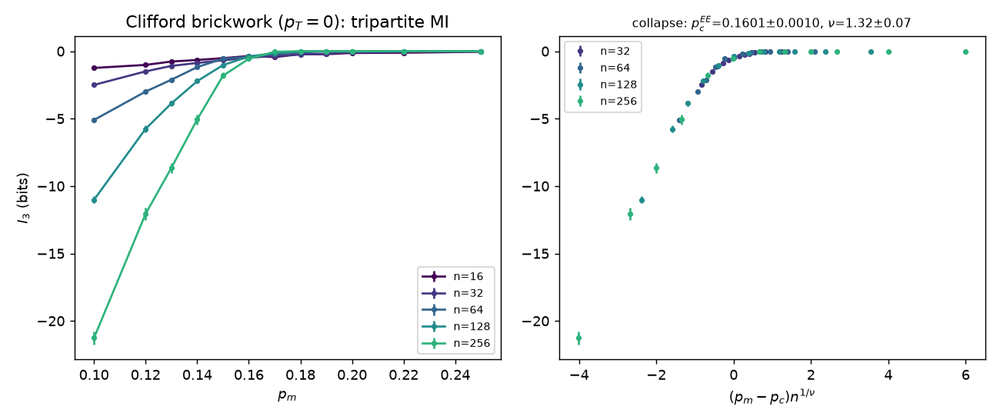
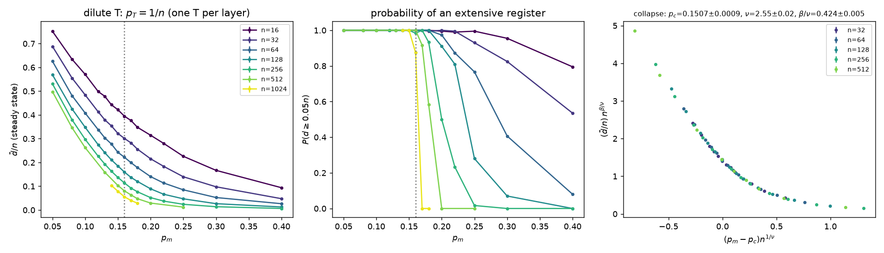
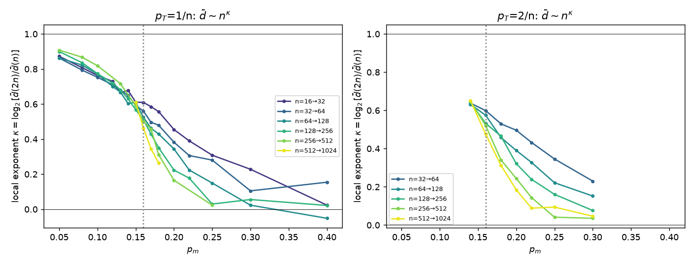
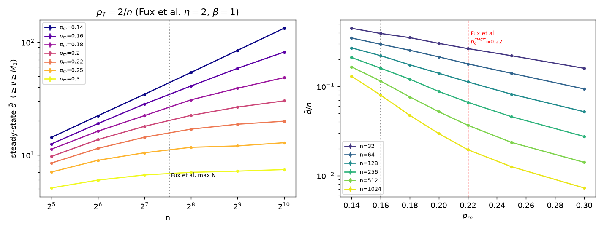
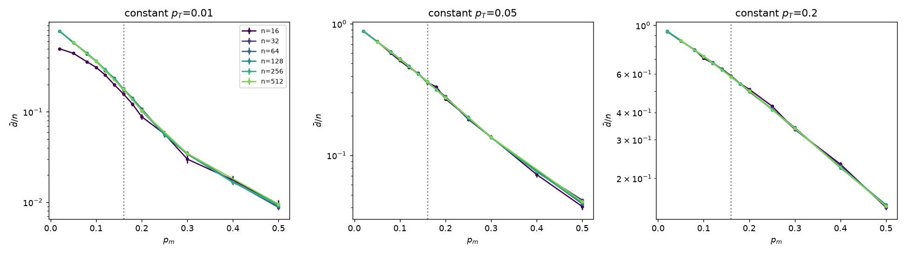
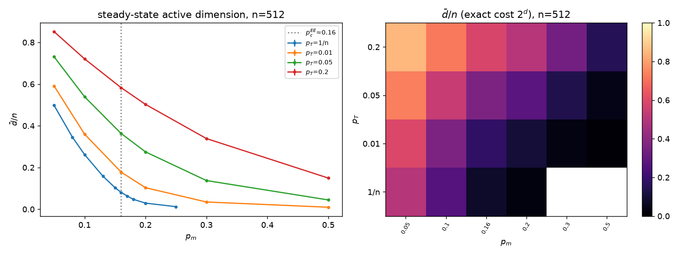
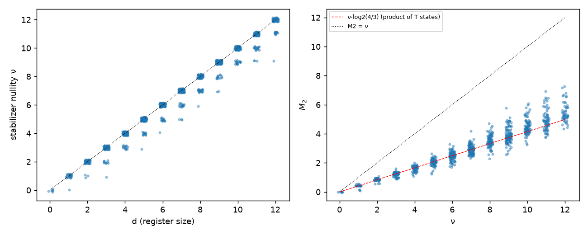

# A simulability transition in monitored Clifford+T circuits

Branch `exp/magic-transition` (from main e7e102d). Author: qsim-magic-transition agent, 4 Oct 2026.
Code: `src/monitored/{mod.rs,circuit.rs,ent.rs}` (new engine), `examples/magic_transition.rs` (campaign
driver), `tests/magic_transition.rs` (4 tests). Data: `research/data/magic-transition/` (`raw.csv` one row
per trajectory, `aggregate.csv`, `fss.json`, PNGs, `analyze.py`, `jobs*.txt`, `run*.sh`). All runs on the
M1 Pro (statistical campaign, ≤ 4 single-threaded workers, paused while the bench lock was held).

## Headline

**With a fixed number η of T gates per layer (T density η/n, the regime of Bejan–McLauchlan–Béri and
Fux et al.), the exact simulation cost `2^d` has a sharp simulability transition at
p_c^sim = 0.159 ± 0.0014 (η = 1, d̄/n collapse on n = 128–1024; size-pair crossings of the growth
exponent give 0.154 ± 0.006, drifting up with n), with d̄ ∝ n^κ, κ_c = 0.53–0.56 (β/ν = 0.49 ± 0.01) and an
effective ν = 2.51 ± 0.03, while the entanglement transition of the same circuits (I₃ collapse) is at
p_c^EE = 0.1601 ± 0.0010, ν = 1.32 ± 0.07: within finite-size drift the two coincide, and they coincide
with Bejan et al.'s magic transition (0.159 ± 0.001).** This is not an accident: we show that `d(t)` is
*exactly* the entropy of the same monitored Clifford circuit with every T replaced by a Z-dephasing channel,
so the simulability transition is a purification transition. With a **constant** T density (0.01, 0.05,
0.2) `d/n` is n-independent within statistical error (≤ 2 %) from n = 32 to 512 at every p_m (no transition, cost `2^{Θ(n)}`
everywhere). And since `M_2 ≤ ν ≤ d` per trajectory, the bound rules out an *extensive*-magic phase above
p_c^EE; for η = 2 we find d̄ (hence M_2) growing ever more slowly with n up to n = 1024 at p = 0.18–0.22
(local exponent 0.31 → 0.09) with no feature at Fux et al.'s p_c^magic ≈ 0.22. Largest exact (amplitude,
Born-sampled, mid-circuit-measured) simulation: **n = 2048, depth 8192 (8.4 M two-qubit Cliffords, 8.1 k
T gates, 4.2 M mid-circuit measurements) in 140 s on one M1 core** (wall time inside the shared statistical campaign, not a locked benchmark), d ≤ 18; n = 1024 runs in 30–45 s.

| quantity | value | how |
|---|---|---|
| p_c^EE (Clifford, p_T = 0) | **0.1601 ± 0.0010**, ν = 1.32 ± 0.07 (n = 32–256; n ≥ 64: 0.1636 ± 0.0019, ν = 1.62 ± 0.17) | I₃ collapse; size-pair crossings 0.147, 0.159, 0.166 (± 0.003) |
| p_c^sim, η = 1 | **0.1591 ± 0.0014**, ν_eff = 2.51 ± 0.03, β/ν = 0.49 ± 0.01 (n = 128–1024); 0.1550 ± 0.0010 (n ≥ 64); 0.1507 ± 0.0009 (n ≥ 32) | d̄/n collapse, χ²/dof 0.4–1.0 |
| p_c^sim, η = 1, model-free | 0.1535 ± 0.0056 (κ_c = 0.56 ± 0.06) from n = 256/512/1024; 0.157 ± 0.013 from 128/256/512 | crossing of κ(n,2n) and κ(2n,4n), κ = log₂ d̄(2n)/d̄(n) |
| p_c^sim, η = 2 | 0.145 ± 0.002 (collapse), 0.141–0.147 (crossings); coarse p grid (0.14, 0.16) | same |
| constant p_T | no transition: d/n = s(p_m, p_T) flat in n (χ²/dof 4–19 for any collapse) | `constant_pt.png` |
| exact-register magic (979 exact runs with d ≤ 12) | ν = d in 84 %, ⟨d − ν⟩ = 0.17; M_2/ν median 0.415 = log₂(4/3) (one T state) | `magic_exact.png` |

Error bars are statistical (bootstrap over trajectories); the drift of p_c^sim and the size of ν_eff with the
smallest size kept are the dominant systematic (see §5).


## 1. The engine: exact monitored Clifford+T with a shrinking register

The state is kept in the rotation-frame form of `src/adaptive.rs`,

    |ψ⟩ = C (|φ⟩_A ⊗ |0⟩_rest),   C Clifford (n qubits),   |φ⟩ dense on d = |A| "active" coordinates,

but `C` is now a Schrödinger (CHP-style) tableau with rows `D_j = C X_j C†`, `S_j = C Z_j C†` and signed
phases, so that both **left** multiplication by physical Cliffords (column updates, one 16-entry table
lookup per row for a uniformly random two-qubit Clifford) and **right** multiplication by virtual Cliffords
(row products) are cheap. For an operation on physical qubit `a` the engine reads the virtual image
`Q = C† Z_a C` off column `a` (x bit j ⇔ `S_j` anticommutes with `Z_a`, z bit j ⇔ `D_j` does):

| operation | `Q` has an x bit on an inactive coordinate `v` | otherwise (`Q` acts on the register only) |
|---|---|---|
| `T_a` | absorb `CNOT(v,·)`, `CZ(v,·)`, `S_v` (all controlled by `v`, which holds \|0⟩, so the state is unchanged) into `C` until `Q = ±X_v`; `v` joins the register in `cos π/8 \|0⟩ ∓ i sin π/8 \|1⟩`: **d → d+1** | `exp(−iπ/8 · ε Q_A)` on `\|φ⟩` (sign ε from a row product); d unchanged |
| `M_a` (Z measurement) | same isolation; outcome ±1 with probability exactly 1/2; `C → C H_v (X_v)`; d unchanged | Born probability `(1 ± ε⟨φ\|Q_A\|φ⟩)/2`, project `\|φ⟩`, rotate `Q_A → Z_u` with register Cliffords (applied to `\|φ⟩` and absorbed into `C`), drop the now-factorised coordinate `u`: **d → d−1** (or nothing if `Q_A = 1`: outcome deterministic) |

This is what Clifft does at measurements; here it is a self-contained module (`mod.rs` ≈ 950 lines, `ent.rs` ≈ 400, `circuit.rs` ≈ 120) that only borrows
`rotate_dense` from `adaptive.rs`. Cost: `O(n)` per two-qubit Clifford (tableau column update), `O(n · n/64)` per T/measurement
(row products), `O(2^d)` per dense update. A d-only mode (`Mode::DimensionOnly`) skips the amplitudes.

**Cut entropies, exactly** (`ent.rs`). With `G = ⟨S_j : j inactive⟩`, the Paulis on a region `R` that commute
with `G` form a group `H_R ⊇ G_R = G ∩ Paulis(R)` (`g` generators) whose quotient maps onto a logical Pauli
group on the register with `k` generators, symplectic rank `2a` and centre `b = k − 2a`. Up to a Clifford on
`R`, `ρ_R = |0⟩⟨0|^{⊗g} ⊗ σ ⊗ (I/2)^{⊗(|R|−g−a−b)}`, so

    S_α(ρ_R) = |R| − g − a − b + S_α(σ),    0 ≤ S_α(σ) ≤ a + b,

where `σ` is the state of `|φ⟩` on the `a` logical pairs with the `b` central logicals dephased. The frame
part is GF(2) elimination (`O(n³/64)`), `S_2(σ)` is computed from `|φ⟩` after a register Clifford that puts
the logical group in standard form. In d-only mode the two bounds are reported.

### 1.1 A structural fact: d is the entropy of a dephased monitored Clifford circuit

The *unsigned* tableau never depends on the amplitudes or on the measurement outcomes (outcomes only flip
row signs), so **d(t) is a property of the circuit, identical for every Born trajectory**
(`dimension_is_outcome_independent` checks it for 20 circuits, d-only vs exact vs two outcome records).
Moreover `n − d = log2 |G|`, and the table above is, operation by operation, the update of the stabilizer
group of a *mixed* stabilizer state ρ ∝ Π_{g∈G}(1+g)/2:

* Clifford: `G → U G U†`;
* `Z_a` measurement: anticommuting → standard replacement (|G| unchanged); commuting, `±Z_a ∉ G` →
  `G → ⟨G, ±Z_a⟩` (purification, d−1); `±Z_a ∈ G` → unchanged;
* `T_a`: `G → {g ∈ G : [g, Z_a] = 0}` — exactly the full Z-dephasing channel `ρ → (ρ + Z_a ρ Z_a)/2`.

So **d(t) = S(ρ_t)**, the von Neumann entropy (bits) of the *same* monitored Clifford circuit with every
`T` replaced by a dephasing channel. Two consequences:

1. d is computable in polynomial time at any `n` (we run n = 1024 in d-only mode), while `2^d` is the exact
   amplitude cost. The "simulability transition" of this engine is therefore a **purification transition of a
   monitored Clifford circuit with dephasing noise injected at the T sites** (Gullans–Huse 2020 with a
   noise source; cf. Weinstein–Bao–Altman 2022, Li–Vijay–Fisher 2023 on noise in monitored circuits).
2. A rigorous chain of magic bounds per trajectory: the stabilizer nullity of ψ equals that of φ
   (`ν(ψ) = ν(φ) ≤ d`), and for the stabilizer 2-Rényi entropy
   `M_2 = −log2(Σ_P ⟨P⟩⁴ / 2^n) ≤ ν` (the 2^{n−ν} stabilizers alone contribute `2^{n−ν}` to the sum). Hence

       M_2(ψ_t) ≤ ν(ψ_t) ≤ d(t)   for every trajectory and time.

   Any measurement rate at which `d/n → 0` is one at which the magic density `M_2/n → 0`.

## 2. Validation (exactness)

`tests/magic_transition.rs` (dev profile with all `debug_assert`s on, and release):

* `clifford_group_has_11520_elements`: the BFS over {H, S, CNOT} words gives the whole two-qubit Clifford
  group mod phase (uniform sampling as in Li–Chen–Fisher / Bejan et al.).
* `exact_against_state_vector_with_midcircuit_measurements`: 60 random monitored circuits, n = 3…10,
  depth 3n, `p_m ∈ {0.05, 0.15, 0.3, 0.5}`, `p_T ∈ {0.1, 0.25, 0.5}`, open and periodic. The engine samples
  each outcome from the Born rule; the dense state vector is collapsed onto the same outcome and its
  probability is compared (|Δp| < 1e-9 at every one of the mid-circuit measurements); every 3 layers the full
  state (expanded from the gate logs) has fidelity 1 ± 1e-9 with the SV; the exact Rényi-2 entropy of the
  half chain **and of random qubit subsets** matches the SV to 1e-7, equals that of the complement, and lies
  in the frame bounds; for d ≤ 8 the stabilizer nullity and M_2 of the register equal those of the full SV
  state (`magic_atlas::state_magic`).
* `dimension_is_outcome_independent` (above) and `dephasing_picture_matches` (full-region frame algebra:
  g = n − d, a = d).
* `examples/magic_transition validate` (Mac, larger n, same seeds, Born outcomes, every measurement compared):
  n = 20, depth 40, three circuits (85–273 mid-circuit measurements, d up to 18): max |Δp| = 1.2e-11,
  fidelity − 1 ≤ 2e-13; n = 22, depth 44, two circuits (97, 188 measurements): max |Δp| = 2e-13, fidelity − 1
  ≤ 2.3e-13 (`data/magic-transition/validate.txt`). Exact S_2 agrees with the frame bounds in all of them.

## 3. Model and observables

Brickwork of uniformly random two-qubit Cliffords on a ring of n qubits (even/odd layers alternate); after
every layer, each qubit gets `T` with probability `p_T` and then a Z measurement with probability `p_m`
(Bejan–McLauchlan–Béri's "uncorrelated monitoring"; Fux et al. use the same ingredients). Initial state
|0ⁿ⟩, depth 4n, steady-state `d̄` = average of d over the last n layers. Families:

| family | `p_T` | n | use |
|---|---|---|---|
| E0 | 0 (pure Clifford) | 16–256 | entanglement-transition reference: tripartite mutual information `I_3` of quarters (exact) |
| E1 | `1/n` (η = 1 T per layer, `qD = O(1)` of Bejan et al.) | 16–512 | dilute magic: d/n, P(d ≥ 0.05 n), FSS |
| E3 | `2/n` (η = 2, Fux et al.'s main case) | 32–1024 | direct test of their `p_c^magic ≈ 0.22` |
| E2 | 0.01, 0.05, 0.2 (constant density) | 16–512 | dense magic |
| E4, E5 | `η/n`, exact amplitudes | 32–2048 | ν, M_2 (d ≤ 12), exact S_2; largest exact sizes |

Samples per point: 400 (n ≤ 32) down to 60 (n = 512) and 16 (n = 1024); see `aggregate.csv`.
FSS: weighted polynomial master curve (degree 4), minimise χ²/dof over `(p_c, ν[, β/ν])` for
`Φ n^{β/ν} = F((p − p_c) n^{1/ν})`; error bars = bootstrap over trajectories (60 resamples).

## 4. Results

### 4.1 Entanglement reference (p_T = 0)



I₃ of four quarters of the ring: volume law (I₃ → −∞ ∝ n) below, area law (I₃ → 0) above. Collapse over
n = 32–256: **p_c^EE = 0.1601 ± 0.0010, ν = 1.32 ± 0.07** (χ²/dof 1.4), in agreement with the literature
for this model (0.1599, ν ≈ 1.2–1.3; Gullans–Huse, Zabalo et al., Li–Chen–Fisher). Size-pair crossings drift
up (0.147 → 0.159 → 0.166 ± 0.003), the usual small-size correction.

### 4.2 Dilute magic (η = 1 T per layer): a simulability transition at p_c^EE





* Below p_c the register is extensive or nearly so: d̄ ∝ n^κ with κ = 0.82–0.91 at p = 0.05–0.10 and
  **κ increasing with n** (0.77 → 0.82 at p = 0.10 from the 128/256 to the 256/512 pair). d̄/n itself still
  decreases with n at these sizes (0.57 → 0.26 at p = 0.10 for n = 16 → 512), so the asymptotic density is
  not reached; what is clean is the fan of κ curves.
* Above p_c, κ falls with n towards 0: at p = 0.25, d̄ = 5.4, 6.0, 6.2, 6.3 for n = 64…512 (saturated); at
  p = 0.18 the local exponent goes 0.55 → 0.48 → 0.43 → 0.35 → 0.31 → (n=1024) 0.26. The exact cost is
  `poly(n) · 2^{O(1)}` there.
* The κ curves for successive size pairs cross at **0.1535 ± 0.0056** (n = 256/512/1024) with
  κ_c = 0.56 ± 0.06, i.e. d̄_c ∝ n^{0.56}: at criticality the register grows like √n.
* Collapse of d̄/n with `Φ n^{β/ν} = F((p − p_c) n^{1/ν})`: p_c = 0.1591 ± 0.0014, ν_eff = 2.51 ± 0.03,
  β/ν = 0.49 ± 0.01 (n = 128–1024, χ²/dof 0.37); with smaller sizes included p_c moves down (0.155, 0.151)
  while ν_eff stays ≈ 2.55 and β/ν ≈ 0.42–0.46.
* P(d ≥ 0.05 n) (middle panel) steps from 1 to 0 ever more sharply, at p ≈ 0.16 for n = 1024.

**Is it the same transition as the entanglement one?** The location agrees within the finite-size drift
(0.153–0.159 vs 0.160–0.166, both drifting upwards with size), and the dephasing picture (§1.1) says it must:
with O(1) injections per layer, d is extensive iff injected entropy survives for a time ≳ n, i.e. iff the
Clifford circuit is in its mixed (volume-law) phase, and for Clifford circuits the purification and
entanglement transitions coincide (Gullans–Huse). It also matches Bejan et al.'s magic transition
(0.159 ± 0.001 from their PBC runtime proxy). **The exponent does not match**: ν_eff ≈ 2.5 for the
d̄/n order parameter vs ν ≈ 1.3 for I₃ (and Bejan et al.'s ν ≈ 1.23). We think ν_eff is an artefact of the
strong corrections visible in the κ < 1 below p_c (the collapse has to absorb a drifting amplitude), not a
second universality class, but we cannot prove it at n ≤ 1024.

### 4.3 Fux et al.'s η = 2 setup and the claimed magic transition at p ≈ 0.22



Fux–Tirrito–Dalmonte–Fazio (arXiv:2312.02039) find for the same ingredients with q = 2/N (TEBD, N ≤ 184,
F-test between sub-extensive and area-law fits of M_2) an entanglement transition at 0.16 and a **magic**
transition at p_c^magic ≈ 0.22, with an intermediate phase "area-law entanglement, (sub)extensive magic".
Our d is an upper bound on their M_2 for every trajectory (`M_2 ≤ ν ≤ d`, §1.1; on the exact runs
M_2/ν has median 0.415, 10–90 % range 0.37–0.49). At η = 2 we get (`aggregate.csv`, n = 32 … 1024):

| p_m | d̄(32) | d̄(128) | d̄(256) | d̄(512) | d̄(1024) | κ(512→1024) |
|---|---|---|---|---|---|---|
| 0.16 | 12.5 | 28.3 | 40.9 | 58.6 | 81.6 | 0.48 |
| 0.18 | 11.3 | 22.3 | 30.8 | 39.0 | 48.5 | 0.31 |
| 0.20 | 9.7 | 17.9 | 22.4 | 26.5 | 30.2 | 0.19 |
| 0.22 | 8.5 | 14.4 | 16.9 | 18.7 | 19.9 | 0.09 |
| 0.25 | 7.1 | 10.5 | 11.7 | 12.0 | 12.8 | 0.09 |
| 0.30 | 5.1 | 6.6 | 7.0 | 7.2 | 7.4 | 0.04 |

Checks that this is the stationary, n-driven value: at n = 256, d̄ is the same for depth 1024, 4096 and
16384 (e.g. p = 0.18: 30.8, 30.5, 29.6; p = 0.22: 17.2, 17.4, 17.4; family E6), and at fixed depth 4096
the n-dependence is the same as at depth 4n (E7). So:

* For p > 0.16 the magic density is zero: d̄/n (an upper bound on M_2/n) falls from 0.35 to 0.047 at
  p = 0.18 between n = 32 and 1024.
* Between 0.16 and ~0.22 the bound grows sub-linearly with a local exponent that keeps shrinking with n,
  across the whole range; nothing distinguishes 0.22. Over Fux et al.'s window (N ≤ 184) d̄ grows by a factor
  1.7–2 between N = 32 and 128 at p = 0.18–0.22, which is the kind of growth an F-test would call "sub-extensive". **We see no
  evidence for a second (magic) transition at 0.22; if one exists, its order parameter is sub-extensive on
  both sides (≤ d̄ ≈ 20 at n = 1024, p = 0.22)**. Caveat: d bounds M_2 from above only; a slowly
  (logarithmically) growing M_2 below some p* > 0.16 is not excluded by these data.

### 4.4 Constant T density: no transition, cost exponential everywhere





For p_T = 0.01, 0.05, 0.2 the steady-state d/n is the same for n = 32…512 within statistical error (≤ 2 %) at every
p_m from 0.02 to 0.5 (e.g. p_T = 0.01: 0.590, 0.364, 0.179, 0.104, 0.035, 0.009 at p_m = 0.05, 0.1, 0.16,
0.2, 0.3, 0.5; p_T = 0.05 at p_m = 0.16: 0.362, 0.357, 0.365, 0.363, 0.363 for n = 32…512). No collapse
exists (χ²/dof 4–19, ν runs to the bound). In the dephasing picture this is expected: a finite density of
noise is a relevant perturbation that turns the purification transition into a crossover (cf. noisy monitored
circuits: Weinstein–Bao–Altman, Li–Vijay–Fisher). Practically, the rotation-frame engine is exponential in n
at any constant T density, even deep in the area-law phase (d/n ≈ 0.035 at p_m = 0.3, p_T = 0.01 still means
d ≈ 36 at n = 1024).

### 4.5 Entanglement from the frame

Half-chain bounds `[|R| − g − a − b, |R| − g]` (d-only mode) are tight wherever d is small: η = 1, n = 512,
p = 0.25: S ∈ [1.5, 4.7]; p = 0.20: [2.6, 11.1]. Below p_c they are loose (p = 0.10: [3.6, 71.8]) because
most of the register is logical information shared across the cut. The exact S₂ is available whenever the
register fits (d ≤ 26): on the E4/E5 runs it is 0.8–4.6 bits (area law), e.g. S₂ ∈ {0, 1, 2} bits at n = 1024–2048,
p = 0.25–0.3.

### 4.6 What the register holds

On 979 exact runs with d ≤ 12 (n = 32–2048, η = 1, 2, p = 0.16–0.3): the register is magic all the way
down (ν = d in 84 %, ⟨d − ν⟩ = 0.17), and M_2/ν has mean 0.425, median 0.415 = log₂(4/3) (the value per T state), 10–90 % range 0.37–0.49; in 23 %
it is exactly a product of single T states (M_2 = ν log₂(4/3)), i.e. each T's magic was still isolated.
So d is a tight magic proxy in this model, not just a cost. (These averages are over runs whose register
stayed ≤ 24 qubits; 440 of 1570 exact runs near p_c hit that cap and are excluded, which biases E4
means low near p_c.)



## 5. Caveats

* **Finite-size drift.** p_c^sim estimates move up as small sizes are dropped (0.151 → 0.155 → 0.159) and
  the κ crossings scatter (0.113–0.157); p_c^EE crossings drift the other way within 0.147–0.166. "The
  same within finite-size drift" is the honest statement, not "equal to 3 digits".
* **ν_eff ≈ 2.5** for d̄/n is twice the I₃ value; unexplained (likely corrections to scaling; d̄/n has
  not converged even at p = 0.05).
* η = 2 has only p = 0.14 and 0.16 near p_c, so its p_c (0.145) is interpolation-limited.
* Steady state: d̄ is averaged over the last n layers of a depth-4n circuit; depth-independence was
  checked at n = 256 for p ≥ 0.16 (to 64n) but not below p_c, where the approach to the steady state is
  slowest.
* Campaign conditions: the bench lock was held by peers most of the afternoon, so the workers were
  paused most of the time; statistics were cut to 24–60 circuits at n = 512 and 8–16 at n = 1024. Phase-1
  rows lost their `tag` column to a driver-script bug (an extra `shift` in `run.sh`); families are
  recovered exactly from (n, p_T) in `analyze.py`.
* The circuit puts T before the measurements in each slot, so a T on a qubit measured in the same slot is
  wasted (probability p_m); this rescales η slightly and is the same convention as "between Clifford
  layers" in Bejan et al.

## 6. Relation to the literature

* **Li–Chen–Fisher / Skinner–Ruhman–Nahum / Gullans–Huse:** reproduced p_c^EE ≈ 0.160, ν ≈ 1.3.
* **Bejan–McLauchlan–Béri (PRX Quantum 5, 030332):** their runtime proxy for Pauli-based computation
  has a magic transition at 0.159 ± 0.001 for qD = O(1); our exact-engine cost transition is at the same
  place, and the dephasing theorem gives a one-line reason (their "stabilizer purification" is literally the
  purification of the dephased Clifford circuit, and their "logical qubits of the effective code" is our d).
  For O(n) T gates per layer they found PBC hard until percolation (p ≈ 0.48); we find the rotation-frame
  register extensive at every p_m we ran (to 0.5) for constant p_T.
* **Fux–Tirrito–Dalmonte–Fazio (arXiv:2312.02039):** see §4.3. The upper bound d on M_2 shows no
  extensive magic above 0.16 and no feature at 0.22 up to n = 1024.
* **Niroula et al. (arXiv:2304.10481)** (magic transition of a random stabilizer code under coherent errors
  and syndrome measurements) and **Leone et al. (arXiv:2302.07895)** (subsystem stabilizer entropy vs T
  density, no measurements) are different settings; nothing here tests them.

## 7. Reproduce

```
cargo test --release --test magic_transition
cargo build --release --example magic_transition
B=target/release/examples/magic_transition
$B validate n=20 seeds=3 depth=40
$B scan tag=E1 n=256 pm=0.16 ptn=1 samples=10 ent=i3            # d-only, η = 1
$B scan tag=E5 n=2048 pm=0.25 ptn=1 samples=1 mode=exact maxd=26 magic=1 magicmax=12 ent=half
# full campaign: data/magic-transition/jobs*.txt via run*.sh (≤ 4 workers, SIGSTOP on the bench lock)
python3 data/magic-transition/analyze.py data/magic-transition/raw.csv data/magic-transition
```
