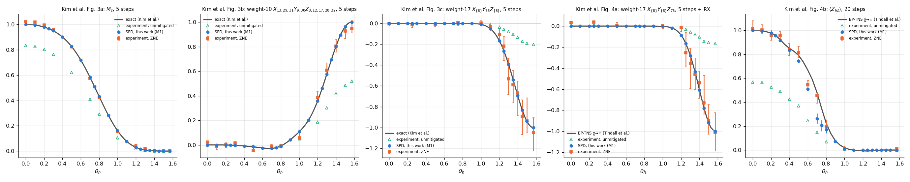
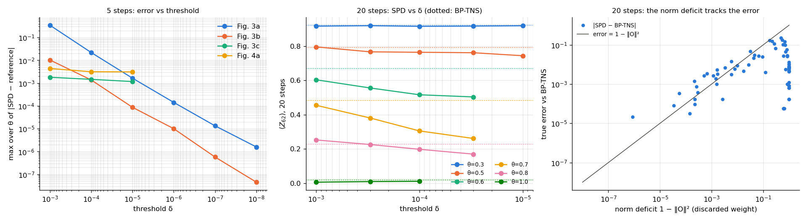
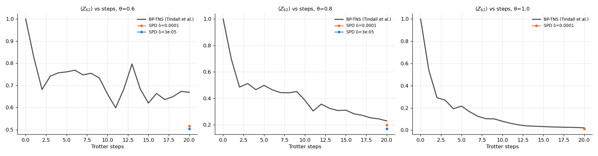
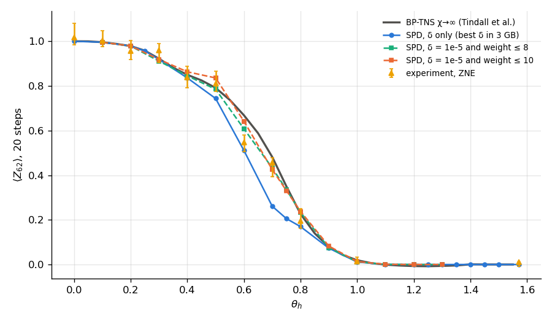
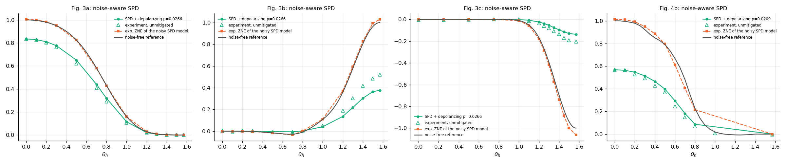
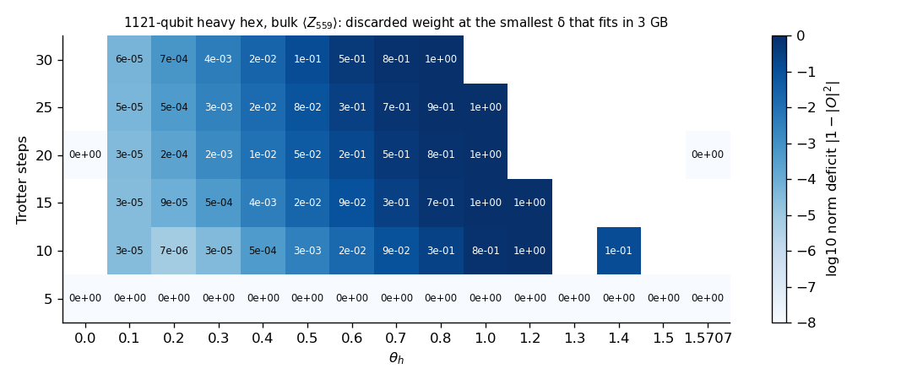

# Spoofing "quantum utility" on a laptop: sparse Pauli dynamics for IBM's 127-qubit kicked-Ising experiment

**Provenance.** Branch `exp/spoof-utility`, rebased on `main` @ a62d359,
4–5 Oct 2026. All builds and runs were on Dylan's MacBook Pro (M1 Pro, 8
cores, 16 GB, macOS) with `RAYON_NUM_THREADS=2`, ≤ 3 GB per process and
load 12–30 from other agents. The VPS was used for git only.

**Target.** Kim et al., *Evidence for the utility of quantum computing before
fault tolerance*, Nature **618**, 500 (2023). The paper ran 127-qubit kicked
transverse-field Ising Trotter circuits on ibm_kyiv and reported
zero-noise-extrapolated (ZNE) observables. This study adds a Rust
sparse-Pauli-dynamics (SPD) engine, `qsim_lab::spd`, and measures how far it
gets on one laptop under the swarm budget: 2 worker threads, ≤ 3 GB per
process, no GPU.

## TL;DR

| Kim et al. figure | observable | laptop result (M1, 2 threads) | max error vs reference | experiment's (ZNE) max error |
|---|---|---|---|---|
| 3a | `M_z`, 5 steps | 0.02 s per point | **1.6e-6** vs exact | 0.024 |
| 3b | weight 10, 5 steps | 3 s per point (δ = 1e-6), 7 s (δ = 1e-8) | **4.6e-8** vs exact | 0.053 |
| 3c | weight 17, 5 steps | 1–4 min per point (δ = 1e-5) | **1.2e-3** vs exact | 0.140 |
| 4a | weight 17, 5 steps + RX | 2–60 s per point (δ = 1e-4 / 1e-5) | **2.6e-4** vs BP-TNS χ = 500 | 0.091 |
| 4b | `⟨Z_62⟩`, **20 steps** | plain SPD, 1–30 s per point | **0.22** vs BP-TNS χ→∞ | 0.122 |
| 4b | same, SPD + weight cap 9 | 0.1–4 s per point | **0.035** vs BP-TNS χ→∞ | 0.122 |

1. **All four 5-step figures are reproduced on the laptop**, with errors 30× to
   10⁶× smaller than the experiment's, in milliseconds to minutes per point.
   That includes Fig. 4a, which the experiment presented as beyond exact
   classical simulation. On the 1121-qubit (Condor-sized) lattice, `M_z` after
   5 steps is *exact* in 0.7 s per point.
2. **Plain SPD fails the 20-step point within 3 GB.** For 0.5 ≤ θ_h ≤ 0.8 it
   is biased low by up to 0.22, worse than the experiment's ZNE (0.12).
   Converged SPD there needs ~10⁹ Pauli strings (Begušić, Gray & Chan, Table S3:
   760–885 M strings, 10–13 h on 6 cores). We hold at most ~18 M.
3. **The standard SPD error bar is wrong at depth 20.** The δ-ladder difference
   says 0.013 at θ = 0.6 when the true error is 0.16. Ground truth on 12–24 qubit
   heavy-hex patches (exact state vector, 20 steps) shows SPD's error *growing*
   as δ shrinks through the affordable range: on the 24-qubit patch it goes
   −0.055 → −0.069 → −0.081 for δ = 1e-4 → 3e-5 → 1e-5. The discarded Frobenius
   weight `1 − ‖O‖²` is the reliable warning: every point that is off by
   more than 0.01 has a deficit of at least 0.01.
4. **A Pauli-weight cap of 8–10 rescues the 20-step curve.** Weight cap ≤ 9 plus
   δ = 1e-5 is within 0.035 of BP-TNS at every θ, in seconds. The 24-qubit exact
   patch confirms the effect: at θ = 0.6, cap 10 gives an error of +0.003
   against −0.081 for plain SPD, and across θ caps 8–10 stay within 0.06 (cap 8
   within 0.022). The approximation is **not controlled**, though. The error is
   non-monotone in the cap, and caps ≥ 11 snap back to the plain-SPD bias, so
   the cap was chosen with the references in hand.
5. **Noise makes it easy.** One depolarizing parameter, fitted only at θ = 0
   to the unmitigated data, reproduces the unmitigated `M_z` (5 steps) within
   0.03 and `⟨Z_62⟩` (20 steps) within 0.05 over the whole θ sweep. In that
   regime SPD converges smoothly in δ (to ~0.002). Exponential ZNE applied to
   that classical noise model is biased low at θ = 0.6–0.7 (−0.06/−0.08 against
   BP-TNS), in the same direction as the experiment's ZNE.

## 1. Data and references

* **Experiment.** The authors' data repository
  (github.com/youngseok-kim1/Evidence-for-the-utility-of-quantum-computing-before-fault-tolerance,
  also figshare 10.6084/m9.figshare.22500355).
  `research/data/spoof-utility/extract_kim.py` re-implements their notebooks'
  selection rule: the last of the (linear, exponential) fits with fit
  uncertainty < 0.5, else unmitigated, with a 68 % bootstrap interval. Output:
  `kim_fig*_experiment.csv`. Their exact curves for 3a–3c (0.01 grid) and MPS
  curves are in `kim/`.
* **Coupling map.** The 144 edges published in the authors' `Fig3a.ipynb`.
  `Lattice::eagle127()` reproduces them exactly; the generic generator
  `Lattice::ibm_heavy_hex(rows, row_len)` gives 433 = (13, 27) and 1121 = (21, 43).
* **Classical references beyond the exact regime.** Tindall, Fishman,
  Stoudenmire & Sels, PRX Quantum 5, 010308 (2024), arXiv:2306.14887: BP-evolved
  tensor networks. Their data repository github.com/JoeyT1994/BP-TNS-Data is
  copied to `tindall/`: `⟨Z_62⟩` after 20 steps (χ = 250…500 and the 1/χ → 0
  extrapolation), the Fig. 4a observable, and `⟨Z_62⟩(t)` for t ≤ 20 at
  θ = 0.6, 0.8, 1.0. Begušić, Gray & Chan (Sci. Adv. 10, eadk4321 (2024),
  arXiv:2308.05077) find MIX-TN, SPD and BP-TNS agree to < 0.045 at 20 steps,
  with MIX-TN accurate to < 0.01.
* **Sign convention.** `⟨0|U† O U|0⟩` with `U = (Π e^{+iπ Z_jZ_k/4} Π e^{−iθX_j/2})^T`
  agrees in sign with the stored experiment data for all five observables.
  The Fig. 4a notebook plots `−1 ×` the stored values, and Tindall's weight-17
  file uses the plotted sign, so `analyze.py` flips it.

## 2. The engine (`src/engines/spd.rs`)

Heisenberg picture: push `O` backwards through the circuit as a sparse real
sum of Pauli strings, then evaluate on `|0…0⟩`. Design choices:

1. **The ZZ layer is one O(|x|) bit operation per string.** All 144
   `RZZ(−π/2)` commute and leave `x` fixed. A string anticommutes with `Z_aZ_b`
   iff `x_a ≠ x_b`. The whole layer is therefore `z ← z ⊕ s` with
   `s_q = deg(q)x_q ⊕ ⊕_{r~q} x_r`, using precomputed per-qubit flip masks,
   with sign `i^{k+|x∧z|−|x∧z'|}` where `k` is the number of cut edges. The cost is
   proportional to the number of X/Y sites, independent of lattice size.
2. **The RX layer is one depth-first branching per string**
   (`Z → cos Z + sin Y`, `Y → cos Y − sin Z`). Every factor is ≤ 1, so the
   branch coefficient is monotone and a subtree is cut once it falls below
   the threshold. Every child above the threshold is still produced. Children
   from all parents are merged in a 128-shard hash map, and merged coefficients
   below δ are dropped. Begušić & Chan instead truncate after every single
   gate. Approximating that here (`branch_factor = 0.1`) did not reduce the
   20-step bias (§4).
3. **The first RX layer is closed form**:
   `⟨0|RX†PRX|0⟩ = Π_sites {I: 1, Z: cos θ, Y: −sin θ, X: 0}`. There is no
   branching and no merge for the last backward layer.
4. **The last branching layer is streamed** (`stream = 1`, the default). It feeds
   a linear evaluation, so its children are evaluated depth first instead of
   stored. The work is the same and the largest table disappears. Fig. 3b at
   δ = 1e-5 drops from 16.6 M stored terms to 0.15 M (26 MB RSS). `stream = k`
   trades time for memory.
5. **Light cone plus BFS relabelling.** Only qubits within graph distance `T` of the
   observable are kept, so the key width follows the cone:
   * 37 qubits (1 word of 64 bits) for the weight-10 observable;
   * 68 (2 words) for weight-17;
   * 127 (2 words) for `Z_62` at 20 steps;
   * 391 (7 words) for a bulk qubit of the 1121-qubit lattice at 20 steps.
6. **Accounting.** For each cut the engine records the l1 mass (a rigorous but
   loose bound `|Δ⟨O⟩| ≤ Σ|c_cut|`, checked in the tests) and the squared norm.
   It also reports `‖O‖²` entering the last layer.
7. **Noise.** Depolarizing `p` on every qubit after every ZZ layer is applied
   exactly in the Heisenberg picture as a factor `(1 − 4p/3)^{weight}`. An
   optional Pauli-weight cap is applied after each ZZ layer.
8. **Memory.** ~167 B per stored string (measured: 2.46 M strings at 410 MB RSS),
   so 3 GB holds ~18 M strings. The `--mem-gb` flag converts a budget into a hard
   term cap; runs that hit it are flagged `aborted` and excluded.

Drivers:
* `examples/spoof_utility.rs` runs the figures and the larger lattices: `3a|3b|3c|4a|4b|mz|z<q>`
  with `--delta`, `--steps`, `--lattice 127|433|1121`, `--depol`, `--max-weight`,
  `--stream`, `--branch-factor` and `--mem-gb`. Output is one JSON line per point.
* `examples/spoof_patch.rs` runs truncated SPD against the exact state vector on
  heavy-hex patches at any depth.

### Validation (`tests/engines/spd.rs`, 8 tests, green on the M1; clippy `-D warnings` clean)

* **Lattice.** `eagle_matches_published_coupling_map` also checks that the three
  published colour layers are perfect matchings. `larger_heavy_hex_lattices`:
  433 qubits / 504 edges and 1121 / 1320, degree ≤ 3, connected, no adjacent
  degree-3 pair.
* **Dense state vector, δ = 0.** `exact_spd_matches_statevector_on_heavy_hex_patches`
  agrees to 1e-10.
  * Patches: 4 Eagle patches of 12–16 qubits.
  * Circuits: 1–4 steps, random θ, with and without the extra RX layer.
  * Observables: `M_z`, random weight-1/2/3/5 strings, and multi-term
    observables with repeated strings.
  * Options: light cone on and off; stream 0, 1, 2 and 99.
  * A guard requires more than half the values to be non-zero.
* `exact_spd_matches_statevector_at_special_angles` (θ = 0, π/4, ±π/2, π, 3π/2).
* **Full 127 qubits.** `exact_spd_matches_pauli_path_engine_at_127_qubits`
  compares against the independent exact Clifford+Rz engine
  `pauli_path::expectation` on the gate-level circuit (RZZ = CNOT·Rz·CNOT):
  1–3 steps, the paper's observables, at least 20 cases, agreement to 1e-10.
* **Clifford point.** `clifford_point_matches_pauli_path_at_depth_20`
  (θ = π/2, up to 20 steps): the weight-10/17 observables are ±1
  stabilizers, and SPD keeps exactly one term.
* **Truncation.** `truncation_error_is_within_the_l1_bound_and_converges`
  covers stream 0/1/3, δ and weight caps.
* **Noise.** `noisy_spd_matches_density_matrix`: a 6-qubit exact density
  matrix with per-qubit depolarizing, agreement to 1e-10.
* **Dynamics cross-check.** `⟨Z_62⟩(t)` at θ = 0.6 for t = 1…7 reproduces
  Tindall et al.'s published dynamics to all printed digits:
  0.8253, 0.6812, 0.7414, 0.7568, 0.7609, 0.7686, 0.7474.

## 3. The 127-qubit figures



Every per-θ table is in [`data/spoof-utility/tables.md`](../data/spoof-utility/tables.md).
Each row gives the SPD value, the δ-ladder difference, the norm deficit, the
time, the reference, the ZNE value with its CI, and the difference.

* **Fig. 3a (`M_z`, 5 steps).** The 127-term sum observable is exact at
  δ = 1e-8. 14,256 strings is the full set, and the truncated l1 mass is
  1e-18. The error vs Kim et al.'s exact curve is ≤ 1.6e-6 (their file's
  precision). Why it is cheap: `Z_q` commutes with the last ZZ layer and the
  first RX layer is closed form, so 5 steps leave three branching layers.
  Begušić & Chan needed ~15 min per point for exact `M_z` in single-core Python.
* **Fig. 3b (weight 10).** Error ≤ 4.6e-8 at δ = 1e-8, about 7 s per point.
* **Fig. 3c (weight 17, light cone of 68 qubits).** Error ≤ 1.2e-3 at
  δ = 1e-5 with `stream = 2`, 1–4 min per point. The residual sits at
  θ = 0.9–1.0, where the exact value is ~1e-3 to 1e-2, and it shrinks with δ:
  1.5e-3 at 1e-4, 1.2e-3 at 1e-5. A δ = 3e-6 run at θ = 0.9 did not finish in
  21 min and was dropped.
* **Fig. 4a (weight 17 + RX).** Kim et al. have no exact curve here. Against
  Tindall's raw χ = 500 BP-TNS data, SPD (δ = 1e-5) agrees to **≤ 2.6e-4** at
  every θ. Their 1/χ → 0 *extrapolated* column deviates from both by up to
  3.1e-3 (at θ = 1.2–1.35). Two independent methods agreeing at the 1e-4 level
  suggests the extrapolation, not the χ = 500 data, is off there.
* **Fig. 4b (20 steps).** See §4.

**Locked timings** (`bench_m1.jsonl`). Interleaved, min of 3. During the window
the machine's load average was 12–19 from other agents, so these are upper
bounds.

| figure | θ_h | δ | 1 thread | 2 threads | stored strings (peak) |
|---|---|---|---|---|---|
| 3a `M_z` | 0.6 | 1e-8 | 0.029 s | 0.017 s | 14,256 |
| 3b weight 10 | 1.0 | 1e-6 | 5.44 s | 2.86 s | 152,208 |
| 4a weight 17 + RX | 1.2 | 1e-4 | 3.14 s | 1.83 s | 5,587,393 |
| 4b `Z_62`, 20 steps | 0.6 | 1e-4 | 1.13 s | 0.70 s | 287,519 |
| 4b `Z_62`, 20 steps | 0.6 | 3e-5 | 10.05 s | 6.15 s | 2,461,265 |

The experiment's reported wall times were 4 h (Fig. 4a) and 9.5 h (Fig. 4b).

## 4. The 20-step point: where plain SPD loses



* **Left: 5 steps.** The error against exact references falls steadily with δ.
* **Middle: `⟨Z_62⟩` at 20 steps vs δ**, with BP-TNS dotted. For
  0.5 ≤ θ ≤ 0.8 the value moves *away* from the reference as δ shrinks over
  everything that fits in 3 GB. At θ = 0.6: 0.516 (δ = 1e-4), 0.503 (3e-5),
  0.511 (1e-5, 15.8 M strings, 76 s), against BP-TNS 0.669 and ZNE 0.546.
* **Right: true error vs the norm deficit `1 − ‖O‖²`.** Points with a deficit
  below ~1e-2 are accurate. Large deficits do not imply large errors when the
  value itself is ≈ 0 (θ ≥ 1).

| θ_h | BP-TNS χ→∞ | plain SPD (best δ) | deficit | δ-ladder diff | ZNE experiment |
|---|---|---|---|---|---|
| 0.3 | 0.922 | 0.919 | 7e-4 | 2e-3 | 0.960 |
| 0.4 | 0.850 | 0.836 | 6e-3 | 5e-3 | 0.839 |
| 0.5 | 0.791 | 0.744 | 3e-2 | 2e-2 | 0.812 |
| 0.6 | 0.669 | 0.511 | 2e-1 | 1e-2 | 0.546 |
| 0.7 | 0.482 | 0.261 | 5e-1 | 4e-2 | 0.455 |
| 0.8 | 0.227 | 0.170 | 8e-1 | 3e-2 | 0.195 |
| 1.0 | 0.019 | 0.011 | 1.0 | 2e-3 | 0.013 |



**Depth scan** (`⟨Z_62⟩(t)` against Tindall's BP-TNS dynamics):
* θ = 0.6, δ = 3e-5: exact to 1e-4 through 6 steps, within 0.01 through
  10 steps, then the error swings: −0.057 at 12 steps, +0.013 at 14, −0.11 at
  18, −0.17 at 20.
* θ = 0.8: within 0.006 through 10 steps, then −0.02 to −0.06.
* θ = 1.0, δ = 1e-4: within 0.01 at every depth. The value is small, and so
  is the absolute error, even though `‖O‖²` collapses to 0.002.

**Exact ground truth at depth 20** (`patch_exact.jsonl`). BFS balls of
12–24 qubits around qubit 62, which are trees, against the dense state vector:

| patch | θ_h | steps | exact | δ = 1e-3 | 1e-4 | 3e-5 | 1e-5 (strings) |
|---|---|---|---|---|---|---|---|
| 24 | 0.3 | 20 | 0.9222 | −0.006 | −0.008 | −0.006 | −0.004 (0.19 M) |
| 24 | 0.6 | 10 | 0.6479 | +0.115 | +0.034 | +0.012 | +0.002 (4.8 M) |
| 24 | 0.6 | 15 | 0.5836 | +0.093 | +0.037 | +0.026 | −0.007 (8.4 M) |
| 24 | 0.6 | 20 | 0.6186 | −0.007 | −0.055 | −0.069 | **−0.081** (11.6 M) |
| 24 | 1.0 | 20 | 0.0171 | −0.011 | −0.006 | (> 3 GB) | |
| 20 | 0.6 | 20 | 0.5712 | +0.040 | −0.019 | −0.044 | −0.059 (9.4 M) |
| 16 | 0.6 | 20 | 0.5882 | +0.046 | +0.009 | −0.011 | −0.017 (8.1 M) |
| 14 | 0.6 | 20 | 0.5740 | +0.074 | +0.036 | +0.016 | +0.004 (6.9 M) |
| 12 | 0.6 | 20 | 0.7005 | −0.001 | +0.024 | +0.025 | +0.018 (2.0 M) |

At 10 steps SPD converges normally. At 20 steps, even 12–16 qubits need
2–8 M strings at δ = 1e-5 (the full space is 4^k), and convergence is erratic.
On the 16, 20 and 24-qubit patches the error changes sign and *grows* as δ
shrinks. On 14 qubits it happens to converge (+0.004), and on 12 it stalls at
~0.02. This is the non-monotone convergence Begušić, Gray & Chan report for
SPD and PEPO (their Fig. S3), now measured against exact answers. It rules out
the BP-TNS reference or an engine bug as the cause of the 127-qubit gap.

**Per-gate-like merging does not help.** Pruning children at 0.1·δ and
merging before applying δ approximates Begušić & Chan's truncate-after-every-gate
rule. At θ = 0.6 it gives 0.5055 vs 0.5160 (127 qubits, δ = 1e-4), and 0.537
vs 0.564 on the 24-qubit patch (exact 0.619). That is no closer, and 25–30×
slower.

### Weight cap: an uncontrolled but effective fix



Weight truncation in the style of Rudolph et al. (LOWESA) and Shao et al.,
added on top of δ = 1e-5. Each cell is the value with its error against
BP-TNS χ→∞ in parentheses:

| θ_h | BP-TNS | plain SPD | w ≤ 6 | w ≤ 8 | w ≤ 9 | w ≤ 10 | w ≤ 11 | w ≤ 12 | w ≤ 16 |
|---|---|---|---|---|---|---|---|---|---|
| 0.4 | 0.850 | 0.836 (−0.014) | – | 0.845 (−0.005) | 0.860 (+0.010) | 0.863 (+0.013) | 0.839 (−0.011) | – | – |
| 0.5 | 0.791 | 0.744 (−0.047) | 0.840 (+0.049) | 0.785 (−0.006) | 0.827 (+0.035) | 0.836 (+0.044) | 0.755 (−0.036) | 0.758 (−0.034) | 0.745 (−0.047) |
| 0.6 | 0.669 | 0.511 (−0.158) | 0.702 (+0.034) | 0.608 (−0.061) | 0.661 (−0.008) | 0.642 (−0.027) | 0.529 (−0.140) | 0.529 (−0.139) | 0.512 (−0.156) |
| 0.7 | 0.482 | 0.261 (−0.221) | 0.504 (+0.022) | 0.433 (−0.049) | 0.457 (−0.025) | 0.425 (−0.057) | 0.307 (−0.175) | 0.295 (−0.186) | – |
| 0.75 | 0.350 | 0.206 (−0.145) | – | 0.336 (−0.014) | 0.353 (+0.003) | 0.331 (−0.019) | 0.238 (−0.113) | – | – |
| 0.8 | 0.227 | 0.170 (−0.057) | 0.263 (+0.036) | 0.233 (+0.007) | 0.251 (+0.024) | 0.238 (+0.011) | 0.182 (−0.045) | – | – |
| 0.9 | 0.079 | 0.073 (−0.006) | – | 0.075 (−0.004) | 0.085 (+0.006) | 0.083 (+0.004) | 0.071 (−0.008) | – | – |

On the exact 24-qubit patch at 20 steps the same pattern appears:

| θ_h | exact | w ≤ 8 | w ≤ 9 | w ≤ 10 | w ≤ 11 | w ≤ 12 | plain SPD (δ) |
|---|---|---|---|---|---|---|---|
| 0.3 | 0.9222 | −0.011 | −0.007 | −0.003 | −0.004 | −0.004 | −0.004 (1e-5) |
| 0.5 | 0.7707 | +0.009 | +0.051 | +0.057 | −0.002 | +0.005 | – |
| 0.6 | 0.6186 | −0.022 | +0.038 | +0.003 | −0.093 | −0.078 | −0.081 (1e-5) |
| 0.7 | 0.4185 | −0.008 | +0.022 | −0.039 | −0.148 | −0.143 | – |
| 0.8 | 0.2067 | +0.017 | +0.039 | +0.015 | – | – | – |
| 1.0 | 0.0171 | −0.005 | −0.003 | −0.004 | – | – | −0.006 (1e-4) |

(δ = 1e-5, errors against the exact state vector.) Cap 8 stays within 0.022
on the patch, cap 9 within 0.035 on 127 qubits (against BP-TNS), and no single
cap is best everywhere. Caps 11–12 are fine at θ = 0.3 and 0.5 but fail at
0.6–0.7.

With a cap of 8–10, SPD reproduces the 20-step curve to 0.035–0.06 in 0.1–15 s
per point. That is as good as or better than the experiment's ZNE at every θ.
Caps ≥ 11 jump back to the plain-SPD bias, so the result is not a convergent
approximation in the cap. We have **no theory** for why caps 8–10 work, and we
picked the window with the references in view. Treat this as an empirical
observation that needs an independent check (the exact patch is one), not as a
certified method.

## 5. Noise-aware SPD



**Model.** Uniform single-qubit depolarizing `p` after every ZZ layer, with
readout folded in. `p` is fitted once, at θ = 0, where the dynamics is trivial
(`⟨Z⟩ = (1 − 4p/3)^T`):
* 5 steps: unmitigated `M_z(0) = 0.8345` gives p = 0.0266;
* 20 steps: unmitigated `Z_62(0) = 0.5689` gives p = 0.0209.

**Results over the θ sweep.**
* **M_z (5 steps).** The model tracks the unmitigated data within 0.03.
* **`⟨Z_62⟩` (20 steps).** Within 0.05; the model is above the data by
  0.02–0.05 for θ = 0.2–0.7.
* **High-weight observables.** The uniform model over-damps them (at θ = π/2
  the weight-10 observable comes out 0.38 against 0.52 measured). The device
  is not uniformly noisy, and one parameter cannot capture that.

**Noise restores SPD's control at 20 steps.** Damping kills high-weight
strings, so the noisy 20-step runs converge smoothly and monotonically in δ.
At θ = 0.6: 0.3012, 0.2960, 0.2958, 0.2944 for δ = 1e-4 … 3e-6, at 1.4–7.5 M
strings. At θ ≤ 0.5 the δ-ladder changes are ≤ 1e-3. The noisy experiment is
therefore classically simulable to better than its own shot noise, which is
the known message of Aharonov et al. and Schuster et al.

**ZNE on the model.** We applied the same exponential extrapolation through
G = 1, 1.2, 1.6 (with p·G) to the converged noisy model:
* `M_z` is recovered within 0.006;
* `⟨Z_62⟩` is recovered within 0.04 for θ ≤ 0.5, but is biased *low* by
  0.057 (θ = 0.6) and 0.076 (θ = 0.7) against BP-TNS. The experiment's ZNE is
  also low there (0.546 vs 0.669 at θ = 0.6).

With noise this simple, exponential ZNE alone produces a bias of the observed
sign and about half the observed size. This supports Begušić, Gray & Chan's
reading that the 20-step experimental extrapolation, not the classical
simulations, carries the larger error.

## 6. Larger heavy-hex lattices: 433 (Osprey) and 1121 (Condor)

**`M_z` after 5 steps, exact on every lattice.** The δ-ladder 1e-7 → 1e-9 is
flat, and on 1121 the term count saturates at 145,884, so nothing is truncated.
Cost on 1121 qubits: 0.7 s per point (18-word keys). On 433: 0.12 s.

| θ_h | 127 | 433 | 1121 | 1121 − 127 |
|---|---|---|---|---|
| 0.3 | 0.94943 | 0.94837 | 0.94786 | −0.0016 |
| 0.5 | 0.82498 | 0.81894 | 0.81620 | −0.0088 |
| 0.7 | 0.58248 | 0.57215 | 0.56772 | −0.0148 |
| 0.8 | 0.43032 | 0.41970 | 0.41540 | −0.0149 |
| 1.0 | 0.16068 | 0.15194 | 0.14860 | −0.0121 |

The open boundary raises `M_z`: boundary qubits have fewer neighbours. The
127-qubit device overestimates the bulk (large-N) magnetisation by up to 0.015,
a 3.6 % relative effect. Patra et al. (gPEPS, χ = 32) describe the sizes as
showing "minimal differences". These are exact numbers for the same comparison.

**Local observables do not care about device size.** A bulk degree-3 qubit after 5 steps
(`Z_62` on 127, `Z_215` on 433, `Z_559` on 1121) has the same 31-qubit cone and
identical values to all printed digits. After 20 steps the cones are 127 / 332 /
391 qubits, and SPD costs about the same on all three: 1.2 / 2.1 / 1.7 s at
θ = 0.6, δ = 1e-4. The truncated values agree to 3e-3 (0.516 / 0.519 / 0.519),
so the 127-qubit boundary is nearly invisible to `Z_62` at this depth. The
same truncation bias as §4 applies to all three. Wider keys mean the
1121-qubit run hits the 3 GB cap one δ step earlier at θ ≥ 0.7.



**Where the laptop is in control** (`map_1121.png`). This is the discarded weight
for bulk `⟨Z_559⟩` on 1121 qubits, at the smallest δ that fits in 3 GB, across
depth and θ. Reading it with the depth-scan and patch evidence: a deficit
≤ 1e-2 means an error ≲ 0.01. Under plain SPD the controlled region is:
* any θ at 5 steps;
* θ ≤ 0.5 at 10 steps;
* θ ≤ 0.4 at 15–20 steps;
* θ ≤ 0.3 at 25–30 steps.

The near-Clifford corner (θ → π/2) is also controlled, because values there
are ≈ 0 and are recovered either way. The "beyond classical" band
0.5 ≲ θ ≲ 0.9 at ≥ 15 steps is where plain SPD on this laptop breaks, on every
lattice size. The weight cap of §4 or tensor networks are needed there.

## 7. Known vs new

**Known (cited):**
* **SPD** — Begušić & Chan, arXiv:2306.16372, and Begušić, Gray & Chan,
  Sci. Adv. 2024, arXiv:2308.05077: threshold truncation, the converged
  20-step data (~10⁹ strings), and non-monotone convergence. The brief's
  arXiv:2306.04797 is the earlier Clifford-perturbation paper by Begušić,
  Hejazi & Chan.
* **Tensor networks** — BP-TNS: Tindall et al., PRX Quantum 2024. gPEPS on
  127/433/1121 qubits: Patra et al., arXiv:2309.15642. PEPO: Liao et al.,
  arXiv:2308.03082. Heisenberg MPO and ZNE benchmarking: Anand et al.,
  arXiv:2306.17839.
* **Light cones and effective volume** — a 31-qubit exact simulation:
  Kechedzhi et al., arXiv:2306.15970.
* **Pauli propagation with weight truncation** — LOWESA: Rudolph et al.,
  arXiv:2308.09109; Shao et al.
* **Noisy circuits are classically easy** — Aharonov et al. 2022; Schuster et al.,
  arXiv:2407.12768.

**New here (engineering plus measurements; no new algorithm):**
* A Rust SPD engine specialised to these circuits:
  * the whole ZZ layer in O(|x|) per string;
  * δ-pruned depth-first RX branching;
  * closed-form first layer;
  * streamed last layer (peak memory 10–100× lower);
  * light-cone-relabelled keys, so a 1121-qubit device costs what the cone costs.

  It is differential-tested against the dense SV, an independent 127-qubit
  exact engine, the published coupling map, and an exact noisy density matrix.
* All 5-step figures on a laptop at 10–1000× better accuracy than the
  experiment, in seconds. Exact `M_z` on 127, 433 and 1121 qubits, with the
  finite-size shift quantified.
* An exact-reference measurement at depth 20 (heavy-hex patches): the
  δ-ladder error estimate understates the true SPD error by ~10×, while the
  norm deficit flags every bad point.
* A weight-cap window (8–10) where 20-step SPD agrees with BP-TNS to ≤ 0.06,
  confirmed on an exact patch. It is uncontrolled and unexplained.
* The 4a comparison suggests Tindall et al.'s 1/χ → 0 extrapolation is off by
  ~3e-3 at θ = 1.2–1.35, while their χ = 500 data agrees with SPD to 2.6e-4.
* A one-parameter noise model that reproduces the unmitigated data, and the
  ZNE bias it implies at θ = 0.6–0.7.

## 8. Caveats

* **Timings.** All timings are on a shared M1 Pro (load 12–30 from other
  agents) with 2 threads. Only the §3 timing table was taken under the bench
  lock; campaign wall times are indicative.
* **The 20-step reference is itself approximate.** BP-TNS χ→∞ is quoted to
  ~0.01, and independent methods agree within 0.045. Our plain-SPD errors at
  θ = 0.6–0.7 (0.16–0.22) are far outside that band, and the exact patches
  confirm the mechanism. The weight-cap agreement (≤ 0.06) is *within* the
  methods' spread at some θ, so it cannot be ranked more finely than that.
* **Kim et al.'s Fig. 3c "exact" curve** is an MPS χ = 2048 LCDR calculation.
  Our 1.2e-3 residual shrinks with δ, so it is consistent with SPD truncation.
* **The noise model** is one parameter (uniform depolarizing, readout folded
  in), not the device's sparse Pauli–Lindblad model. It describes low-weight
  observables well and over-damps weight-10/17.
* **Not attempted:** δ < 1e-5 at 20 steps (exceeds 3 GB), GPU (owned by another
  agent), and `M_z` at 20 steps (127× the `Z_62` cost).

## Reproduce

```bash
cargo test --release --test spd
RAYON_NUM_THREADS=2 cargo run --release --example spoof_utility -- 3b --delta 1e-6
RAYON_NUM_THREADS=2 cargo run --release --example spoof_utility -- 4b --thetas 0.6 --delta 1e-5 --max-weight 9
cargo run --release --example spoof_patch -- 24 0.6 20 1e-4,1e-5      # exact 24-qubit check
python3 research/data/spoof-utility/extract_kim.py <kim-repo>          # experiment values
python3 research/data/spoof-utility/analyze.py                         # tables.md + figures
```

The campaign drivers that produced the data (`campaign*.sh`: 2 threads, pause
on the bench lock, ≥ 4 GB free check) are in `research/data/spoof-utility/scripts/`.
