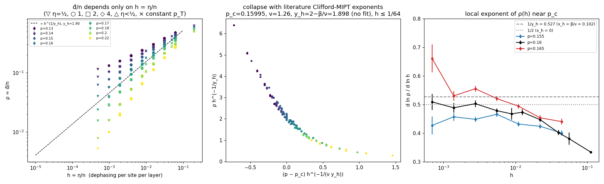
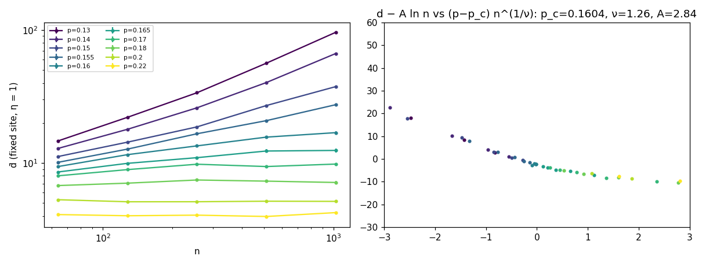
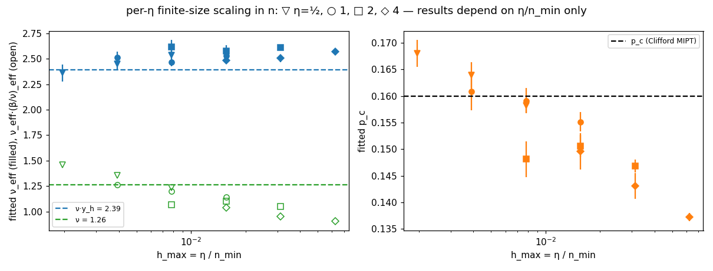

# Why ν_eff ≈ 2.5: the simulability transition is the Clifford MIPT seen through a relevant noise field

Branch `exp/transition-theory` (from main d44563c). Follow-up to `research/simulability/magic-transition.md` (§4.2, §5 "ν_eff ≈ 2.5 unexplained").
Code: `examples/transition_theory.rs` — a d-only driver (`steady`, `survival`, `decay`) on the public API of
`src/monitored/`; **no engine change** (pattern `poisson` reuses `circuit::layer` and the same seed mixing,
and reproduces `magic-transition/raw.csv` bit for bit, e.g. n = 128, p = 0.16, η = 1, seed 100000: d̄ = 18.375 in both).
Data/analysis: `research/data/transition-theory/` — `steady.csv` (22.5 k trajectories), `survival.csv` (2.8 k injections), `decay_mean.csv`, `survival_km.csv`,
`decay.csv`, `cells.csv`, `jobs.txt` + `order.txt` + `run_order.sh` (campaign), `load.py`, `analyze.py`, `corrfit.py`,
`fits.json`, `corrfit.json`, `same_h_pairs.csv`, `local_slope.csv`, four PNGs. Campaign: M1 Pro, 2 single-threaded
workers (MAC CORE BUDGET), 326 jobs, n = 64 … 2048, η = 1/32 … 4, i.e. h = η/n from 1/16 down to 1/65536.

## 0. Answer

**The simulability transition at fixed η is the (1+1)D Clifford measurement-induced (purification) transition — same
p_c, same ν — but d̄/n is not an ordinary order parameter: it is the response of that critical point to a uniform
dephasing field of density h = η/n, so the system size enters only through h, and an n-collapse at fixed η measures
ν_eff = ν·y_h and (β/ν)_eff = 1/y_h, where y_h = 2 − x_h ≈ 1.9 is the RG eigenvalue of a single dephasing event
(x_h = the Gullans–Huse reference-qubit / order-parameter dimension ≈ 0.11).** The "2.5" is therefore not a
second universality class and not a log-n artefact; it is ν ≈ 1.26 times y_h ≈ 1.9, slightly inflated by
corrections to scaling.

| quantity | this work | Clifford-MIPT prediction / literature |
|---|---|---|
| d̄/n depends on (p, h = η/n) only | 576 pairs of cells with equal h but different (n, η) (n·η ≥ 16): χ²/pair = 1.12, median \|Δρ\|/ρ = 0.7 % | (★) below |
| p_c (h-collapse with correction, free) | **0.1598 ± 0.0003 (stat) ± 0.0012 (sys)** | 0.15995(10) Sierant et al.; 0.1598(5) Gullans–Huse; 0.1596(3) Zabalo et al. |
| ν = (β/ν)_eff / (1/ν_eff) = a/b | **1.28 ± 0.02 (stat) +0.12/−0.08 (sys)** | 1.260(15) Sierant; 1.30(5) Gullans–Huse; I₃ here 1.32 ± 0.07 |
| y_h = 1/a (from the collapse) | **1.92 ± 0.02 (stat) ± 0.15 (sys)** | 2 − x_σ = 1.88–1.90 |
| x_h, single-dephasing survival P(t) ∝ t^{−x_h} at p_c | **0.12 ± 0.02** (n = 512, 1465 injections; n = 1024–2048 consistent) | β/ν = 0.102(7) Sierant; η/2 = 0.11(1) Gullans–Huse; x₁ᵖ = 0.120(5) Zabalo 2022; 5/48 = 0.104 percolation |
| local exponent d ln ρ / d ln h at p = 0.16, h ≤ 1/1024 | **0.52 ± 0.02** (κ_c = 0.48 ± 0.02) | 1/y_h = 0.53 (κ_c = 0.47) |
| ν_eff = 1/b (what an n-collapse at fixed η measures) | **2.45 ± 0.02 (stat) ± 0.03 (sys)** (all η ∈ {½,1,2,4} give 2.36–2.61 in n-collapses) | ν·y_h = 2.38 ± 0.04 |
| ν from a *line* of dephasing (T on a fixed site every layer) — ordinary FSS d − A ln n = G((p − p_c) n^{1/ν}) | **ν = 1.26 ± 0.03, p_c = 0.1604 ± 0.0005, A = 2.8 ± 0.2** | ν = 1.26; line defect is a different (marginal-in-n) perturbation, so no y_h appears |
| entropy of the maximally mixed state at p_c | S(t) ≈ c n/t, c = 4.0 ± 0.4 for 30 ≲ t ≲ n | scale invariance (x_ρ = 1) |
| d̄ at p = 0.16 | d̄ ≈ 0.90 √(c η n) for n = 128–2048, η = 1/16–4 (ratio 0.86–0.93) | mean-field balance η = d²/(c n) |

Error bars: statistical = bootstrap over cells (20 resamples of the collapse fit) or over trajectories (survival);
systematic = spread over the correction-to-scaling exponent ω_h ∈ {0.25, 0.5, 1} and the p/h windows (§4.2).

What is known vs new: the Clifford-MIPT exponents (p_c, ν, x_σ) and the fact that noise is a relevant,
symmetry-breaking perturbation (Dias et al., Liu et al., Weinstein–Bao–Altman) are known. New here: (i) the
identification of the T-gate simulability order parameter d̄/n with the noise-field response of the Clifford critical
point, made exact by the dephasing theorem of magic-transition §1.1; (ii) the scaling law (★) and its numerical
verification across η, n and constant p_T (d̄/n is a function of η/n alone to < 1 %); (iii) the exponent identity
ν_eff = ν(2 − x_σ), (β/ν)_eff = 1/(2 − x_σ), which resolves the 2.5-vs-1.3 discrepancy; (iv) the line-defect control
(fixed T site) recovering ν = 1.26 with d_c ∝ ln n; (v) d̄_c ≈ 0.9 √(4 η n), i.e. the exact Clifford+T cost at the
critical point is 2^{Θ(√(ηn))}; (vi) d(t) from |0ⁿ⟩ and from the maximally mixed state coalesce *exactly* (a coupling
argument), giving a rigorous stationarity check.

## 1. The puzzle

`magic-transition.md`: with η T gates per layer (T on each qubit w.p. p_T = η/n per layer, uniform two-qubit Clifford
brickwork, Z measurements w.p. p), d̄/n collapses with Φ n^{β/ν} = F((p − p_c) n^{1/ν}) at p_c ≈ 0.159 but with
ν_eff = 2.51 ± 0.03, β/ν = 0.49 ± 0.01, while I₃ of the same circuits gives ν = 1.32 ± 0.07. p_c drifts up as small
n are dropped, η = 2 gives a lower apparent p_c (0.145), and d̄_c ∝ n^{0.53–0.56}. The same study proved that d(t)
is *exactly* the von Neumann entropy (bits) of the monitored Clifford circuit in which every T is replaced by full
Z-dephasing, ρ → (ρ + Z ρ Z)/2. So the question is why a purification transition of a Clifford circuit shows a
non-Clifford exponent.

## 2. Theory

### 2.1 Two relevant directions at the Clifford critical point
With T sites replaced by dephasing, the model is the Clifford MIPT with a **uniform bulk noise density h = η/n per
site per layer**. At the critical point (z = 1) two perturbations are relevant:

* δ = p − p_c, RG eigenvalue 1/ν;
* h, RG eigenvalue y_h = D − x_h = 2 − x_h, where x_h is the scaling dimension of one dephasing event.

A dephasing event on a pure stabilizer state creates one bit of entropy: the dephased qubit becomes maximally
entangled with an environment qubit. That is precisely the Gullans–Huse local probe — a reference qubit entangled
with one site — whose entropy is the order parameter of the MIPT. So x_h = x_σ, the bulk order-parameter dimension,
measured for this very model as β/ν = 0.129(8)/1.260(15) = 0.102(7) (Sierant et al. 2022), η_bulk/2 = 0.11(1)
(Gullans–Huse 2020) and x₁ᵖ = 0.120(5) (first purification exponent, Zabalo et al. 2022); 2D percolation (the Haar
d → ∞ limit) has 5/48 = 0.104. Hence **y_h ≈ 1.88–1.90: dephasing is strongly relevant** (cf. "quantum noise as a
symmetry-breaking field", Dias et al., arXiv:2208.13861), and a density h of it sets a length

    ξ_h ∝ h^{−1/y_h} ≈ (n/η)^{0.53}  ≪ n.

We measure x_h directly (§3.4): one dephasing in the steady state of the pure Clifford circuit at p = 0.16 survives
(the entropy stays 1) with P(t) ∝ t^{−0.12±0.02}.

### 2.2 The entropy density is an inverse length
d counts logical qubits of the dynamically generated code (Gullans–Huse mixed phase; Li–Fisher "statistical
mechanics of QECCs"). At criticality such a count is O(1) per scale-invariant block: e.g. the maximally mixed state
must decay as S(t) ≈ c n/t for 1 ≪ t ≪ n (each t × t block of space-time holds O(1) bits). We check this (§3.5):
c = 4.0 ± 0.4 at p = 0.16, flat in t/n over 30 ≲ t ≲ n. So ρ = d/n has scaling dimension x_ρ = 1.

### 2.3 The scaling law
For n ≫ ξ_h the system size drops out and

    ρ(p, h) = h^{1/y_h} · Φ( (p − p_c) · h^{−1/(ν y_h)} ).        (★)

Limits:
* **Mixed (code) phase, δ < 0:** ρ → s(p) ∝ |δ|^{ν}: injected entropy fills the error-protected code of the volume-law
  phase to capacity (its "code rate"), which vanishes as 1/ξ. Exponentially slow purification (Gullans–Huse) is why
  the code stays full.
* **Pure phase, δ > 0:** linear response, an injected bit survives τ(p) ∝ ξ^{y_h − 1} layers, so **d̄ = η τ(p):
  independent of n and linear in η** (checked in §3.6).
* **δ = 0:** ρ ∝ h^{1/y_h}, i.e. d̄_c ∝ η^{1/y_h} n^{1 − 1/y_h} ≈ η^{0.53} n^{0.47}.
  Mean-field version (x_h → 0): purification at criticality runs as dS/dt = −S²/(c n) (that is S = c n/t), so with
  injection rate η the steady state is d̄_c = √(c η n). With the measured c = 4 this predicts d̄_c = 2√(ηn); we
  observe 0.90 × that for every (n, η) we ran (§3.3) — the 10 % and the slow drift are the x_h ≈ 0.1 correction.

### 2.4 What the fixed-η finite-size scaling measured
At fixed η, h = η/n, so (★) is

    d̄/n = (η/n)^{1/y_h} · Φ( (p − p_c) (n/η)^{1/(ν y_h)} ),

which has exactly the form Φ n^{β/ν} = F((p − p_c) n^{1/ν}) used in magic-transition §4.2, with

    (β/ν)_eff = 1/y_h ≈ 0.53,   ν_eff = ν·y_h ≈ 2.38,   κ_c = 1 − 1/y_h ≈ 0.47,   and  ν_eff·(β/ν)_eff = ν.

The original numbers already satisfy the identity: 2.51 × 0.49 = 1.23 ≈ ν. Further consequences, all observed:
* η and n are interchangeable: the fit at (η, n_min) is the fit at (2η, 2n_min) — this is why η = 2 "has a lower p_c":
  it is the η = 1 analysis with the smallest sizes halved; the apparent p_c rises towards 0.160 as h_max = η/n_min → 0
  (`per_eta.png`).
* A constant p_T is a fixed h: d/n is n-independent (no transition), as found in magic-transition §4.4; the constant-
  p_T points fall on the same ρ(p, h) curves as the η/n points (`h_scaling.png`, crosses).
* The transition is sharp only in the limit h → 0, i.e. it is the zero-field Clifford critical point, approached along
  the h axis. The relevant divergent length is ξ_h ∝ (n/η)^{1/y_h} ≈ √(n/η), not n.

### 2.5 Control: a line of noise
If instead the T gates sit on a **fixed** site (η = 1: every layer on qubit 0), the noise is a time-like line defect.
Its coupling has eigenvalue 1 − x_h ≈ 0.9 > 0 and flows to a strongly dephasing line, but it introduces **no new bulk
scale**: n is again the only length, ordinary FSS with the true ν should hold, and at p_c the entropy between the
system and the line is like an entanglement entropy at criticality, d_c ≈ A ln n. Observed: ν = 1.26 ± 0.03,
p_c = 0.1604 ± 0.0005, A = 2.8 ± 0.2 (§3.7). This is the cleanest demonstration that ν_eff = 2.5 comes from how the
noise is distributed, not from the critical point.

## 3. Numerical tests

All d-only (polynomial). Steady state: depth 2n, d̄ = mean over the last n/2 layers; `d_prev` over the n/2 layers
before agrees within errors for every cell (and the old depth-4n data agree with the new depth-2n data where
both exist). Families: S (η = ½, 1, 2, 4; n = 64–1024, 12–200 samples, 10 p values 0.13–0.22; plus n = 2048 at
η = 1, 4), H (small h: (n, η) = (1024, ¼), (1024, 1/16), (2048, 1/32) at p = 0.15–0.17), F (fixed site), X
(exactly η T per layer at random distinct sites), M (depth 8n, |0ⁿ⟩ vs maximally mixed start), V (survival),
D (decay); plus the d-only rows of `magic-transition/raw.csv` (constant p_T, η = 1, 2 at n = 16, 32 and p ∉ grid).

### 3.1 d̄/n is a function of h = η/n only


Left: ρ vs h for all sources (η = 1/32 … 4, constant p_T = 0.01, 0.05, 0.2): one curve per p. Cells with the same h
and different (n, η) agree: 576 pairs of cells with equal h and n·η ≥ 16 (η from 1/32 to 4, constant p_T, n = 16–2048) have χ²/pair = 1.12, median relative difference 0.7 %, max 6.8 % (`same_h_pairs.csv`); e.g. p = 0.16, h = 1/128: ρ = 0.1597 (n = 128, η = 1), 0.1597 (n = 256, η = 2), 0.1590 (n = 64, η = ½). Deviations appear only when n·η ≲ 4 (n ≲ ξ_h), e.g. n = 16 at p_T = 0.01
(12 % low). Exact-count injection (exactly η T per layer at distinct random sites, family X) gives the same ρ as
Poisson injection: 9 cells (n = 128–512, p = 0.14–0.18), χ²/point = 1.3, mean +1.0 % (largest +3.5 %, 2.4σ).

### 3.2 Exponents from the h-collapse
Middle panel: collapse with the *literature* Clifford exponents (p_c = 0.15995, ν = 1.26, y_h = 2 − 0.102), no fit.
Fitting (★) with a weighted degree-4 master curve and the leading correction ρ → ρ(1 + c h^{ω_h})
(`corrfit.py`, p ∈ [0.14, 0.20] or [0.145, 0.18], h ≤ 1/16 … 1/64, n·η ≥ 16):

| ω_h | p_c (free) | a = 1/y_h | b = 1/(ν y_h) | ν = a/b | y_h | ν_eff = 1/b | χ²/dof |
|---|---|---|---|---|---|---|---|
| 0.25 | 0.1601–0.1608 | 0.551–0.568 | 0.407–0.412 | 1.34–1.40 | 1.76–1.81 | 2.43–2.46 | 0.98–1.12 |
| **0.5** | **0.1596–0.1599** | **0.520–0.524** | **0.406–0.411** | **1.27–1.29** | **1.91–1.92** | **2.43–2.46** | **0.98–1.10** |
| 1.0 | 0.1583–0.1592 | 0.485–0.502 | 0.402–0.409 | 1.20–1.23 | 1.99–2.06 | 2.45–2.49 | 0.99–1.20 |

(ranges over the two p windows and h_max ∈ {1/16, 1/32, 1/64}; 130–229 cells; bootstrap σ per fit: p_c 0.0003,
ν 0.015, y_h 0.02, ν_eff 0.02). With p_c fixed at 0.15995 the ω_h = 0.5 fits give a = 0.524–0.526, ν = 1.28–1.29,
y_h = 1.90–1.91, ν_eff = 2.43–2.46 (`corrfit.json`). With every exponent fixed to the literature values (no fit)
χ²/dof = 3.6 for h ≤ 1/256 (14.9 for h ≤ 1/64, where corrections matter).

ω_h = 0.5 (≈ ω/y_h with an irrelevant exponent ω ≈ 1) gives the best χ²/dof (1.00–1.11) and p_c free lands on the
literature value; we quote it with the ω_h spread as the systematic error. Without the correction term the free
fits drift with the h window exactly as in magic-transition (p_c 0.153 → 0.160, a 0.43 → 0.51 as h_max goes
1/16 → 1/512, χ²/dof up to 5, `fits.json` `h_free`), but b — hence ν_eff = 2.43–2.62 — is comparatively stable.

### 3.3 The critical point itself
Right panel of `h_scaling.png`: local exponent d ln ρ/d ln h. At p = 0.16 it rises from 0.33 (h = 0.1) and settles at
0.50–0.52 for h ≤ 1/1024 (down to h = 1/65536, n = 2048, η = 1/32): **a = 0.52 ± 0.02, y_h = 1.92 ± 0.08**,
κ_c = 0.48 ± 0.02. At 0.155 it falls (0.43 → 0.32: mixed phase, ρ → s(p) > 0), at 0.165 it rises (→ 0.85 at
h = 1/65536: pure phase, linear response ρ ∝ h). Mean-field check: d̄(p = 0.16) / √(4ηn) = 0.908, 0.889, 0.906, 0.925, 0.903 for n = 128, 256, 512, 1024, 2048 at η = 1; 0.864, 0.893, 0.915 for n = 1024 at η = 1/16, ¼, 4; 0.907 for n = 2048, η = 4 — i.e. d̄_c ≈ 0.9·√(4ηn) over two decades of ηn.

### 3.4 One dephasing event: x_h
`survival`: pure Clifford steady state at p, one dephasing at a random site, record when the entropy returns to 0
(re-inject 16–32 layers after a death; censor at t_max). Kaplan–Meier P(t) (`survival_decay.png`, left):

| n | p | injections | x on t ∈ [4, 32] | [8, 64] | [16, 128] | [32, 256] |
|---|---|---|---|---|---|---|
| 256 | 0.155 | 172 | 0.056 ± 0.014 | 0.082 ± 0.024 | 0.097 ± 0.025 | — |
| 256 | 0.16 | 227 | 0.121 ± 0.023 | 0.109 ± 0.021 | 0.141 ± 0.026 | — |
| 256 | 0.165 | 291 | 0.129 ± 0.021 | 0.162 ± 0.024 | 0.259 ± 0.030 | — |
| 512 | 0.16 | 1465 | 0.109 ± 0.008 | 0.124 ± 0.009 | 0.146 ± 0.010 | 0.185 ± 0.012 |
| 1024 | 0.155 | 81 | 0.096 ± 0.030 | 0.117 ± 0.040 | 0.112 ± 0.033 | 0.078 ± 0.032 |
| 1024 | 0.16 | 248 | 0.094 ± 0.018 | 0.133 ± 0.021 | 0.205 ± 0.028 | 0.204 ± 0.031 |
| 1024 | 0.165 | 311 | 0.151 ± 0.027 | 0.199 ± 0.025 | 0.263 ± 0.025 | 0.326 ± 0.040 |
| 2048 | 0.16 | 37 | 0.146 ± 0.056 | 0.126 ± 0.049 | 0.113 ± 0.047 | 0.069 ± 0.030 |

(errors: bootstrap over circuits). The exponent grows with t on the pure side (0.165: exponential cutoff at
t ~ ξ) and shrinks on the mixed side (0.155), as it should.

At p = 0.16 and t ≤ n/8: **x_h = 0.12 ± 0.02** (n = 512: 0.109 ± 0.008 on t ∈ [4, 32], 0.124 ± 0.009 on [8, 64];
larger windows bend down as t → n/4). This is the Gullans–Huse order-parameter dimension, as assumed in §2.1,
and gives y_h = 1.88 ± 0.02, consistent with the collapse value 1.92 ± 0.02 ± 0.15 and the direct slope 1.92 ± 0.08.

### 3.5 Decay of the maximally mixed state (x_ρ = 1)
`decay`: start maximally mixed (H then T on every qubit, d = n), no injection. S(t)·t/n (`survival_decay.png`,
right) is flat at p = 0.16 for 30 ≲ t ≲ n with c = 3.7, 3.9, 4.3 (± 0.2–0.4) for n = 256, 512, 1024 (mean over t ∈ [n/8, n/4]); the local slope of ln S vs ln t on [8, n/4] is −0.84…−0.87 because of the short-time rise visible in the figure, rises at 0.155 (mixed phase: S → s n) and falls at 0.165
(pure: S → 0 at t ~ ξ).

### 3.6 Pure phase: d̄ = η τ(p)
n = 1024, d̄ for η = ½, 1, 2, 4: p = 0.22: 5.40, 10.30, 19.82, 36.74; p = 0.20: 8.06, 16.29, 29.98, 53.74 — linear in
η while h ≲ ξ^{−y_h}, bending (sub-linear) as h approaches the crossover; and n-independent at fixed η
(p = 0.25, η = 2: 12.0, 12.8 at n = 512, 1024).

### 3.7 Line defect: ordinary FSS with ν = 1.26


n = 64–1024, 10 p values, η = 1 on qubit 0. At p ≤ 0.155 d grows ∝ n (the code fills through the single
noisy site), at p ≥ 0.17 it saturates (d = 4–10), and at p = 0.16 it grows logarithmically (9.4 → 16.9 from
n = 64 to 1024). Collapse d − A ln n = G((p − p_c) n^{1/ν}) on p ∈ [0.14, 0.18]: **p_c = 0.1604 ± 0.0005,
ν = 1.26 ± 0.03, A = 2.84 ± 0.14** (χ²/dof 1.41; n ≥ 128: 0.1601 ± 0.0010, 1.25 ± 0.07, 3.0 ± 0.4). On the wider window
0.13–0.20 a degree-4 master curve cannot follow both the extensive and the saturated branches (χ²/dof 7–9); the
d/n-ansatz used for random injection does not describe this data (χ²/dof 5.2). Same Clifford critical point, ordinary ν.

### 3.8 Per-η finite-size scaling in n (the original ansatz)


| η | n range | h window | p_c | ν_eff | (β/ν)_eff | ν_eff·(β/ν)_eff | χ²/dof |
|---|---|---|---|---|---|---|---|
| ½ | 64–1024 | 1/2048–1/128 | 0.1582 ± 0.0014 | 2.54 ± 0.04 | 0.486 ± 0.012 | 1.23 | 1.7 |
| ½ | 128–1024 | 1/2048–1/256 | 0.1639 ± 0.0025 | 2.45 ± 0.05 | 0.553 ± 0.028 | 1.35 | 1.6 |
| 1 | 64–1024 | 1/1024–1/64 | 0.1552 ± 0.0018 | 2.53 ± 0.04 | 0.451 ± 0.013 | 1.14 | 1.7 |
| 1 | 128–1024 | 1/1024–1/128 | 0.1591 ± 0.0024 | 2.47 ± 0.04 | 0.487 ± 0.020 | 1.20 | 1.8 |
| 1 | 256–1024 | 1/1024–1/256 | 0.1609 ± 0.0036 | 2.51 ± 0.06 | 0.503 ± 0.032 | 1.26 | 2.3 |
| 2 | 64–1024 | 1/512–1/32 | 0.1468 ± 0.0012 | 2.61 ± 0.03 | 0.402 ± 0.006 | 1.05 | 1.1 |
| 2 | 128–1024 | 1/512–1/64 | 0.1506 ± 0.0021 | 2.58 ± 0.06 | 0.426 ± 0.012 | 1.10 | 1.1 |
| 4 | 64–1024 | 1/256–1/16 | 0.1372 ± 0.0008 | 2.57 ± 0.03 | 0.352 ± 0.004 | 0.90 | 1.4 |
| 4 | 256–1024 | 1/256–1/64 | 0.1496 ± 0.0034 | 2.49 ± 0.03 | 0.418 ± 0.020 | 1.04 | 0.9 |

(p ∈ [0.13, 0.22], `fits.json` `per_eta`; the η = 1 row with n ≥ 128 reproduces magic-transition's 0.159 / 2.51 / 0.49.)

Every η gives ν_eff ≈ 2.4–2.6 (prediction ν y_h = 2.38), and p_c and (β/ν)_eff move together with the h window
(η/n_max, η/n_min), not with η separately; ν_eff·(β/ν)_eff scatters around ν (0.9–1.46, poorly constrained in
3–5-size fits with a strongly correlated (p_c, β/ν)).

### 3.9 Stationarity and depth
Family M (depth 8n, window n, p = 0.10, 0.13, 0.14 — the slow, mixed side; n = 256, 512): the d(t) trajectories
started from |0ⁿ⟩ and from the maximally mixed state are **identical** (72/72 pairs) by t = 7n. This is exact, not
statistical: the unsigned stabilizer groups obey G_mixed(t) ⊆ G_zero(t) under all three update rules (Clifford
conjugation, measurement replacement/extension, dephasing restriction), so d_mixed ≥ d_zero and, once equal, they
stay equal — a coupling. The depth-8n means agree with the depth-2n family S within 1–2 % (e.g. p = 0.13, n = 512:
80.4 ± 0.7 vs 81.6 ± 0.5).

## 4. Statement

* **Universality.** The fixed-η simulability transition of the exact Clifford+T engine (and Bejan–McLauchlan–Béri's
  magic transition for qD = O(1), whose "stabilizer purification" is the same object) is the (1+1)D Clifford MIPT:
  p_c = 0.1598 ± 0.0003 ± 0.0012, ν = 1.28 ± 0.02 (+0.12/−0.08), with the observable d̄/n being the response to the
  relevant dephasing field h = η/n with y_h = 2 − x_σ, x_σ = 0.12 ± 0.02 (survival) — not a new universality class.
* **Corrected exponents.** The exponents of the order parameter d̄/n in *n at fixed η* are ν_eff = ν·y_h = 2.45 ± 0.04
  (theory 2.38 ± 0.04), (β/ν)_eff = 1/y_h = 0.52 ± 0.02 (theory 0.53), κ_c = 0.48 ± 0.02 (theory 0.47). The previously
  reported 2.51 ± 0.03, 0.49 ± 0.01, 0.53–0.56 are these, biased by corrections to scaling at large h (small n) —
  the same corrections that pull the apparent p_c down at small n and at larger η.
* **Not a log-n mixing.** A log appears only for a *line* of noise (fixed T site), where d_c ≈ 2.8 ln n and ordinary
  FSS gives ν = 1.26 ± 0.03.
* **Cost.** Exact amplitude simulation at the critical point costs 2^{d̄} with d̄_c ≈ 0.9·√(4ηn) ≈ 1.8√(ηn):
  sub-exponential 2^{Θ(√n)}; in the pure phase d̄ = η τ(p) = O(1); in the mixed phase d̄ = s(p) n.

## 5. Literature

* Gullans & Huse, PRX 10, 041020 (2020) (purification transition; mixed phase = error-protected code) and PRL 125,
  070606 (2020) (reference-qubit order parameter; p_c = 0.1598(5), ν = 1.30(5), η_bulk = 0.22(1) for this model).
* Li & Fisher, PRB 103, 104306 (2021) (statistical mechanics of the dynamically generated QECC; code rate, contiguous
  code distance): the mixed-phase capacity s(p) that the injected entropy fills.
* Zabalo, Gullans, Wilson, Gopalakrishnan, Huse, Pixley, PRB 101, 060301 (2020) (critical exponents, ν ≈ 1.2–1.3) and
  Zabalo et al., PRL 128, 050602 (2022) (Clifford p_c = 0.1596(3), purification exponents x₁ᵖ = 0.120(5),
  x₂ᵖ = 0.240(5); Clifford ≠ Haar ≠ percolation).
* Sierant, Schirò, Lewenstein, Turkeshi, PRB 106, 214316 (2022): p_c = 0.15995(10), ν = 1.260(15), β = 0.129(8).
* Dias, Perković, Haque, Ribeiro, McClarty, arXiv:2208.13861 "Quantum noise as a symmetry-breaking field";
  Liu, Li, Zhang, Jian, Yao, PRB 110, 064323 (2024) (noise with q = p/L^α; α = 1 is our η/n); Weinstein, Bao, Altman (arXiv:2202.12905),
  PRL 129, 080501 (2022). These establish noise as a relevant field; the y_h = 2 − x_σ identification for dephasing
  and its use to explain a "magic/simulability" exponent are, as far as we know, new.
* Bejan, McLauchlan, Béri, PRX Quantum 5, 030332 (2024): magic transition at 0.159(1), ν ≈ 1.2 from a PBC runtime
  proxy with qD = O(1); consistent with p_c here. Their ν was obtained differently (crossings of a cost proxy), so
  there is no conflict with ν_eff ≠ ν for d̄/n.
* Fux, Tirrito, Dalmonte, Fazio, arXiv:2312.02039 (η = 2 "magic transition" at 0.22): in our picture there is no second
  critical point; for p > p_c and fixed η, d̄ → η τ(p), finite and smooth in p (magic-transition §4.3).
* Niroula et al., arXiv:2304.10481: magic transition of a random stabilizer code under coherent errors — a different
  setting (no monitored dynamics), not tested here.

## 6. Caveats

* The correction-to-scaling exponent ω_h is not determined by the data (χ² differences ≤ 0.1 between 0.25, 0.5, 1);
  it dominates the systematic errors of ν and y_h. The direct estimates (survival x_h, slope at p = 0.16, line-defect ν)
  do not depend on it.
* Survival statistics at n ≥ 1024 are thin (80–311 injections per p; a surviving injection costs t_max layers); the
  quoted x_h leans on n = 512 (1465 injections) with t ≤ n/8.
* Smallest h (1/65536) uses η = 1/32 at n = 2048 (n·η = 64, eight trajectories per p); the same-h tests show n·η ≥ 16
  suffices for < 1 % finite-n effects at larger h, but at h = 1/65536 this is not separately verified.
* x_ρ = 1 rests on the decay plateau S·t/n = c over one decade of t at three sizes.
* Mac-sharing incident: from ≈ 19:00 to 19:46 (4 Oct) the SIGSTOP watcher of this campaign was not running (a stale
  `done` flag from a restarted runner made it exit), so two statistical workers kept running while the bench lock
  was held during that window. Peers' locked timings in that window may have seen 2 extra busy cores.

## 7. Reproduce

```
cargo build --release --example transition_theory
B=target/release/examples/transition_theory
$B steady n=256 pm=0.16 eta=1 samples=10                       # same circuits as magic_transition ptn=1
$B steady n=256 pm=0.16 eta=1 pattern=fixed samples=10          # line defect
$B survival n=512 pm=0.16 burn=128 tmax=256 gap=16 samples=100
$B decay n=512 pm=0.16 depth=1024 samples=20
# campaign: research/data/transition-theory/{jobs.txt,order.txt,run_order.sh} (2 workers, SIGSTOP on the bench lock)
python3 research/data/transition-theory/analyze.py   # NB=20 bootstrap; reads steady/survival/decay.csv
python3 research/data/transition-theory/corrfit.py
```
